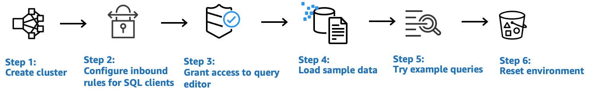

Amazon Redshift will no longer support the creation of new Python UDFs starting November 1, 2025.
If you would like to use Python UDFs, create the UDFs prior to that date.
Existing Python UDFs will continue to function as normal. For more information, see the
[blog post](https://aws.amazon.com/blogs/big-data/amazon-redshift-python-user-defined-functions-will-reach-end-of-support-after-june-30-2026/ "https://aws.amazon.com/blogs/big-data/amazon-redshift-python-user-defined-functions-will-reach-end-of-support-after-june-30-2026/") .

# Get started with Amazon Redshift provisioned data warehouses

If you are a first-time user of Amazon Redshift, we recommend that you read the following sections to help you get started
using provisioned clusters. The basic flow of Amazon Redshift is to create provisioned resources, connect to Amazon Redshift,
load sample data, and then run queries on the data. In this guide, you can choose to load sample data from Amazon Redshift or from an Amazon S3 bucket.
The sample data is used throughout the Amazon Redshift documentation to demonstrate features.

This tutorial demonstrates how to use Amazon Redshift provisioned clusters, which are AWS data warehouse objects
for which you manage system resources. You can also use Amazon Redshift with serverless workgroups, which are data warehouse
objects that scale automatically in response to usage. To get started using Redshift Serverless, see
[Get started with Amazon Redshift Serverless data warehouses](new-user-serverless.md "new-user-serverless.md").

After you have created and signed in to the Amazon Redshift provisioned console, you can create and manage Amazon Redshift
objects, including clusters, nodes, and databases. You can also run queries, view queries,
and perform other SQL data definition language (DDL) and data manipulation language (DML)
operations with a SQL client.

###### Important

The cluster that you provision for this exercise runs in a live environment. As long as
it's running, it accrues charges to your AWS account. For pricing information,
see the [Amazon Redshift pricing page](https://aws.amazon.com//redshift/pricing/ "https://aws.amazon.com//redshift/pricing/").

To avoid unnecessary charges, delete your cluster when you are done with
it. The final section of this chapter explains how to do so.

Sign in to the AWS Management Console and open the Amazon Redshift console at
[https://console.aws.amazon.com/redshiftv2/](https://console.aws.amazon.com/redshiftv2/ "https://console.aws.amazon.com/redshiftv2/").

We recommend that you begin by going to the
**Provisioned clusters dashboard** to get started using the Amazon Redshift console.

Depending on your configuration, the following items appear in the navigation pane of the Amazon Redshift provisioned console:

- **Redshift Serverless** – Access and analyze data without the need to set up, tune, and manage Amazon Redshift provisioned clusters.
- **Provisioned clusters dashboard** – View the list of clusters in your AWS Region, check **Cluster metrics** and
  **Query overview** for insights to metrics data (such as CPU
  utilization) and query information. Using these can help you determine if your
  performance data is abnormal over a specified time range.
- **Clusters** – View your list of clusters in this AWS Region, choose a
  cluster to start querying, or perform cluster-related actions. You can also create a
  new cluster from this page.
- **Query editor** – Run queries on databases hosted on your Amazon Redshift cluster.
  We recommend using the **Query editor v2** instead.
- **Query editor v2** – Amazon Redshift query editor v2 is a separate
  web-based SQL client application to author and run queries on your Amazon Redshift
  data warehouse. You can visualize your results in charts and collaborate by sharing
  your queries with others on your team.
- **Queries and loads** – Get information for reference or troubleshooting, such
  as a list of recent queries and the SQL text for each query.
- **Datashares** – As a producer account administrator, either authorize
  consumer accounts to access datashares or choose not to authorize access. To use an
  authorized datashare, a consumer account administrator can associate the datashare
  with either an entire AWS account or specific cluster namespaces in an account. An
  administrator can also decline a datashare.
- **Zero-ETL integrations** – Manage integrations that make transactional data available in Amazon Redshift after being written in supported sources.
- **IAM Identity Center connections** – Configure the connection between Amazon Redshift and IAM Identity Center.
- **Configurations** – Connect to Amazon Redshift clusters from SQL client tools over
  Java Database Connectivity (JDBC) and Open Database Connectivity (ODBC) connections.
  You can also set up an Amazon Redshift–managed virtual private cloud (VPC) endpoint.
  Doing so provides a private connection between a VPC based on the Amazon VPC service
  that contains a cluster and another VPC that is running a client tool.
- **AWS Partner Integration** – Create integration with a supported AWS Partner.
- **Advisor** – Get specific recommendations about changes you can make to your Amazon Redshift
  cluster to prioritize your optimizations.
- **AWS Marketplace** – Get information on other tools or AWS services that work with
  Amazon Redshift.
- **Alarms** – Create alarms on cluster metrics to view performance data and track metrics over a time period that you specify.
- **Events** – Track events and get reports on information such as the date the
  event occurred, a description, or the event source.
- **What's new** – View new Amazon Redshift features and product updates.
  In this tutorial, you perform the following steps.



###### Topics

- [Signing up for AWS](#provisioned-prereq-signup "#provisioned-prereq-signup")
- [Determine firewall rules](#rs-gsg-prereq-firewall-rules "#rs-gsg-prereq-firewall-rules")
- [Step 1: Create a sample Amazon Redshift cluster](#rs-gsg-launch-sample-cluster "#rs-gsg-launch-sample-cluster")
- [Step 2: Configure inbound rules for SQL
  clients](#rs-gsg-authorize-cluster-access "#rs-gsg-authorize-cluster-access")
- [Step 3: Grant access to a SQL client and run queries](#rs-gsg-connect-to-cluster "#rs-gsg-connect-to-cluster")
- [Step 4: Load data from Amazon S3 to Amazon Redshift](#rs-gsg-create-sample-db "#rs-gsg-create-sample-db")
- [Step 5: Try example queries using the query
  editor](#rs-gsg-try-query "#rs-gsg-try-query")
- [Step 6: Reset your environment](#rs-gsg-clean-up-tasks "#rs-gsg-clean-up-tasks")

## Signing up for AWS

If you don't already have an AWS account, sign up for one. If you already have
an account, you can skip this prerequisite and use your existing account.

1. Open [https://portal.aws.amazon.com/billing/signup](https://portal.aws.amazon.com/billing/signup "https://portal.aws.amazon.com/billing/signup").
2. Follow the online instructions.

Part of the sign-up procedure involves receiving a phone call or text message and entering
a verification code on the phone keypad.

When you sign up for an AWS account, an _AWS account root user_ is created. The root user has access to all AWS services
and resources in the account. As a security best practice, assign administrative access to a user, and use only the root user to perform [tasks that require root user access](../../../IAM/latest/UserGuide/id_root-user.md#root-user-tasks "../../../IAM/latest/UserGuide/id_root-user.md#root-user-tasks").

## Determine firewall rules

###### Note

This tutorial assumes your cluster uses the default port 5439 and Amazon Redshift query editor v2 can be used to run SQL commands.
It doesn't go into details about networking configurations or setting up a SQL client that might be necessary in your environment.

In some environments, you specify a port when you launch your Amazon Redshift cluster.
You use this port along with the cluster's endpoint URL to access the cluster.
You also create an inbound ingress rule in a security group to allow access through the
port to your cluster.

If your client computer is behind a firewall, make sure that you know an open port
that you can use. Using this open port, you can connect to the cluster from a SQL client
tool and run queries. If you don't know an open port, work with someone who
understands your network firewall rules to determine an open port in your firewall.

Though Amazon Redshift uses port 5439 by default, the connection doesn't work if that
port isn't open in your firewall. You can't change the port number for your
Amazon Redshift cluster after it's created. Thus, make sure that you specify an open port
that works in your environment during the launch process.

## Step 1: Create a sample Amazon Redshift cluster

In this tutorial, you walk through the process to create an Amazon Redshift cluster with a database. Then you load
a dataset from Amazon S3 to tables in your database. You can use this sample cluster to evaluate the Amazon Redshift
service.

Before you begin setting up an Amazon Redshift cluster, make sure that you complete any necessary prerequisites such as [Signing up for AWS](#provisioned-prereq-signup "#provisioned-prereq-signup") and [Determine firewall rules](#rs-gsg-prereq-firewall-rules "#rs-gsg-prereq-firewall-rules").

For any operation that accesses data from another AWS resource, your cluster needs
permission to access the resource and the data on the resource on your behalf. An
example is using a SQL COPY command to load data from Amazon Simple Storage Service (Amazon S3). You provide those
permissions by using AWS Identity and Access Management (IAM). You can do this through an IAM role that you create and
attached to your cluster. For more information about credentials and access
permissions, see
[Credentials and access permissions](../dg/loading-data-access-permissions.md "../dg/loading-data-access-permissions.md") in the
_Amazon Redshift Database Developer Guide_.

###### To create an Amazon Redshift cluster

1. Sign in to the AWS Management Console and open the Amazon Redshift console at
   [https://console.aws.amazon.com/redshiftv2/](https://console.aws.amazon.com/redshiftv2/ "https://console.aws.amazon.com/redshiftv2/").

###### Important

If you use IAM user credentials, ensure that you have the necessary
permissions to perform the cluster operations. For more information, see
[Security in Amazon Redshift](../mgmt/iam-redshift-user-mgmt.md "../mgmt/iam-redshift-user-mgmt.md") in the _Amazon Redshift Management Guide_. 2. On the AWS console, choose the AWS Region where you want to create the
cluster. 3. On the navigation menu, choose **Clusters**, then choose **Create cluster**.
The **Create cluster** page appears. 4. In the **Cluster configuration** section, specify values
for **Cluster identifier**, **Node type**, and
**Nodes**:

    * **Cluster identifier**: Enter
     `examplecluster` for this tutorial. This identifier
     must be unique. The identifier must be from 1–63 characters using as
     valid characters a–z (lowercase only) and - (hyphen).
    * Choose one of the following methods to size your cluster:


    ###### Note

    The following step assumes an AWS Region that supports RA3 node types. For a list of AWS Regions
     that support RA3 node types, see [Overview of RA3 node types](../mgmt/working-with-clusters.md#rs-ra3-node-types "../mgmt/working-with-clusters.md#rs-ra3-node-types") in the
     *Amazon Redshift Management Guide*. To learn more about the node specifications for each
     node type and size, see [Node type
     details](../mgmt/working-with-clusters.md#rs-node-type-info "../mgmt/working-with-clusters.md#rs-node-type-info").


    	+ If you don't know how large to size your cluster, choose **Help me
    	 choose**. Doing so opens a sizing calculator that asks you
    	 questions about the size and query characteristics of the data that you plan
    	 to store in your data warehouse.


    	If you know the required size of your cluster (that is, the node type and
    	 number of nodes), choose **I'll choose**. Then choose the
    	 **Node type** and number of **Nodes**
    	 to size your cluster.


    	For this tutorial, choose **ra3.4xlarge** for **Node type**
    	 and **2** for **Number of nodes**.


    	If a choice for **AZ configuration** is available, choose **Single-AZ**.
    	+ To use the sample dataset Amazon Redshift provides, in **Sample data**, choose
    	 **Load sample data**. Amazon Redshift loads the sample
    	 dataset Tickit to the default `dev` database and
    	 `public` schema.

5.  In the **Database configuration** section, specify
    a value for **Admin user name**. For **Admin password**,
    choose from the following options:

        * **Generate a password** – Use
         a password generated by Amazon Redshift.
        * **Manually add an admin password** –
         Use your own password.
        * **Manage admin credentials in AWS Secrets Manager** –
         Amazon Redshift uses AWS Secrets Manager to generate and manage your admin password. Using AWS Secrets Manager to
         generate and manage your password's secret incurs a fee. For information on AWS Secrets Manager
         pricing, see [AWS Secrets Manager Pricing](https://aws.amazon.com/secrets-manager/pricing/ "https://aws.amazon.com/secrets-manager/pricing/").

    For this tutorial, use these values:

        * **Admin user name**: Enter `awsuser`.
        * **Admin user password**: Enter `Changeit1` for the password.

6.  For this tutorial, create an IAM role and set it as the default for
    your cluster, as described following. There can only be one default IAM role
    set for a cluster.
    1. Under **Cluster permissions**, for **Manage IAM roles**,
       choose **Create IAM role**.
    2. Specify an Amazon S3 bucket for the IAM role to access by one of the following methods:
       - Choose **No additional Amazon S3 bucket** to allow the created IAM role to access
         only the Amazon S3 buckets that are named as `redshift`.
       - Choose **Any Amazon S3 bucket** to allow the created IAM role to access all Amazon S3 buckets.
       - Choose **Specific Amazon S3 buckets** to specify one or more Amazon S3 buckets for the
         created IAM role to access. Then choose one or more Amazon S3 buckets from the
         table.

    3. Choose **Create IAM role as default**. Amazon Redshift automatically creates and sets the IAM role as the default for your cluster.

    Because you created your IAM role from the console, it has the
    `AmazonRedshiftAllCommandsFullAccess` policy attached. This
    allows Amazon Redshift to copy, load, query, and analyze data from Amazon
    resources in your IAM account.For information on how to manage the default IAM role for a cluster, see
    [Creating an IAM role as default for Amazon Redshift](../mgmt/default-iam-role.md "../mgmt/default-iam-role.md")
    in the _Amazon Redshift Management Guide_.

7.  (Optional) In the **Additional configurations** section,
    turn off **Use defaults** to modify **Network and
    security**, **Database configuration**,
    **Maintenance**, **Monitoring**, and
    **Backup** settings.

In some cases, you might create your cluster with the **Load sample
data** option and want to turn on enhanced Amazon VPC routing. If so,
the cluster in your virtual private cloud (VPC) requires access to the Amazon S3
endpoint for data to be loaded.

To make the cluster publicly accessible, you can do one of two things. You
can configure a network address translation (NAT) address in your VPC for the
cluster to access the internet. Or you can configure an Amazon S3 VPC endpoint in
your VPC. For more information about enhanced Amazon VPC routing, see [Enhanced Amazon VPC routing](../mgmt/enhanced-vpc-enabling-cluster.md "../mgmt/enhanced-vpc-enabling-cluster.md") in the _Amazon Redshift Management Guide_. 8. Choose **Create cluster**. Wait for your cluster to be created with `Available` status on the **Clusters** page.

## Step 2: Configure inbound rules for SQL

clients

###### Note

We recommend you skip this step and access your cluster using Amazon Redshift query editor v2.

Later in this tutorial, you access your cluster from within a virtual private
cloud (VPC) based on the Amazon VPC service. However, if you use an SQL client from outside your firewall
to access the cluster, make sure that you grant inbound access.

###### To check your firewall and grant inbound access to your cluster

1. Check your firewall rules if your cluster needs to be accessed from outside a firewall.
   For example, your client might be an Amazon Elastic Compute Cloud (Amazon EC2) instance or an external computer.

For more information on firewall rules, see [Security group rules](../../../AWSEC2/latest/UserGuide/security-group-rules.md "../../../AWSEC2/latest/UserGuide/security-group-rules.md") in the _Amazon EC2 User Guide_. 2. To access from an Amazon EC2 external client, add an ingress rule to the security group attached to
your cluster that allows inbound traffic. You add Amazon EC2 security group rules in
the Amazon EC2 console. For example, a CIDR/IP of 192.0.2.0/24 allows clients in that
IP address range to connect to your cluster. Find out the correct CIDR/IP for your
environment.

## Step 3: Grant access to a SQL client and run queries

To query databases hosted by your Amazon Redshift cluster, you have several options for SQL clients. These include:

- Connect to your cluster and run queries using Amazon Redshift query editor v2.

If you use query editor v2, you don't have to download and set up an
SQL client application. You launch Amazon Redshift query editor v2 from the Amazon Redshift console.

- Connect to your cluster using RSQL. For more information, see
  [Connecting with Amazon Redshift RSQL](../mgmt/rsql-query-tool.md "../mgmt/rsql-query-tool.md")
  in the _Amazon Redshift Management Guide_.
- Connect to your cluster through a SQL client tool, such as SQL Workbench/J. For more information, see
  [Connect to your cluster by using SQL Workbench/J](../mgmt/connecting-using-workbench.md "../mgmt/connecting-using-workbench.md")
  in the _Amazon Redshift Management Guide_.

This tutorial uses Amazon Redshift query editor v2 as an easy way to run queries on
databases hosted by your Amazon Redshift cluster. After creating your cluster, you can
immediately run queries. For details about considerations
when using the Amazon Redshift query editor v2, see
[Considerations when working with query editor v2](../mgmt/query-editor-v2-using.md#query-editor-v2-considerations "../mgmt/query-editor-v2-using.md#query-editor-v2-considerations")
in the _Amazon Redshift Management Guide_.

### Granting access to the query editor v2

The first time an administrator configures query editor v2 for your AWS account, they choose
the AWS KMS key that is used to encrypt query editor v2 resources.
Amazon Redshift query editor v2 resources include saved queries, notebooks, and charts.
By default, an
AWS owned key is used to encrypt resources. Alternatively, an administrator can use a
customer managed key by choosing the Amazon Resource Name (ARN) for the key in the
configuration page. After you configure an account, AWS KMS encryption settings
can't be changed. For more information, see
[Configuring your AWS account](../mgmt/query-editor-v2-getting-started.md "../mgmt/query-editor-v2-getting-started.md")
in the _Amazon Redshift Management Guide_.

To access the query editor v2, you need permission. An administrator can attach one of the
AWS managed policies for Amazon Redshift query editor v2 to the IAM role or user to grant
permissions. These AWS managed policies are written with different options
that control how tagging resources allows sharing of queries. You can use the
IAM console ([https://console.aws.amazon.com/iam/](https://console.aws.amazon.com/iam/ "https://console.aws.amazon.com/iam/")) to attach IAM policies.
For more information about these policies, see
[Accessing the query editor v2](../mgmt/query-editor-v2-getting-started.md#query-editor-v2-configure "../mgmt/query-editor-v2-getting-started.md#query-editor-v2-configure")
in the _Amazon Redshift Management Guide_.

You can also create your own policy based on the permissions allowed and denied in
the provided managed policies. If you use the IAM console policy editor to
create your own policy, choose **SQL Workbench** as the
service for which you create the policy in the visual editor. The query editor v2
uses the service name AWS SQL Workbench in the visual editor and IAM Policy
Simulator.

For more information, see
[Working with query editor v2](../mgmt/query-editor-v2-using.md#query-editor-v2-configure "../mgmt/query-editor-v2-using.md#query-editor-v2-configure")
in the _Amazon Redshift Management Guide_.

## Step 4: Load data from Amazon S3 to Amazon Redshift

After creating your cluster, you can load data from Amazon S3 to your database tables.
There are multiple ways to load data from Amazon S3.

- You can use a SQL client to run the SQL CREATE TABLE command to create a table in your database and then use the SQL COPY command to load data
  from Amazon S3. The Amazon Redshift query editor v2 is a SQL client.
- You can use the Amazon Redshift query editor v2 load wizard.

This tutorial demonstrates how to use the Amazon Redshift query editor v2 to run SQL commands to CREATE tables and COPY data.
Launch **Query editor v2** from the Amazon Redshift console navigation pane.
Within query editor v2 create a connection to `examplecluster` cluster and database named `dev` with your admin user `awsuser`.
For this tutorial choose **Temporary credentials using a database user name** when you create the connection.
For details on using Amazon Redshift query editor v2, see
[Connecting to an Amazon Redshift database](../mgmt/query-editor-v2-using.md#query-editor-v2-connecting "../mgmt/query-editor-v2-using.md#query-editor-v2-connecting")
in the _Amazon Redshift Management Guide_.

### Loading data from Amazon S3 using SQL commands

On the query editor v2 query editor pane, confirm you are connected to the `examplecluster` cluster and `dev` database.
Next, create tables in the database and load data to the tables.
For this tutorial, the data that you load is available in an Amazon S3 bucket accessible from many AWS Regions.

The following procedure creates tables and loads data from a public Amazon S3 bucket.

Use the Amazon Redshift query editor v2 to copy and run the following
create table statement to create a table in the `public` schema of the `dev` database. For more information about the syntax, see
[CREATE TABLE](../dg/r_CREATE_TABLE_NEW.md "../dg/r_CREATE_TABLE_NEW.md")
in the _Amazon Redshift Database Developer Guide_.

###### To create and load data using a SQL client such as query editor v2

1. Run the following SQL command to CREATE the `sales` table.

```

   `drop table if exists sales;`
   `create table sales(
 salesid integer not null,
 listid integer not null distkey,
 sellerid integer not null,
 buyerid integer not null,
 eventid integer not null,
 dateid smallint not null sortkey,
 qtysold smallint not null,
 pricepaid decimal(8,2),
 commission decimal(8,2),
 saletime timestamp);`
```

2. Run the following SQL command to CREATE the `date` table.

```

`drop table if exists date;`
`create table date(
 dateid smallint not null distkey sortkey,
 caldate date not null,
 day character(3) not null,
 week smallint not null,
 month character(5) not null,
 qtr character(5) not null,
 year smallint not null,
 holiday boolean default('N'));`
```

3. Load the `sales` table from Amazon S3 using the COPY command.

###### Note

We recommend using the COPY command to load large datasets into Amazon Redshift from
Amazon S3. For more information about COPY syntax, see
[COPY](../dg/r_COPY.md "../dg/r_COPY.md")
in the _Amazon Redshift Database Developer Guide_.

Provide authentication for your cluster to access Amazon S3 on your behalf to
load the sample data. You provide authentication by referencing the IAM role that you
created and set as the `default` for your cluster when you chose **Create IAM role as default** when you created the cluster.

Load the `sales` table using the following SQL command.
You can optionally download and view from Amazon S3 the
[source data for the `sales` table](https://s3.amazonaws.com/redshift-downloads/tickit/sales_tab.txt "https://s3.amazonaws.com/redshift-downloads/tickit/sales_tab.txt").
.

```
COPY sales
    FROM 's3://redshift-downloads/tickit/sales_tab.txt'
    DELIMITER '\t'
    TIMEFORMAT 'MM/DD/YYYY HH:MI:SS'
    REGION 'us-east-1'
    IAM_ROLE default;
```

4. Load the `date` table using the following SQL command.
   You can optionally download and view from Amazon S3 the
   [source data for the `date` table](https://s3.amazonaws.com/redshift-downloads/tickit/date2008_pipe.txt "https://s3.amazonaws.com/redshift-downloads/tickit/date2008_pipe.txt").
   .

```
COPY date
    FROM 's3://redshift-downloads/tickit/date2008_pipe.txt'
    DELIMITER '|'
    REGION 'us-east-1'
    IAM_ROLE default;
```

### Loading data from Amazon S3 using the query editor v2

This section describes loading your own data into an Amazon Redshift cluster.
The query editor v2 simplifies loading data when using the **Load data** wizard.
The COPY command generated and used in the query editor v2 **Load data** wizard supports many of
the parameters available to the COPY command syntax to load data from Amazon S3. For
information about the COPY command and its options used to copy load from Amazon S3,
see [COPY from
Amazon Simple Storage Service](../dg/copy-parameters-data-source-s3.md "../dg/copy-parameters-data-source-s3.md") in the _Amazon Redshift Database Developer Guide_.

To load your own data from Amazon S3 to Amazon Redshift, Amazon Redshift requires an IAM role that
has the required privileges to load data from the specified Amazon S3 bucket.

To load your own data from Amazon S3 to Amazon Redshift, you can use the query editor v2 load data wizard.
For information on how to use the load data wizard, see [Loading data from Amazon S3](../mgmt/query-editor-v2-loading-data.md "../mgmt/query-editor-v2-loading-data.md") in the _Amazon Redshift Management Guide_.

### Create TICKIT data in your cluster

TICKIT is a sample database that you can optionally load into your Amazon Redshift cluster for the purposes of learning
how to query data in Amazon Redshift.
You can create the full set of TICKIT tables and load data into your cluster in the following ways:

- When you create a cluster in the Amazon Redshift console, you have the option to load sample TICKIT data at the same time.
  On the Amazon Redshift console, choose **Clusters**, **Create cluster**.
  In the **Sample data** section, select **Load sample data**
  Amazon Redshift loads its sample dataset to your Amazon Redshift cluster `dev` database automatically during cluster
  creation.
- To connect to an existing cluster, do the following:
  - In the Amazon Redshift console, choose **Clusters** from the navigation bar.
  - Choose your cluster from the **Clusters** pane.
  - Choose **Query data**, **Query in query editor v2**.
  - Expand **examplecluster** in the resources list. If this is your first
    time connecting to your cluster, the **Connect to examplecluster** appears. Choose
    **Database username and password**. Leave the database as `dev`.
    Specify `awsuser` for the username and `Changeit1` for the password.
  - Choose **Create connection**.

- With Amazon Redshift query editor v2, you can load TICKIT data into a sample database named **sample_data_dev**.
  Choose the **sample_data_dev** database in the resource list. Next to the **tickit**
  node, choose the
  **Open sample notebooks** icon. Confirm that you want to create the sample database.
- Amazon Redshift query editor v2 creates the sample database along with a sample notebook named **tickit-sample-notebook**.
  You can choose **Run all** to run this notebook to query data in the sample database.

To view details about the TICKIT data, see
[Sample database](../dg/c_sampledb.md "../dg/c_sampledb.md") in the
_Amazon Redshift Database Developer Guide_.

## Step 5: Try example queries using the query

editor

To set up and use the Amazon Redshift query editor v2 to query a database, see
[Working with query editor v2](../mgmt/query-editor-v2-using.md "../mgmt/query-editor-v2-using.md") in the
_Amazon Redshift Management Guide_.

Now, try some example queries, as shown following. To create new queries in the query editor v2, choose the **+**
icon in the upper right of the query pane, and choose **SQL**. A new query page appears where
you can copy and paste the following SQL queries.

###### Note

Be sure to run the first query in the notebook first, which sets the `search_path` server configuration value
to the `tickit` schema using the following SQL command:

```
set search_path to tickit;
```

For more information on working
with the SELECT command, see
[SELECT](../dg/r_SELECT_synopsis.md "../dg/r_SELECT_synopsis.md") in the
_Amazon Redshift Database Developer Guide_.

```
-- Get definition for the sales table.
SELECT *
FROM pg_table_def
WHERE tablename = 'sales';

```

```
-- Find total sales on a given calendar date.
SELECT sum(qtysold)
FROM   sales, date
WHERE  sales.dateid = date.dateid
AND    caldate = '2008-01-05';

```

```
-- Find top 10 buyers by quantity.
SELECT firstname, lastname, total_quantity
FROM   (SELECT buyerid, sum(qtysold) total_quantity
        FROM  sales
        GROUP BY buyerid
        ORDER BY total_quantity desc limit 10) Q, users
WHERE Q.buyerid = userid
ORDER BY Q.total_quantity desc;

```

```
-- Find events in the 99.9 percentile in terms of all time gross sales.
SELECT eventname, total_price
FROM  (SELECT eventid, total_price, ntile(1000) over(order by total_price desc) as percentile
       FROM (SELECT eventid, sum(pricepaid) total_price
             FROM   sales
             GROUP BY eventid)) Q, event E
       WHERE Q.eventid = E.eventid
       AND percentile = 1
ORDER BY total_price desc;

```

## Step 6: Reset your environment

In the previous steps, you have successfully created an Amazon Redshift cluster, loaded data into tables, and queried data
using a SQL client such as Amazon Redshift query editor v2.

When you have completed this tutorial, we suggest that you reset your
environment to the previous state by deleting your sample cluster. You continue to incur
charges for the Amazon Redshift service until you delete the cluster.

However, you might want to keep the sample cluster running if you intend to try
tasks in other Amazon Redshift guides or tasks described in
[Run commands to define and use a database in your data warehouse](database-tasks.md "database-tasks.md").

###### To delete a cluster

1. Sign in to the AWS Management Console and open the Amazon Redshift console at
   [https://console.aws.amazon.com/redshiftv2/](https://console.aws.amazon.com/redshiftv2/ "https://console.aws.amazon.com/redshiftv2/").
2. On the navigation menu, choose **Clusters** to display your list of clusters.
3. Choose the `examplecluster` cluster. For
   **Actions**, choose **Delete**. The
   **Delete examplecluster?** page appears.
4. Confirm the cluster to be deleted, uncheck the **Create final snapshot** setting,
   then enter `delete` to confirm deletion. Choose **Delete cluster**.

On the cluster list page, the cluster status is updated as the cluster is deleted.

After you complete this tutorial, you can find more information about Amazon Redshift and next
steps in [Additional resources to learn about Amazon Redshift](additional-resources.md "additional-resources.md").
