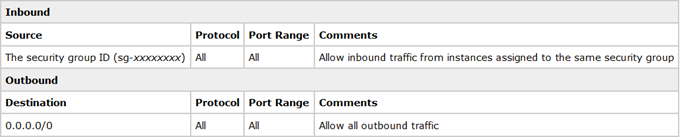

Amazon Redshift will no longer support the creation of new Python UDFs starting November 1, 2025.
If you would like to use Python UDFs, create the UDFs prior to that date.
Existing Python UDFs will continue to function as normal. For more information, see the
[blog post](https://aws.amazon.com/blogs/big-data/amazon-redshift-python-user-defined-functions-will-reach-end-of-support-after-june-30-2026/ "https://aws.amazon.com/blogs/big-data/amazon-redshift-python-user-defined-functions-will-reach-end-of-support-after-june-30-2026/") .

# VPC security groups

When you provision an Amazon Redshift cluster or Amazon Redshift Serverless workgroup, access is
restricted by default so nobody has access to it. To grant other users inbound access,
you associate it with a security group. If you are on the EC2-VPC platform, you can
either use an existing Amazon VPC security group or define a new one. You then associate it
with a cluster or workgroup as described following. If you are on the EC2-Classic
platform, you define a security group and associate it with your cluster or workgroup.
For more information on using security groups on the EC2-Classic platform, see [Amazon Redshift security groups](security-network-isolation.md#working-with-security-groups "security-network-isolation.md#working-with-security-groups").

A VPC security group consists of a set of rules that control access to an instance on
the VPC, such as your cluster. Individual rules set access based either on ranges of IP
addresses or on other VPC security groups. When you associate a VPC security group with
a cluster or workgroup, the rules that are defined in the VPC security group control
access.

Each cluster you provision on the EC2-VPC platform has one or more Amazon VPC security
groups associated with it. Amazon VPC provides a VPC security group called default, which is
created automatically when you create the VPC. Each cluster that you launch in the VPC
is automatically associated with the default VPC security group if you don't
specify a different VPC security group when your Redshift resources. You can associate
a VPC security group with a cluster when you create the cluster, or you can associate a
VPC security group later by modifying the cluster.

The following screenshot shows the default rules for the default VPC security
group.

You can change the rules for the default VPC security group as needed.

If the default VPC security group is enough for you, you don't need to create
more. However, you can optionally create additional VPC security groups to better manage
inbound access. For example, suppose that you are running a service on an Amazon Redshift
cluster or Serverless workgroup, and you have several different service levels you
provide to your customers. If you don't want to provide the same access at all
service levels, you might want to create separate VPC security groups, one for each
service level. You can then associate these VPC security groups with your cluster or
workgroups.

You can create up to 100 VPC security groups for a VPC and associate a VPC security
group with multiple clusters and workgroups. However, note that there are limits to the
number of VPC security groups you can associate with a cluster or workgroup.

Amazon Redshift applies changes to a VPC security group immediately. So if you have
associated the VPC security group with a cluster, inbound cluster access rules in the
updated VPC security group apply immediately.

You can create and modify VPC security groups at [https://console.aws.amazon.com/vpc/](https://console.aws.amazon.com/vpc/ "https://console.aws.amazon.com/vpc/"). You can also
manage VPC security groups programmatically by using the AWS CLI, the Amazon EC2 CLI, and the
AWS Tools for Windows PowerShell. For more information about working with VPC security groups, see [Security groups for your VPC](../../../vpc/latest/userguide/VPC_SecurityGroups.md "../../../vpc/latest/userguide/VPC_SecurityGroups.md") in
the _Amazon VPC User Guide_.
