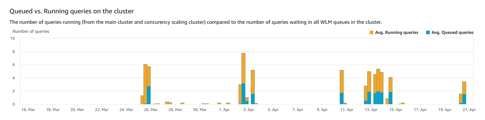
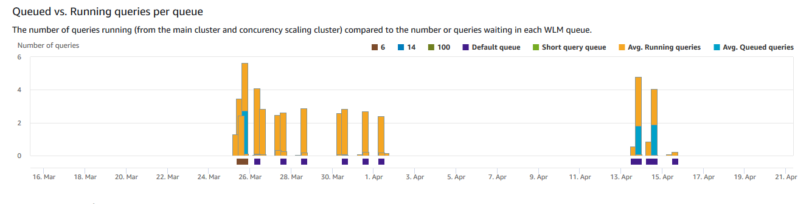
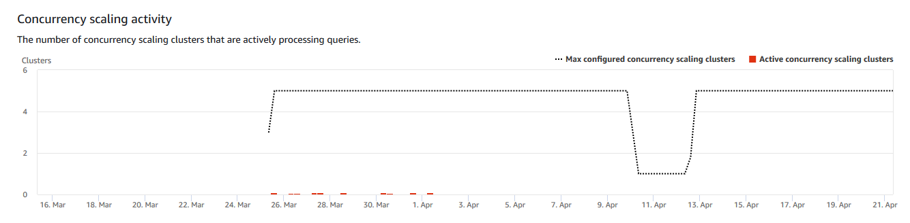
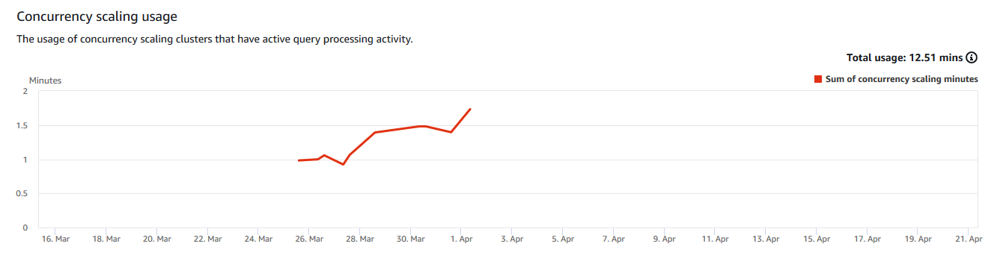

Amazon Redshift will no longer support the creation of new Python UDFs starting November 1, 2025.
If you would like to use Python UDFs, create the UDFs prior to that date.
Existing Python UDFs will continue to function as normal. For more information, see the
[blog post](https://aws.amazon.com/blogs/big-data/amazon-redshift-python-user-defined-functions-will-reach-end-of-support-after-june-30-2026/ "https://aws.amazon.com/blogs/big-data/amazon-redshift-python-user-defined-functions-will-reach-end-of-support-after-june-30-2026/") .

# Viewing workload

concurrency and concurrency scaling data

By using concurrency scaling metrics in Amazon Redshift, you can do the following:

- Analyze whether you can reduce the number of queued queries by enabling
  concurrency scaling. You can compare by WLM queue or for all WLM queues.
- View concurrency scaling activity in concurrency scaling clusters. This
  can tell you if concurrency scaling is limited by the
  `max_concurrency_scaling_clusters`. If so, you can choose to
  increase the `max_concurrency_scaling_clusters` in the DB
  parameter.
- View the total usage of concurrency scaling summed across all concurrency
  scaling clusters.

###### To display concurrency scaling data

1. Sign in to the AWS Management Console and open the Amazon Redshift console at
   [https://console.aws.amazon.com/redshiftv2/](https://console.aws.amazon.com/redshiftv2/ "https://console.aws.amazon.com/redshiftv2/").
2. On the navigation menu, choose **Clusters**, then choose
   the cluster name from the list to open its details. The details of the
   cluster are displayed, which can include **Cluster performance**, **Query monitoring**,
   **Databases**, **Datashares**,
   **Schedules**, **Maintenance**, and **Properties** tabs.
3. Choose the **Query monitoring** tab for metrics about
   your queries.
4. In the **Query monitoring** section, choose
   **Workload concurrency** tab.

The tab includes the following graphs:

    * **Queued vs. Running queries on the cluster**
     – The number of queries running (from the main cluster and
     concurrency scaling cluster) compared to the number of queries
     waiting in all WLM queues in the cluster.
    * **Queued vs. Running queries per queue** –
     The number of queries running (from the main cluster and concurrency
     scaling cluster) compared to the number or queries waiting in each
     WLM queue.
    * **Concurrency scaling activity** – The
     number of concurrency scaling clusters that are actively processing
     queries.
    * **Concurrency scaling usage** – The usage
     of concurrency scaling clusters that have active query processing
     activity.

## Workload

concurrency graphs

The following examples show graphs that are displayed in the new Amazon Redshift console.
To create similar graphs in Amazon CloudWatch, you can use the concurrency scaling and
WLM CloudWatch metrics. For more information about CloudWatch metrics for Amazon Redshift, see
[Performance data in Amazon Redshift](metrics-listing.md "metrics-listing.md").

- **Queued vs. Running queries on the cluster**

- **Queued vs. Running queries per queue**

- **Concurrency scaling activity**

- **Concurrency scaling usage**

