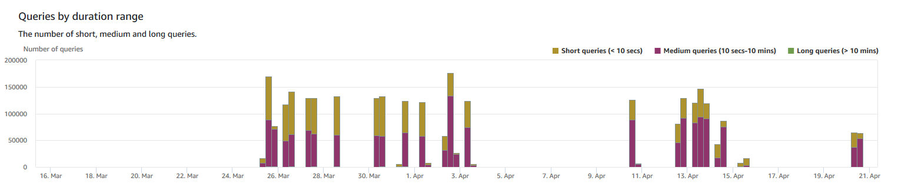
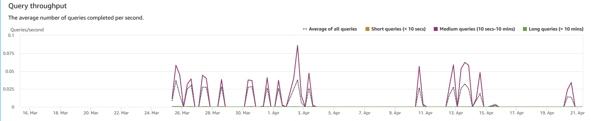
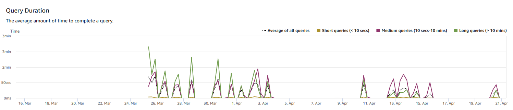
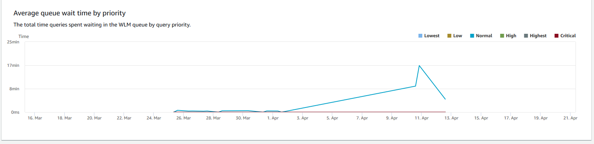
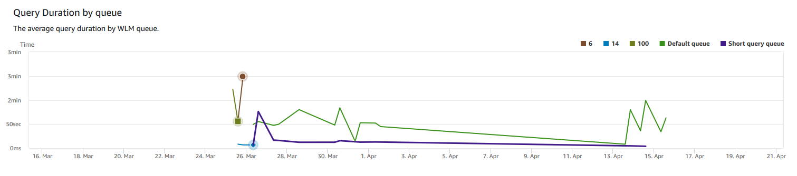
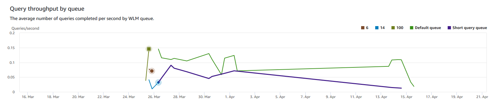
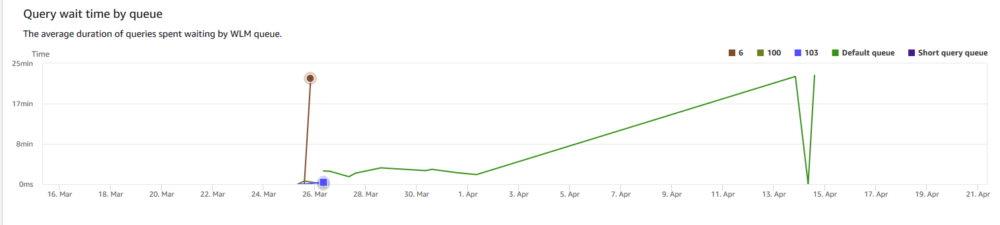

Amazon Redshift will no longer support the creation of new Python UDFs starting November 1, 2025.
If you would like to use Python UDFs, create the UDFs prior to that date.
Existing Python UDFs will continue to function as normal. For more information, see the
[blog post](https://aws.amazon.com/blogs/big-data/amazon-redshift-python-user-defined-functions-will-reach-end-of-support-after-june-30-2026/ "https://aws.amazon.com/blogs/big-data/amazon-redshift-python-user-defined-functions-will-reach-end-of-support-after-june-30-2026/") .

# Viewing database

performance data

You can use database performance metrics in Amazon Redshift to do the following:

- Analyze the time spent by queries by processing stages. You can look for
  unusual trends in the amount of time spent in a stage.
- Analyze the number of queries, duration, and throughput of queries by
  duration ranges (short, medium, long).
- Look for trends in the about of query wait time by query priority (Lowest,
  Low, Normal, High, Highest, Critical).
- Look for trends in the query duration, throughput, or wait time by WLM
  queue.

###### To display database performance data

1. Sign in to the AWS Management Console and open the Amazon Redshift console at
   [https://console.aws.amazon.com/redshiftv2/](https://console.aws.amazon.com/redshiftv2/ "https://console.aws.amazon.com/redshiftv2/").
2. On the navigation menu, choose **Clusters**, then choose
   the cluster name from the list to open its details. The details of the
   cluster are displayed, including **Cluster performance**, **Query monitoring**,
   **Databases**, **Datashares**,
   **Schedules**, **Maintenance**, and **Properties** tabs.
3. Choose the **Query monitoring** tab for metrics about
   your queries.
4. In the **Query monitoring** section, choose
   **Database performance** tab.

Using controls on the window, you can toggle between **Cluster
metrics** and **WLM queue metrics**.

When you choose **Cluster metrics**, the tab includes the
following graphs:

    * **Workload execution breakdown** – The
     time used in query processing stages.
    * **Queries by duration range** – The number
     of short, medium, and long queries.
    * **Query throughput** – The average number
     of queries completed per second.
    * **Query duration** – The average amount of
     time to complete a query.
    * **Average queue wait time by priority** –
     The total time queries spent waiting in the WLM queue by query
     priority.

When you choose **WLM queue metrics**, the tab includes
the following graphs:

    * **Query duration by queue** – The average
     query duration by WLM queue.
    * **Query throughput by queue** – The
     average number of queries completed per second by WLM queue.
    * **Query wait time by queue** – The average
     duration of queries spent waiting by WLM queue.

## Database

performance graphs

The following examples show graphs that are displayed in the new Amazon Redshift console.

- **Workload execution breakdown**

- **Queries by duration range**

- **Query throughput**

- **Query duration**

- **Average queue wait time by priority**

- **Query duration by queue**

- **Query throughput by queue**

- **Query wait time by queue**

