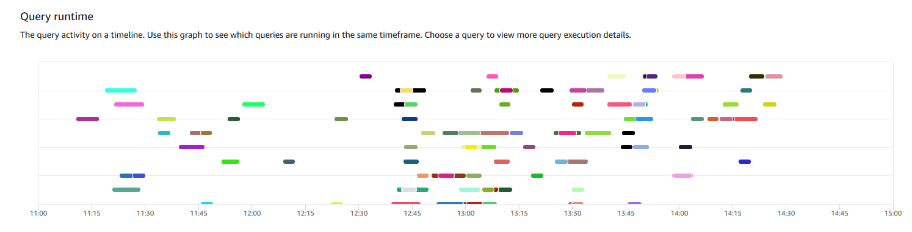
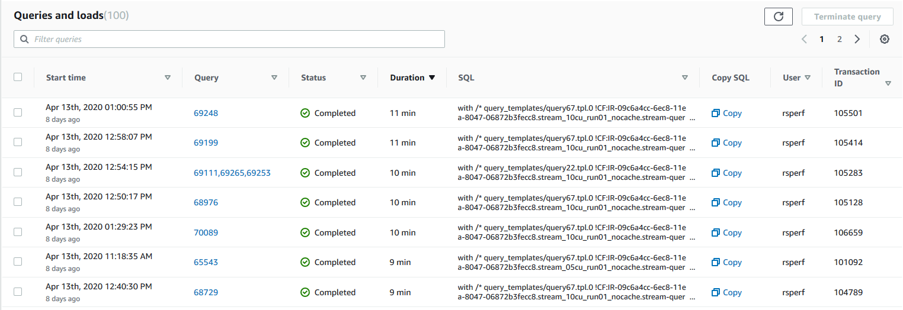
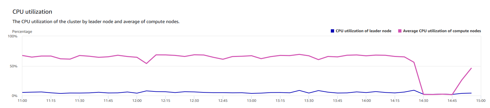
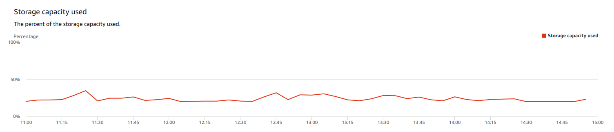
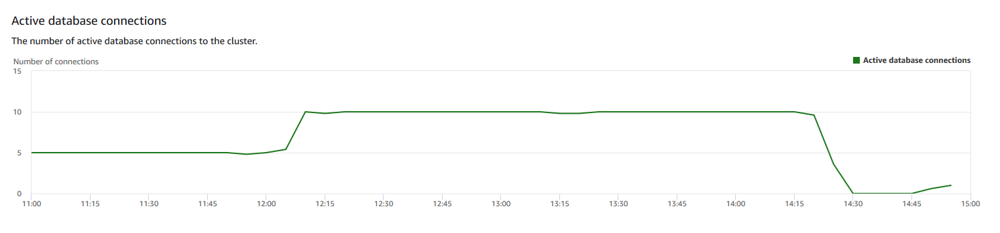

Amazon Redshift will no longer support the creation of new Python UDFs starting November 1, 2025.
If you would like to use Python UDFs, create the UDFs prior to that date.
Existing Python UDFs will continue to function as normal. For more information, see the
[blog post](https://aws.amazon.com/blogs/big-data/amazon-redshift-python-user-defined-functions-will-reach-end-of-support-after-june-30-2026/ "https://aws.amazon.com/blogs/big-data/amazon-redshift-python-user-defined-functions-will-reach-end-of-support-after-june-30-2026/") .

# Viewing query history

data

You can use query history metrics in Amazon Redshift to do the following:

- Isolate and diagnose query performance problems.
- Compare query runtime metrics and cluster performance metrics on the same
  timeline to see how the two might be related. Doing so helps identify poorly
  performing queries, look for bottleneck queries, and determine if you need
  to resize your cluster for your workload.
- Drill down to the details of a specific query by choosing it in the
  timeline. When **Query ID** and other properties are
  displayed in a row below the graph, then you can choose the query to see
  query details. Details include, for example, the query's SQL statement,
  execution details, and query plan. For more information, see [Viewing and analyzing
  query details](performance-metrics-query-execution-details.md "performance-metrics-query-execution-details.md").
- Determine if your load jobs complete successfully and meet your service
  level agreements (SLAs).

###### To display query history data

1. Sign in to the AWS Management Console and open the Amazon Redshift console at
   [https://console.aws.amazon.com/redshiftv2/](https://console.aws.amazon.com/redshiftv2/ "https://console.aws.amazon.com/redshiftv2/").
2. On the navigation menu, choose **Clusters**, then choose
   the cluster name from the list to open its details. The details of the
   cluster are displayed, which can include **Cluster performance**, **Query monitoring**,
   **Databases**, **Datashares**,
   **Schedules**, **Maintenance**, and **Properties** tabs.
3. Choose the **Query monitoring** tab for metrics about
   your queries.
4. In the **Query monitoring** section, choose the
   **Query history** tab.

Using controls on the window, you can toggle between **Query
list** and **Cluster metrics**.

When you choose **Query list**, the tab includes the
following graphs:

    * **Query runtime** – The query activity on
     a timeline. Use this graph to see which queries are running in the
     same timeframe. Choose a query to view more query execution details.
     The x-axis shows the selected period. You can filter the graphed
     queries by running, completed, loads, and so on. Each bar represents
     a query, and the length of the bar represents its runtime from the
     start of the bar to the end. The queries can include SQL data
     manipulation statements (such as SELECT, INSERT, DELETE) and loads
     (such as COPY). By default, the top 100 longest running queries are
     shown for the selected time period.
    * **Queries and loads** – List of queries
     and loads that ran on the cluster. The window includes an option to
     **Terminate query** if a query is currently
     running.

When you choose **Cluster metrics**, the tab includes the
following graphs:

    * **Query runtime** – The query activity on
     a timeline. Use this graph to see which queries are running in the
     same timeframe. Choose a query to view more query execution details.
    * **CPU utilization** – The CPU utilization
     of the cluster by leader node and average of compute nodes.
    * **Storage capacity used** – The percent of
     the storage capacity used.
    * **Active database connections** – The
     number of active database connections to the cluster.

Consider the following when working with the query history graphs:

- Choose a bar that represents a specific query on the **Query
  runtime** chart to see details about that query. You can also,
  choose a query ID on **Queries and loads** list to see its
  details.
- You can swipe to select a section of the **Query
  runtime** chart to zoom in to display a specific time period.
- On the **Query runtime** chart, to have all data
  considered by your chosen filter, page forward through all pages listed on
  the **Queries and loads** list.
- You can change which columns and the number of rows displayed on the
  **Queries and loads** list using the preferences window
  displayed by the **settings gear icon**.
- The **Queries and loads** list can also be displayed by
  navigating from the left navigator **Queries** icon,
  **Queries and loads**. For more information, see [Viewing queries and loads](performance-metrics-queries.md "performance-metrics-queries.md").

## Query history

graphs

The following examples show graphs that are displayed in the new Amazon Redshift console.

###### Note

The Amazon Redshift console graphs only contain data for the latest 100,000 queries.

- **Query runtime**

- **Queries and loads**

- **CPU utilization**

- **Storage capacity used**

- **Active database connections**

