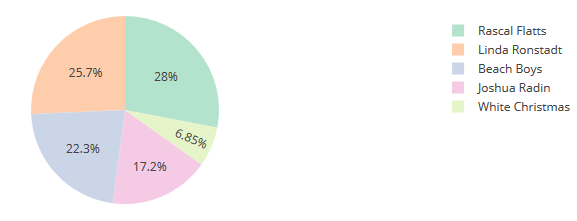
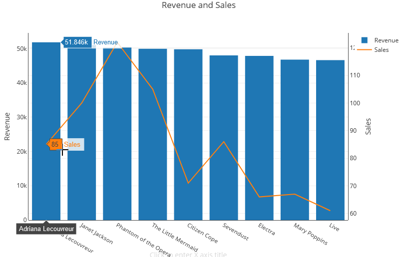

Amazon Redshift will no longer support the creation of new Python UDFs starting Patch 198.
Existing Python UDFs will continue to function until June 30, 2026. For more information, see the
[blog post](https://aws.amazon.com/blogs/big-data/amazon-redshift-python-user-defined-functions-will-reach-end-of-support-after-june-30-2026/ "https://aws.amazon.com/blogs/big-data/amazon-redshift-python-user-defined-functions-will-reach-end-of-support-after-june-30-2026/") .

# Visualizing query results

After you run a query and the results display, you can turn on
**Chart** to display a graphic visualization of the current page of
results. You can use the following controls to define the content, structure, and
appearance of your chart:


Trace

Represents a set of related graphical marks in a chart. You can define
multiple traces in a chart.

Type

You can define the trace type to represent data as one of the
following:

- Scatter chart for a scatter plot or bubble chart.
- Bar chart to represent categories of data with vertical or
  horizontal bars.
- Area chart to define filled areas.
- Histogram that uses bars to represent frequency
  distribution.
- Pie chart for a circular representation of data where each slice
  represents a percentage of the whole.
- Funnel or Funnel Area chart to represent data through various
  stages of a process.
- OHLC (open-high-low-close) chart often used for financial data to
  represent open, high, low, and close values along the x-axis, which
  usually represents intervals of time.
- Candlestick chart to represent a range of values for a category
  over a timeline.
- Waterfall chart to represent how an initial value increases or
  decreases through a series of intermediate values. Values can
  represent time intervals or categories.
- Line chart to represent changes in value over time.

X axis

You specify a table column that contains values to plot along the X axis.
Columns that contain descriptive values usually represent dimensional data.
Columns that contain quantitative values usually represent factual
data.

Y axis

You specify a table column that contains values to plot along the Y axis.
Columns that contain descriptive values usually represent dimensional data.
Columns that contain quantitative values usually represent factual
data.

Subplots

You can define additional presentations of chart data.

Transforms

You can define transforms to filter trace data. You use a split transform
to display multiple traces from a single source trace. You use an aggregate
transform to present a trace as an average or minimum. You use a sort
transform to sort a trace.

General appearance

You can set defaults for background color, margin color, color scales to
design palettes, text style and sizes, title style and size, and mode bar.
You can define interactions for drag, click, and hover. You can define meta
text. You can define default appearances for traces, axes, legends, and
annotations.

###### To create a chart

1. Run a query and get results.
2. Turn on **Charts**.
3. Choose **Trace** and start to visualize your data.
4. Choose a chart style from one of the following:
   - Scatter
   - Bar
   - Area
   - Histogram
   - Pie
   - Funnel
   - Funnel Area
   - OHLC (open-high-low-close)
   - Candlestick
   - Waterfall
   - Line

5. Choose **Style** to customize the appearance, including
   colors, axes, legend, and annotations. You can add text, shapes, and
   images.
6. Choose **Annotations** to add text, shapes, and
   images.
7. Choose **Refresh** to update the chart display. Choose
   **Full screen** to expand the chart display.

## Example: Create a pie chart to

visualize query results

The following example uses the _Sales_ table of
the sample database. For more information, see [Sample database](../dg/c_sampledb.md "../dg/c_sampledb.md") in the
_Amazon Redshift Database Developer Guide_.

Following is the query that you run to provide the data for the pie chart.

```
select top 5 eventname, count(salesid) totalorders, sum(pricepaid) totalsales
from sales, event
where sales.eventid=event.eventid group by eventname
order by 3;

```

###### To create a pie chart for the top event by total sales

1. Run the query.
2. In the query results area, turn on **Chart**.
3. Choose **Trace**.
4. For **Type**, choose **Pie**.
5. For **Values**, choose
   _totalsales_.
6. For **Labels**, choose
   _eventname_.
7. Choose **Style** and then
   **General**.
8. Under **Colorscales**, choose
   **Categorical** and then
   **Pastel2**.



## Example: Create a

combination chart for comparing revenue and sales

Perform the steps in this example to create a chart that combines a bar chart for
revenue data and a line graph for sales data. The following example uses the
_Sales_ table of the tickit sample database.
For more information, see [Sample database](../dg/c_sampledb.md "../dg/c_sampledb.md") in the
_Amazon Redshift Database Developer Guide_.

Following is the query that you run to provide the data for the chart.

```
select eventname, total_price, total_qty_sold
from  (select eventid, total_price, total_qty_sold, ntile(1000) over(order by total_price desc) as percentile
       from (select eventid, sum(pricepaid) total_price, sum(qtysold) total_qty_sold
             from   tickit.sales
             group by eventid)) Q, tickit.event E
       where Q.eventid = E.eventid
       and percentile = 1
order by total_price desc;

```

###### To create a combination chart for comparing revenue and sales

1. Run the query.
2. In the query results area, turn on **Chart**.
3. Under _trace o_, for **Type**, choose
   **Bar**.
4. For **X**, choose _eventname_.
5. For **Y**, choose
   _total_price_.

The bar chart displays with event names along the X axis. 6. Under **Style**, choose **Traces**. 7. For **Name**, enter _Revenue_. 8. Under **Style**, choose **Axes**. 9. For **Titles**, choose **Y** and enter
_Revenue_.

The label _Revenue_ displays on the left Y axis. 10. Under **Structure**, choose
**Traces**. 11. Choose


**Trace**.

The trace 1 options display. 12. For **Type**, choose **Line**. 13. For **X**, choose _eventname_. 14. For **Y**, choose
_total_qty_sold_. 15. Under **Axes To Use**, for **Y Axis**
choose

.

The **Y Axis** displays _Y2_. 16. Under **Style**, choose **Axes**. 17. Under **Titles**, choose **Y2**. 18. For **Name**, enter _Sales_. 19. Under **Lines**, choose
_Y:Sales_. 20. Under **Axis Line**, choose **Show** and
for **Position**, choose **Right**.



## Demo: Build visualizations

using Amazon Redshift query editor v2

For a demo of how to build visualizations, watch the following
video.
