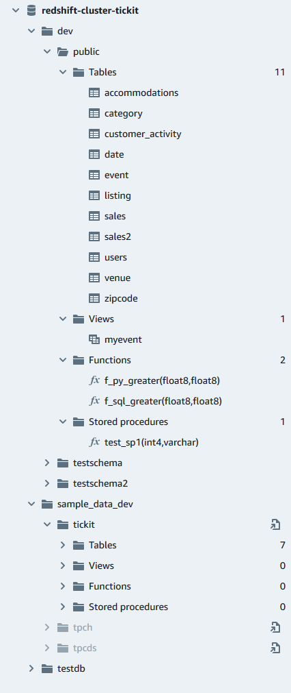

Amazon Redshift will no longer support the creation of new Python UDFs starting November 1, 2025.
If you would like to use Python UDFs, create the UDFs prior to that date.
Existing Python UDFs will continue to function as normal. For more information, see the
[blog post](https://aws.amazon.com/blogs/big-data/amazon-redshift-python-user-defined-functions-will-reach-end-of-support-after-june-30-2026/ "https://aws.amazon.com/blogs/big-data/amazon-redshift-python-user-defined-functions-will-reach-end-of-support-after-june-30-2026/") .

# Browsing an Amazon Redshift database

Within a database, you can manage schemas, tables, views, functions, and stored
procedures in the tree-view panel. Each object in the view has actions associated with
it in a context (right-click) menu.

The hierarchical tree-view panel displays database objects. To refresh the tree-view
panel to display database objects that might have been created after the tree-view was
last displayed, choose the

icon. Open the context (right-click) menu for an object to see what
actions you can perform.

After you choose a table, you can do the following:

- To start a query in the editor with a SELECT statement that queries all
  columns in the table, use **Select table**.
- To see the attributes or a table, use **Show table
  definition**. Use this to see column names, column types, encoding,
  distribution keys, sort keys, and whether a column can contain null values. For
  more information about table attributes, see [CREATE TABLE](../dg/r_CREATE_TABLE_NEW.md "../dg/r_CREATE_TABLE_NEW.md") in the
  _Amazon Redshift Database Developer Guide_.
- To delete a table, use **Delete**. You can either use
  **Truncate table** to delete all rows from the table or
  **Drop table** to remove the table from the database. For
  more information, see [TRUNCATE](../dg/r_TRUNCATE.md "../dg/r_TRUNCATE.md") and [DROP
  TABLE](../dg/r_DROP_TABLE.md "../dg/r_DROP_TABLE.md") in the _Amazon Redshift Database Developer Guide_.
  Choose a schema to **Refresh** or **Drop schema**.

Choose a view to **Show view definition** or **Drop
view**.

Choose a function to **Show function definition** or **Drop
function**.

Choose a stored procedure to **Show procedure definition** or
**Drop procedure**.
