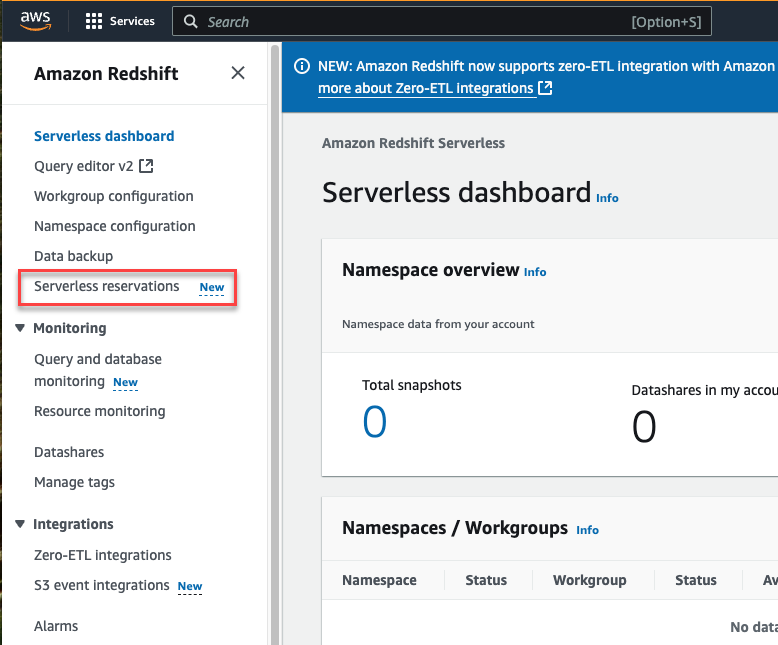
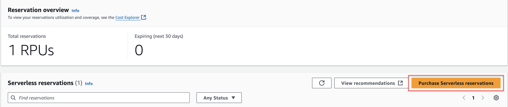
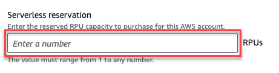
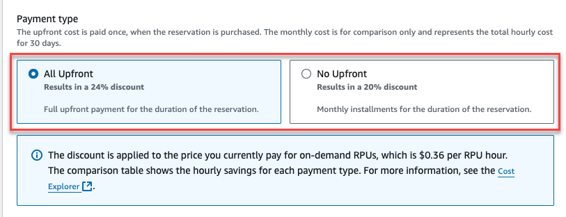
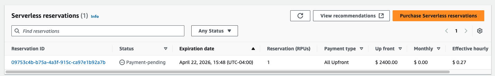
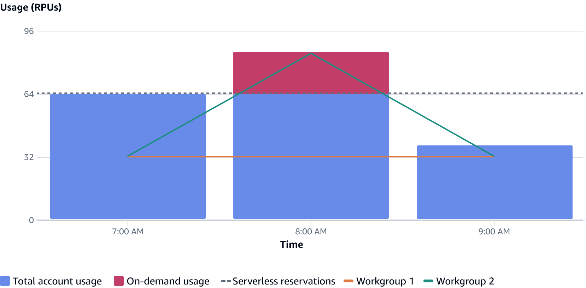

Amazon Redshift will no longer support the creation of new Python UDFs starting November 1, 2025.
If you would like to use Python UDFs, create the UDFs prior to that date.
Existing Python UDFs will continue to function as normal. For more information, see the
[blog post](https://aws.amazon.com/blogs/big-data/amazon-redshift-python-user-defined-functions-will-reach-end-of-support-after-june-30-2026/ "https://aws.amazon.com/blogs/big-data/amazon-redshift-python-user-defined-functions-will-reach-end-of-support-after-june-30-2026/") .

# Billing for serverless reservations

Amazon Redshift Serverless allows you to run and scale analytics without having to provision and manage clusters with a
pay-as-you-go pricing model. Now with serverless reservations, you can further optimize your compute costs and
improve cost predictability of existing and new workloads on Redshift Serverless.

Amazon Redshift manages serverless reservations at the
AWS payer account level, and reservations can be shared between multiple AWS accounts, letting you reduce your compute
costs by up to 24% on all Redshift Serverless workloads in your AWS account. Amazon Redshift bills serverless reservations hourly and
meters reservations per second, offering a consistent billing model, 24 hours a day, seven days a week, while maintaining
flexibility offered by Redshift Serverless. Amazon Redshift charges any usage exceeding the specified RPU level is at standard on-demand rates.

###### Note

If you want to limit on-demand usage, you can use the **Max capacity** setting to set resource-usage limits for your workgroups. For more information,
see [Billing for Amazon Redshift Serverless](serverless-billing.md "serverless-billing.md").

## Benefits of serverless reservations

Serverless reservations are a discounted pricing option for Amazon Redshift Serverless. Serverless reservations
give you the option to
commit to a specified number of Redshift Processing
Units (RPUs) for a year at a discount from on-demand (OD) rates, with no upfront payment. You can
receive a greater discount with an
upfront payment. With serverless reservations, you can optimize your compute costs and improve cost predictability
of existing and new workloads on
Serverless.

Each serverless reservation is purchased at the AWS account level and can be shared between multiple Amazon Redshift Serverless
workgroups in the same payer account. This
gives you flexibility in how the discount is applied. Multiple workgroups with different workload patterns
can share the reservation.

## How a serverless reservation works

Reserving RPUs is a simple process that takes only a few minutes to complete. It includes specifying the RPU level to
reserve and the payment type. Amazon Redshift Serverless uses the standard AWS billing and cost management tool
that helps you determine the reservation level you need and to monitor your usage continuously.
Serverless reservations are managed at the AWS payer account level and can be shared under the same
payer account, and let you reduce your compute costs by up to 24% on all Redshift Serverless workloads in your AWS account.
Serverless reservations are billed hourly and metered per second, offering a consistent billing model,
24 hours a day, seven days a week, while maintaining flexibility offered by Redshift Serverless. Any usage exceeding the
specified RPU level is charged at standard Redshift Serverless on-demand rates.

You can purchase multiple serverless reservations within the same AWS account. When you purchase additional serverless
reservations, they layer on each other. For instance, if you purchase two reservations and choose 100 RPUs
for each, it gives you a total of 200 RPUs at a discounted rate.

###### Note

If you want to set a limit for on-demand usage, you can set the maximum RPUs in the Amazon Redshift Serverless console for a
workgroup by choosing the **Limits** tab and
then selecting **Manage usage limits**.

After you purchase a serverless reservation, it goes into effect immediately and shows up in the Redshift
console in the Serverless reservations dashboard.

## Analyzing your RPU (Redshift Processing Unit) use to determine the reservation level you need

Redshift Serverless Reservations let you lock in predictable, lower compute costs by committing to a specific number of Redshift Processing Units (RPUs) for one year,
giving you discounts over on-demand pricing. These discounts can be up to 20 percent with the no-upfront option, or up to 24 percent when you pay all-upfront.
You purchase Redshift Serverless Reservations at the AWS payer-account level, and your savings automatically apply to any Redshift Serverless workgroup in any AWS
linked account, so you can centrally manage budgets while supporting multiple teams. Redshift Serverless meters the usage at per-second granularity, averaged across each hour,
and then billed hourly, ensuring you pay only for the capacity you use. Redshift Serverless Reservations combine flexible application across accounts with
term-based savings, giving you predictable analytics prices without sacrificing the agility of Redshift Serverless.

### Analyzing RPU Use for Reservations

You can determine your RPU usage levels in one of two ways: You can use the Redshift Serverless dashboard for a seven-day view, or
use Cost Explorer for long term analysis. The following procedures demonstrate how to analyze your RPU use:

###### Method 1: Redshift Serverless Dashboard (7-day view)

1. Sign in to the AWS Management Console and open the Amazon Redshift console at
   [https://console.aws.amazon.com/redshiftv2/](https://console.aws.amazon.com/redshiftv2/ "https://console.aws.amazon.com/redshiftv2/").
2. Open the Serverless dashboard.
3. Choose your workgroup.
4. View RPU capacity usage for a period in length from the last hour up to one week.

###### Method 2: AWS Cost Explorer (Long-term analysis)

1. Sign in to the AWS Management Console and open the Cost Explorer console at
   [https://console.aws.amazon.com/costmanagement/](https://console.aws.amazon.com/costmanagement/ "https://console.aws.amazon.com/costmanagement/").
2. Set Granularity to **Hourly**
3. Group by **Usage type**
4. Apply the following filters:
   - Service: Redshift
   - Region: Your local region
   - Usage type: Filter for **Redshift:ServerlessUsage**

5. Review the Cost and usage graph for hourly serverless usage in your chosen region

## Purchasing a serverless reservation using the console

When you purchase a reservation, you choose the RPU level that will be discounted. Prior to
selecting your RPU level, it’s good to know your base capacity and the on-demand capacity
you use over time. This section shows you how to determine your capacity and reserve a serverless reservation.

To start, in the Redshift console, choose **Serverless**, and then **Serverless reservations** from the menu.



The console shows a description of the feature and a list of existing reservations.
From
here you can purchase a reservation, or you can use the reports and monitoring tools available to check your current usage.
These help you
determine your RPU levels and how many RPUs are appropriate to reserve.

To purchase a reservation, complete the following steps:

1. Choose **Purchase serverless reservations**.

 2. A walk through appears, which has a series of selections. Enter the **Serverless reservation** RPU level to reserve. If you are unsure what this level should be, you can use the tools described further along in this
section.

 3. Set the payment type. You can choose to pay upfront for your reserved RPUs,
or you can pay monthly. If you choose to
pay up front, you get a bigger discount.

 4. When you finish making the selections, choose **Purchase serverless reservations** and then **Confirm**.

After you confirm the reservation, it appears in the list of reservations.



## Usage notes

- You can't change or delete a reservation. But you can create additional reservations to get more coverage.
- Redshift Serverless uses reserved RPUs for a workload prior to using on-demand RPUs, to ensure cost savings.
  If you exceed the number of RPUs that you have reserved, you begin to accrue charges for those additional
  RPUs at the Redshift Serverless on-demand rate.
- Free credits for Amazon Redshift Serverless aren't applied to serverless reservations, only to
  RPUs billed on-demand.

## Serverless reservation examples

In this scenario, your AWS payer/ linked account has two Amazon Redshift workgroups:

- Workgroup 1 has steady state usage, such as for a business-intelligence team.
- Workgroup 2 has unpredictable workloads with spikes in usage, such as for ETL operations.

You want to optimize the costs for these workgroups, so you purchase a one-year serverless reservation.
Based on historical data, you determine that both workgroups consume 64 RPUs at a steady state. Workgroup 2,
however, occasionally increases from 32 RPUs to 48 RPUs and drops to 24 RPUs for short periods. You set the
RPU level of your reservation at 64 RPUs to start, which is aligned with historical trends. The
per-hour billing details are as follows:

- For the first hour, similar to historical usage trends, both workgroups use 32 RPUs for total
  account usage of 64 RPUs. For this hour, all the RPUs are charged at the serverless reservations
  discounted rate. This is because the usage level of 64 RPUs is equal to the 64 RPU serverless reservation.
- For the second hour, workgroup 1 continues to use 32 RPUs. However, workgroup 2 spikes to 48 RPUs,
  for a total account usage of 80 RPUs. For this hour, 64 RPUs are charged at the serverless reservations
  discounted rate, and 16 RPUs are charged at the Redshift Serverless on-demand rate.
- For the third hour, workgroup 1 continues to consume 32 RPUs and workgroup 2 decreases to 8 RPUs.
  In this hour, the account is charged at the 64 RPU serverless reservation rate, even though the account total is
  40 RPU.

See the following diagram for workgroup usage evolution, and on-demand and serverless reservation rates billing details:



## Purchasing a serverless reservation using the AWS CLI or Amazon Redshift API

You use `create-reservation` to create an RPU reservation. The following shows the command:

```
create-reservation
--capacity
--offering-id
```

You set `capacity` to the number of RPUs you want to reserve.
