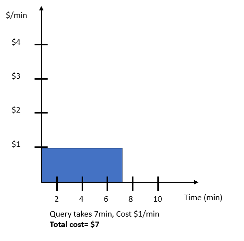
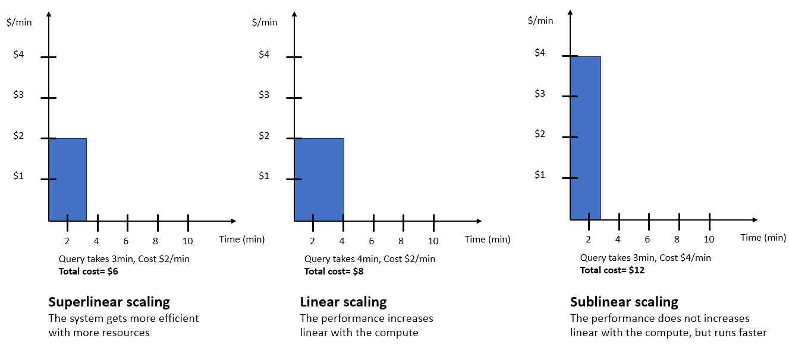

Amazon Redshift will no longer support the creation of new Python UDFs starting November 1, 2025.
If you would like to use Python UDFs, create the UDFs prior to that date.
Existing Python UDFs will continue to function as normal. For more information, see the
[blog post](https://aws.amazon.com/blogs/big-data/amazon-redshift-python-user-defined-functions-will-reach-end-of-support-after-june-30-2026/ "https://aws.amazon.com/blogs/big-data/amazon-redshift-python-user-defined-functions-will-reach-end-of-support-after-june-30-2026/") .

# Compute capacity for Amazon Redshift Serverless

With Amazon Redshift Serverless compute capacity scales automatically up and down to match your
workload requirements. Compute capacity refers to the processing power and memory allocated
to your Amazon Redshift Serverless workloads. Common use cases include handling peak traffic periods, running
complex analytics, or processing large volumes of data efficiently. The following terms
provide details on how Amazon Redshift manages compute capacity.

**RPUs**

Amazon Redshift Serverless measures data warehouse capacity in Redshift Processing Units (RPUs).
RPUs are resources used to handle workloads. One RPU provides 16 GB of memory.

**Base capacity**

This setting specifies the base data warehouse capacity Amazon Redshift uses to serve queries.
Base capacity is specified in RPUs. You can set a base capacity in Redshift Processing Units
(RPUs). Setting a higher base capacity ensures improves query performance , especially for data processing jobs that require a lot
of resources.
The default base capacity for
Amazon Redshift Serverless is 128 RPUs. You can adjust the **Base capacity** setting
from 4 RPUs to 512 RPUs. You can set this value to 4 RPUs, or in units of 8 at or above 8 RPUs (8,16,24...512). You can
set this value using the AWS console, the
`UpdateWorkgroup` API operation, or `update-workgroup` operation
in the
AWS CLI.

With a minimum base capacity of 4 RPU, you have flexibility to run simpler to more
complex workloads based on your data warehouse cost and capacity requirements. The 4 base RPU capacity is targeted towards warehouses
that contain less than 32TB of data, and the 8, 16, and 24 RPU base RPU
capacities are targeted towards workloads that require less than 128TB of data. If your data
requirements are greater than 128 TB, you must use a minimum of 32 base RPUs. In addition, for workloads that
have tables with large number columns and higher concurrency, we recommend using 32 or more base
RPUs.

The maximum base RPUs available, 1024, adds the highest level of computing resources to your workloads.
This provides more flexibility to support workloads of large complexity and accelerates loading and querying data.

###### Note

An expanded maximum base RPU capacity of 1024 is available in the following AWS Regions. In other
regions, the maximum base capacity is 512 RPUs.

- US East (N. Virginia)
- US East (Ohio)
- US West (Oregon)
- Europe (Ireland)
- Europe (Frankfurt)
  You can increment or decrement RPUs in units of 32
  when setting a base capacity between 512-1024.

If you manage larger and more complex workloads, consider increasing the size of your
Redshift Serverless data warehouse. Larger warehouses have access to more compute resources, allowing them to
process queries more efficiently.

Following are some instances where having a higher base capacity is beneficial:

- You have complex queries that take a long time to run
- Your tables have a large number of columns.
- Your queries have a high number of JOINs.
- Your queries aggregate or scan large amounts
  of data from an external source, such as a data lake.

For more information about Amazon Redshift Serverless quotas and limits, go to
[Quotas for Amazon Redshift Serverless objects](amazon-redshift-limits.md#serverless-limits-account "amazon-redshift-limits.md#serverless-limits-account").

## Considerations and limitations

for Amazon Redshift Serverless capacity

The following are considerations and limitations for Amazon Redshift Serverless
capacity. For general Redshift Serverless considerations, see [Considerations when using
Amazon Redshift Serverless](serverless-usage-considerations.md "serverless-usage-considerations.md").

- Configurations of 4 base RPUs support managed storage capacity of up to 32 TB. If you're using
  more than 32 TB of managed storage, you can't set the base RPU to less than 8 RPUs.
- Configurations of 8 or 16 base RPUs support Redshift managed storage capacity of up
  to 128 TB. If you're using more than 128 TB of managed storage, you can't
  set the base to less than 32 RPU.
- Editing your workgroup's base capacity might cancel some of the queries
  running on your workgroup.
- Redshift Serverless scales RPUs for your data warehouse using these increments:
  - 4 to 8 RPUs: Increases in steps of 4 RPUs.
  - 8 to 512 RPUs: Increases in steps of 8 RPUs.
  - 512 to 1024 RPUs: Increases in steps of 32 RPUs.

- Vacuum boost is supported only for 8 RPUs and Above. For 8 RPUs and less, use the following command instead:

```
VACUUM [FULL | SORT ONLY | DELETE ONLY | REINDEX | RECLUSTER] [table_name] [TO threshold PERCENT]
```

### Redshift Serverless with 4 Redshift Processing Units (RPUs) capacity

Redshift Serverless with 4 base RPUs capacity is ideal for smaller or less demanding workloads. This entry
point offers a flexible and cost-effective solution. This entry-level configuration supports data warehouses with up to the following
resources:

- Up to 32 TB of Redshift managed storage.
- A maximum of 100 columns per table
- 64 GB of memory

If you need to exceed these limitations, you must increase your base capacity manually, rather than relying on auto-scaling. Once you scale your data warehouse beyond
4 RPUs, your data warehouse will continue to use more RPUs, and Amazon Redshift won't scale your data warehouse back down to 4 RPUs.

###### Note

You can create tables with more than 100 columns when using 4 base RPUs, however, we recommend that you
limit tables to 100 columns. Exceeding this limit may cause your data warehouse to exhaust its memory during query execution,
which decreases performance.

You can create data warehouses that use 4 RPUs in the following AWS Regions:

- US East (Ohio)
- US East (N. Virginia)
- US West (N. California)
- US West (Oregon)
- Asia Pacific (Mumbai)
- Asia Pacific (Singapore)
- Asia Pacific (Sydney)
- Asia Pacific (Tokyo)
- Europe (Ireland)
- Europe (Stockholm)

## AI-driven scaling and optimization

The AI-driven scaling and optimization feature is available in all AWS
Regions where Amazon Redshift Serverless is available.

Amazon Redshift Serverless offers an advanced AI-driven scaling and optimization feature
to meet diverse workload requirements. Data warehouses may have the following provisioning issues:

- Data warehouses may be over-provisioned to improve performance of resource-intensive queries
- Data warehouses may be under-provisioned to save costs.

Striking the right balance between performance and cost for data warehouse workloads is challenging,
especially with ad-hoc queries and growing data volumes. When running mixed workloads, comprising both
low and high resource-intensive queries, there is a need for intelligent scaling. The AI-driven scaling
and optimization feature automatically scales Serverless compute or RPUs in response to data growth. This feature also helps maintain
query performance within targeted price-performance objectives. The AI-driven scaling and optimization
dynamically allocates compute resources as data volumes increase, ensuring queries continue to meet
performance targets. AI-driven scaling and optimization allows the service to adapt seamlessly to changing
workload requirements, without the need for manual intervention or complex capacity planning.

Amazon Redshift Serverless provides a more comprehensive and responsive scaling solution based on factors such as
query complexity and data volume. This feature allows for optimizing workload price-performance while
maintaining the flexibility to handle varying workloads and growing datasets efficiently. Amazon Redshift Serverless
can automatically make AI-driven optimizations to your Amazon Redshift Serverless endpoint to meet your specified
price-performance targets for your Serverless workgroup. This automatic price-performance optimization
is especially helpful if you don't know what base capacity to set for your workloads, or if some parts
of your workload might benefit from more allocated resources.

**Example**

If your organization typically runs workloads that only require 32 RPU but suddenly introduces a more complex
query, you might not know the appropriate base capacity. Setting a higher base capacity yields better performance
but also incurs higher costs, so the cost might not match your expectations. Using AI-driven scaling and resource optimization,
Amazon Redshift Serverless automatically adjusts the RPUs to meet your price-performance targets while keeping costs optimized for
your organization. This automatic optimization is useful regardless of workload size. The automatic optimization can help
you meet your organization's price-performance targets if you have any number of complex queries.

###### Note

Price-performance targets are a workgroup-specific setting. Different workgroups can have different
price-performance targets.

To keep costs predictable, set a limit of maximum capacity that Amazon Redshift Serverless is allowed to allocate to
your workloads.

To configure price-performance targets, use the AWS console. You must enable your price-performance target
explicitly when you create your Serverless workgroup. You can also modify the price-performance target after you
create the Serverless workgroup. When you enable the price-performance target, it is set to **Balanced** by default.
.

###### To edit the price-performance target for your workgroup

1. In the Amazon Redshift Serverless console, choose **Workgroup configuration**.
2. Choose the workgroup for which you want to edit the price-performance target. Choose the
   **Performance** tab, then choose **Edit**.
3. Choose **Price-performance** target, and adjust the slider to your desired setting.
4. Choose **Save changes**.
5. To update the maximum amount of RPUs that Amazon Redshift Serverless can allocate to your workload, choose the **Limits**
   tab of the **Workgroup Configuration** section.

You can use the **Price-performance target** slider to set your desired balance
between cost and performance. By moving the slider, you can choose one of the following options:

- **Optimizes for cost** — This setting prioritizes cost savings. Amazon Redshift Serverless attempts
  to automatically scale up compute capacity when doing so doesn’t incur additional charges.
  Amazon Redshift Serverless also attempts to scale down compute resources for lower cost, possibly increasing query runtimes.
- **Balanced** — This setting creates a balance between performance and cost. Amazon Redshift Serverless scales
  for performance, and may result in a moderate cost increase or decrease. This is the recommended setting for most Amazon Redshift Serverless
  data warehouses.
- **Optimizes for performance** — This setting prioritizes performance. Amazon Redshift scales aggressively for high performance,
  potentially incurring higher costs.
- Intermediate positions: You can also set the slider to one of two intermediate positions between
  **Balanced** and **Optimizes for cost** or **Optimizes for performance**.
  Use these settings if full optimization for cost or performance is too extreme.

### Considerations when choosing your price-performance target

You can use the price-performance slider to choose your desired price-performance target for your workload.
The AI-driven scaling and optimization algorithm learns over time from your workload history, and improves
prediction and decision accuracy.

**Example**

For this example, assume a query that takes seven minutes and costs $7. The following figure shows the query
runtimes and cost with no scaling.



A given query might scale in a few different ways, as shown below. Based on the price-performance target you choose,
AI-driven scaling predicts how the query trades off performance and cost, and scales it accordingly.
Choosing the different slider options yields the following results:



- **Optimizes for Cost** — With the **Optimizes for Cost**
  option, your data warehouse scales favoring choices that lower your costs. In the preceding example, the super
  linear scaling approach demonstrates this behavior. Scaling will only occur if it can be done in a cost-effective
  manner according to the scaling model predictions. If the scaling models predict that cost-optimized scaling isn’t
  possible for the given workload, then the data warehouse won't scale.
- **Balanced** — With the **Balanced** option, the system
  scales while balancing both cost and performance considerations, with a potential limited increase in cost.
  The **Balanced** option performs superlinear, linear, and possibly sublinear workload scaling.
- **Optimizes for Performance** — With the **Optimizes for Performance**
  option, in addition to the previous methods for improving performances, the system also scales
  even if the costs are higher, and possibly not proportional to the runtime improvement.
  With **Optimizes for Performance**, the system performs superlinear scaling, linear scaling,
  and sublinear scaling if possible. The closer the slider position is to the **Optimizes for Performance**
  position, the more Amazon Redshift Serverless permits sublinear scaling.

Note the following when setting the **Price-Performance** slider:

- You can change the price-performance setting at any time, but the workload scaling won't
  change immediately. The scaling changes over time as the system learns about the current workload.
  We suggest monitoring a Serverless Workgroup for 1-3 days to verify the impact of the new setting.
- The price-performance slider options **Max capacity** and
  **Max RPU-hours** work together. **Max capacity** and
  **Max RPU-hours** are the controls to limit the maximum RPUs that Amazon Redshift Serverless allows
  the data warehouse to scale, and the maximum RPU hours that Amazon Redshift Serverless allows the data warehouse to consume.
  Amazon Redshift Serverless always honors and enforces these settings, regardless of the price-performance
  target setting.

### Monitoring resource autoscaling

You can monitor the AI-driven RPU scaling in the following ways:

- Review the RPU capacity used graph on the Amazon Redshift console.
- Monitor the `ComputeCapacity` metric under `AWS/Redshift-Serverless`
  and `Workgroup` in CloudWatch.
- Query the
  [SYS_QUERY_HISTORY](../dg/SYS_QUERY_HISTORY.md "../dg/SYS_QUERY_HISTORY.md")
  view. Provide
  the specific query ID or query text to identify the time period. Use this time period to query the
  [SYS_SERVERLESS_USAGE](../dg/SYS_SERVERLESS_USAGE.md "../dg/SYS_SERVERLESS_USAGE.md") system view to find the
  `compute_capacity` value. The `compute_capacity` field shows the RPUs scaled
  during the query runtime.

Use the following example to query the `SYS_QUERY_HISTORY` view. Replace the sample value with
your query text.

```
select query_id,query_text,start_time,end_time, elapsed_time/1000000.0 duration_in_seconds
from sys_query_history
where query_text like '`<query_text>`'
and query_text not like '%sys_query_history%'
order by start_time desc
```

Run the following query to see how `compute_capacity` scaled during the period from
`start_time` to `end_time`. Replace `start_time` and `end_time`
in the following query with the output of the preceding query:

```
select * from sys_serverless_usage
where end_time >= '`start_time`'
and end_time <= DATEADD(minute,1,'`end_time`')
order by end_time asc
```

For step-by-step instructions for using these features, see
[Configure monitoring, limits, and alarms in Amazon Redshift Serverless to keep costs predictable](https://aws.amazon.com/blogs/big-data/configure-monitoring-limits-and-alarms-in-amazon-redshift-serverless-to-keep-costs-predictable/ "https://aws.amazon.com/blogs/big-data/configure-monitoring-limits-and-alarms-in-amazon-redshift-serverless-to-keep-costs-predictable/") .

### Considerations when using

AI-driven scaling and optimization

Consider the following when using AI-driven scaling and optimization:

- For existing workloads on Amazon Redshift Serverless requiring 32 to 512 Base RPU,
  we recommend using Amazon Redshift Serverless AI-driven scaling and optimization for optimal results.
  We do not recommend using this feature for less than 32 Base RPU or more than 512 Base RPU workloads.
- Price-performance targets automatically optimize the workload, though results may vary.
  We recommend using this feature over time so the system can learn your specific patterns by running a
  representative workload.
- AI-driven scaling and optimization uses optimal times to apply optimizations to
  Serverless workgroups depending on the workload running on your Amazon Redshift Serverless instance.

To learn more about AI-driven optimizations and resource scaling, watch the following
video.
