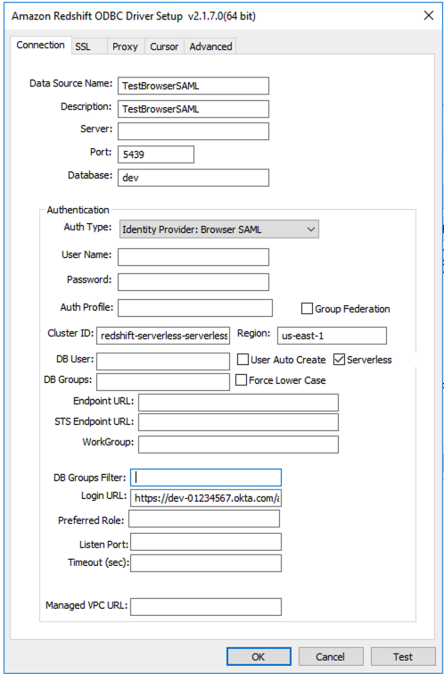

Amazon Redshift will no longer support the creation of new Python UDFs starting November 1, 2025.
If you would like to use Python UDFs, create the UDFs prior to that date.
Existing Python UDFs will continue to function as normal. For more information, see the
[blog post](https://aws.amazon.com/blogs/big-data/amazon-redshift-python-user-defined-functions-will-reach-end-of-support-after-june-30-2026/ "https://aws.amazon.com/blogs/big-data/amazon-redshift-python-user-defined-functions-will-reach-end-of-support-after-june-30-2026/") .

# Migrating a provisioned cluster to

Amazon Redshift Serverless

You can migrate your existing provisioned clusters to Amazon Redshift Serverless, enabling
on-demand and automatic scaling of compute resources. Migrating a provisioned cluster to
Amazon Redshift Serverless allows you to optimize costs by paying only for the resources you use and
automatically scaling capacity based on workload demands. Common use cases for the migration
include running ad-hoc queries, periodic data processing jobs, or handling unpredictable
workloads without over-provisioning resources. Perform the following set of tasks to migrate
your provisioned Amazon Redshift cluster to the serverless deployment option.

## Creating a snapshot of your provisioned

cluster

###### Note

Amazon Redshift automatically converts interleaved keys to compound keys
when you restore a provisioned cluster snapshot to a serverless namespace.

To transfer data from your provisioned cluster to Amazon Redshift Serverless, create a
snapshot of your provisioned cluster, and then restore the snapshot in
Amazon Redshift Serverless.

###### Note

Before you migrate your data to a serverless workgroup, ensure that your
provisioned cluster needs are compatible with the amount of RPU you choose in
Amazon Redshift Serverless.

To create a snapshot of your provisioned cluster

1. Sign in to the AWS Management Console and open the Amazon Redshift console at
   [https://console.aws.amazon.com/redshiftv2/](https://console.aws.amazon.com/redshiftv2/ "https://console.aws.amazon.com/redshiftv2/").
2. On the navigation menu, choose **Clusters**,
   **Snapshots**, and then choose **Create
   snapshot**.
3. Enter the properties of the snapshot definition, then choose **Create
   snapshot**. It might take some time for the snapshot to be
   available.

To restore a provisioned cluster snapshot to a serverless namespace:

1. Sign in to the AWS Management Console and open the Amazon Redshift console at
   [https://console.aws.amazon.com/redshiftv2/](https://console.aws.amazon.com/redshiftv2/ "https://console.aws.amazon.com/redshiftv2/").
2. Start on the Amazon Redshift provisioned cluster console and navigate to the
   **Clusters**, **Snapshots** page.
3. Choose a snapshot to use.
4. Choose **Restore snapshot**, **Restore to serverless
   namespace**.
5. Choose a namespace to restore your snapshot to.
6. Confirm you want to restore from your snapshot. This action replaces all the
   databases in your serverless endpoint with the data from your provisioned cluster.
   Choose **Restore**.

For more information about provisioned cluster snapshots, see [Amazon Redshift
snapshots](working-with-snapshots.md "working-with-snapshots.md").

## Connecting to Amazon Redshift Serverless using a

driver

To connect to Amazon Redshift Serverless with your preferred SQL client, you can use the
Amazon Redshift provided [JDBC driver version 2.x](jdbc20-install.md "jdbc20-install.md"). We recommend connecting to Amazon Redshift using
the latest version of the Amazon Redshift JDBC driver version 2.x.
The port number is optional. If you don’t include it,
Amazon Redshift Serverless defaults to port number 5439. You can change to another port from the
port range of 5431-5455 or 8191-8215. To change the default port for a serverless
endpoint, use the AWS CLI and Amazon Redshift API.

To find the exact endpoint to use for the JDBC, ODBC, or Python driver, see
**Workgroup configuration** in Amazon Redshift Serverless. You can also use the
Amazon Redshift Serverless API operation `GetWorkgroup` or the AWS CLI operation
`get-workgroups` to return information about your workgroup, and then
connect.

### Connecting using

password-based authentication

To establish a connection using the Amazon Redshift JDBC driver version 2.x with password-based authentication, use the following syntax:

```
jdbc:redshift://<`workgroup-name`>.<`account-number`>.<`aws-region`>.redshift-serverless.amazonaws.com:5439/?username=`username`&password=`password`
```

To establish a connection using the Amazon Redshift Python connector with password-based authentication, use the following syntax:

```
import redshift_connector
with redshift_connector.connect(
    host='<`workgroup-name`>.<`account-number`>.<`aws-region`>.redshift-serverless.amazonaws.com',
    database='<`database-name`>',
    user='`username`',
    password='`password`'
    # port value of 5439 is specified by default
) as conn:
    pass
```

To establish a connection using the Amazon Redshift ODBC driver version 2.x with password-based authentication, use the following syntax:

```
Driver={Amazon Redshift ODBC Driver (x64)}; Server=<`workgroup-name`>.<`account-number`>.<`aws-region`>.redshift-serverless.amazonaws.com; Database=`database-name`; User=`username`; Password=`password`
```

### Connecting using IAM

If you prefer logging in with IAM, use the Amazon Redshift Serverless
[`GetCredentials`](../../../redshift-serverless/latest/APIReference/API_GetCredentials.md "../../../redshift-serverless/latest/APIReference/API_GetCredentials.md") API operation.

To use IAM authentication, add `iam:` to the Amazon Redshift JDBC URL
following `jdbc:redshift:`, as shown in the following example.

```
jdbc:redshift:iam://<`workgroup-name`>.<`account-number`>.<`aws-region`>.redshift-serverless.amazonaws.com:5439/<`database-name`>
```

This Amazon Redshift Serverless endpoint doesn’t support customizing dbUser,
dbGroup, or auto-create. By default, the driver
automatically creates database users at login. It then assigns the users to
Amazon Redshift database roles based on the tags specified in IAM, or based on the groups
defined in your identity provider (IdP).

Ensure that your AWS identity has the correct IAM policy for the
`redshift-serverless:GetCredentials` action. The following is an
example IAM policy that grants the correct permissions to an AWS identity to
connect to Amazon Redshift Serverless. For more information about IAM permissions, see [Adding and removing IAM identity permissions](../../../IAM/latest/UserGuide/access_policies_manage-attach-detach.md "../../../IAM/latest/UserGuide/access_policies_manage-attach-detach.md") in the _IAM User Guide_.

JSON

```
`{
 "Version":"2012-10-17",
 "Statement": [
 {
 "Sid": "",
 "Effect": "Allow",
 "Action": "redshift-serverless:GetCredentials",
 "Resource": "*"
 }
 ]
}`

```

To establish a connection using the Amazon Redshift Python connector with IAM based authentication,
use `iam=true` in your code, as shown in the following syntax:

```
import redshift_connector
with redshift_connector.connect(
    iam=True,
    host='<`workgroup-name`>.<`account-number`>.<`aws-region`>.redshift-serverless.amazonaws.com',
    database='<`database-name`>'
    <`IAM credentials`>
) as conn:
    pass
```

For `IAM credentials`, you can use any credentials, including the following:

- AWS profile configuration.
- IAM credentials (an access key ID, secret access key, and optionally a session token).
- Identity provider federation.

To establish a connection using the Amazon Redshift ODBC driver version 2.x with IAM based authentication and a profile, use the following syntax:

```
Driver={Amazon Redshift ODBC Driver (x64)}; IAM=true; Server=<`workgroup-name`>.<`account-number`>.<`aws-region`>.redshift-serverless.amazonaws.com; Database=`database-name`; Profile=`aws-profile-name`;
```

### Connecting using IAM

with the GetClusterCredentials API

###### Note

When connecting to Amazon Redshift Serverless, we recommend that you use the [`GetCredentials`](../../../redshift-serverless/latest/APIReference/API_GetCredentials.md "../../../redshift-serverless/latest/APIReference/API_GetCredentials.md") API.
This API offers comprehensive role-based access control (RBAC) functionality as well as other new features that
aren't available in `GetClusterCredentials`. We support the `GetClusterCredentials` API to simplify the transition from
provisioned clusters to serverless workgroups, but we strongly recommend migrating to using
`GetCredentials` as soon as possible for optimal compatibility.

You can establish a connection to Amazon Redshift Serverless using the [`GetClusterCredentials`](../APIReference/API_GetClusterCredentials.md "../APIReference/API_GetClusterCredentials.md") API. To implement this authentication method,
modify your client or application by incorporating the following parameters:

- `iam=true`
- `clusterid/cluster_identifier=redshift-serverless-<`workgroup-name`>`
- `region=<`aws-region`>`

The following examples demonstrate the BrowserSAML plugin across all three drivers.
This represents one of several available authentication approaches. The examples
can be modified to use alternative authentication methods or plugins according
to your specific requirements.

#### IAM policy permissions for GetClusterCredentials

Following is a sample IAM policy with the permissions required to use `GetClusterCredentials` with Amazon Redshift Serverless:

JSON

```
`{
 "Version":"2012-10-17",
 "Statement": [
 {
 "Sid": "VisualEditor0",
 "Effect": "Allow",
 "Action": [
 "redshift-serverless:GetWorkgroup",
 "redshift-serverless:GetNamespace",
 "redshift:GetClusterCredentials",
 "redshift:CreateClusterUser",
 "redshift:JoinGroup",
 "redshift:ExecuteQuery",
 "redshift:FetchResults",
 "redshift:DescribeClusters",
 "redshift:DescribeTable"
 ],
 "Resource": [
 "arn:aws:redshift-serverless:us-east-1:`111122223333`:workgroup/`workgroup-name`",
 "arn:aws:redshift-serverless:us-east-1:`111122223333`:namespace/`namespace-name`",
 "arn:aws:redshift:us-east-1:`111122223333`:cluster:`cluster-name`",
 "arn:aws:redshift:us-east-1:`111122223333`:dbuser:`database-name`/${redshift:DbUser}"
 ]
 }
 ]
}`

```

To establish a connection using the Amazon Redshift JDBC driver version 2.x with `GetClusterCredentials`, use the following syntax:

```
jdbc:redshift:iam://redshift-serverless-<`workgroup-name`>:<`aws-region`>/<`database-name`>?plugin_name=com.amazon.redshift.plugin.BrowserSamlCredentialsProvider&login_url=<`single sign-on URL from IdP`>"
```

To establish a connection using the Amazon Redshift Python connector with `GetClusterCredentials`, use the following syntax:

```
import redshift_connector
with redshift_connector.connect(
    iam=True,
    cluster_identifier='redshift-serverless-<`workgroup-name`>',
    region='<`aws-region`>',
    database='<`database-name`>',
    credentials_provider='BrowserSamlCredentialsProvider'
    login_url='<`single sign-on URL from IdP`>'
    # port value of 5439 is specified by default
) as conn:
    pass
```

To establish a connection using the Amazon Redshift ODBC driver version 2.x with `GetClusterCredentials`, use the following syntax:

```
Driver= {Amazon Redshift ODBC Driver (x64)}; IAM=true; isServerless=true; ClusterId=redshift-serverless-<`workgroup-name`>; region=<`aws-region`>; plugin_name=BrowserSAML;login_url=<`single sign-on URL from IdP`>
```

Following is an example ODBC DSN configuration in Windows:



## Using the Amazon Redshift Serverless SDK

If you wrote any management scripts using the Amazon Redshift SDK, you must use the new
Amazon Redshift Serverless SDK to manage Amazon Redshift Serverless and associated resources. For more information about
available API operations, see the [Amazon Redshift Serverless API
Reference guide](../../../redshift-serverless/latest/APIReference/Welcome.md "../../../redshift-serverless/latest/APIReference/Welcome.md").
