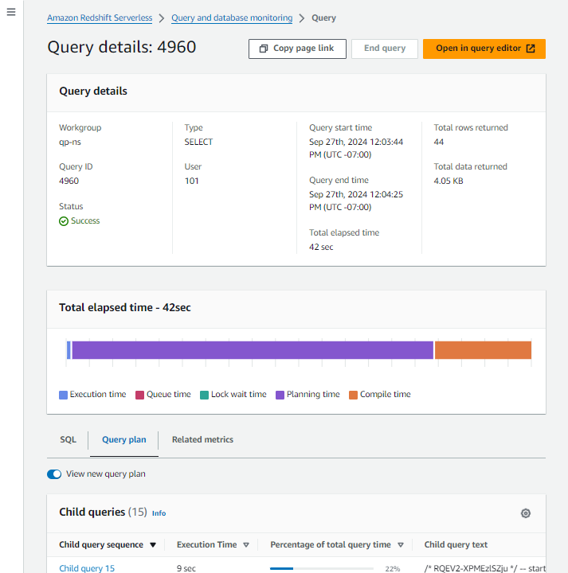
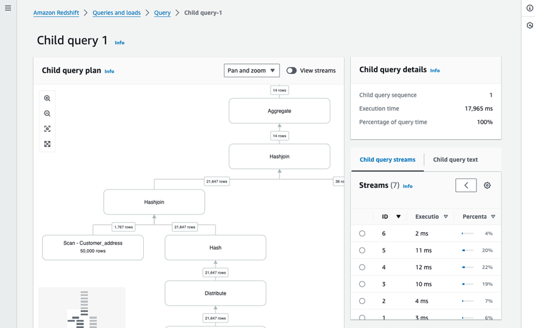
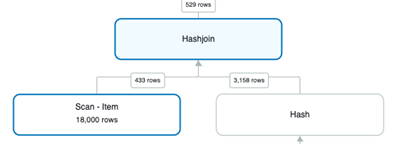
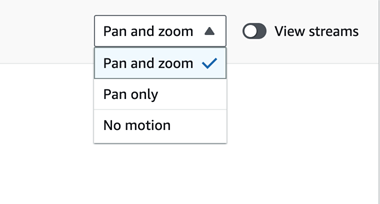

Amazon Redshift will no longer support the creation of new Python UDFs starting November 1, 2025.
If you would like to use Python UDFs, create the UDFs prior to that date.
Existing Python UDFs will continue to function as normal. For more information, see the
[blog post](https://aws.amazon.com/blogs/big-data/amazon-redshift-python-user-defined-functions-will-reach-end-of-support-after-june-30-2026/ "https://aws.amazon.com/blogs/big-data/amazon-redshift-python-user-defined-functions-will-reach-end-of-support-after-june-30-2026/") .

# Query profiler

This document describes Query profiler, a graphical tool for analyzing a query's components and performance.

Query profiler is a query monitoring and troubleshooting feature that's viewable
through the Amazon Redshift console. It's helpful for analyzing query performance. Its primary
purpose is to show a visual and graphical run order, execution plan, and statistics about a query,
and make them easier to understand and troubleshoot. Query profiler helps you analyze the following
types of query components:

- **Child queries** – A child query is a portion of work from a query. Amazon Redshift may
  split a query into multiple child queries if it's more efficient than processing it as a single large
  query. In the profiler you can see the properties of each child query. A child query is made up of streams and
  additional sub-components.

The types of child query that Query profiler shows typically include the following:

    + **Temp table query**: The text of this child query starts with the
     `CREATE TEMP TABLE` command. This child query creates temporary tables for other child queries to process.
    + **Statistics query**: Query profiler adds the following comment
     to the start of this child query to help identify it:


    ```
    -- collect statistics of child query `queryID`
    ```

    This child query
     collects information that the Amazon Redshift query engine uses to optimize performance.

###### Note

Query Profiler shows the query that the user provides as the final child query that Amazon Redshift runs.

- **Streams** – A stream is a collection of segments parceled over available
  compute-node slices. Each child query is made up of one or more segments. In Query profiler, you can see the
  properties of each stream, such as its execution time. By
  glancing through the list of streams, it's likely that you can quickly find
  performance bottlenecks.
- **Segments** – A segment is a combination of several steps that a single process
  can run. A segment is also the smallest compilation unit executable by a compute node slice. A slice is the unit of parallel
  processing in Amazon Redshift. The segments in a stream run in parallel. Query profiler doesn't show segments graphically, but you
  can access the segment information for a step in that step's details pane.
- **Steps** –
  Each segment is made up of a collection of steps. A step
  is a piece of work in a query. Steps can include a _hashjoin_, for example,
  or a _scan_, which is the reading of records from a table.
  For more information about streams, segments, and steps, see [Query planning and execution workflow](../dg/c-query-planning.md "../dg/c-query-planning.md") in the _Amazon Redshift Database Developer Guide_.

Query profiler displays information returned by the `SYS_QUERY_HISTORY`,
`SYS_QUERY_DETAIL`, `SYS_QUERY_EXPLAIN`, and `SYS_CHILD_QUERY_TEXT`
views. For more information about these views, see
[SYS_QUERY_HISTORY](../dg/SYS_QUERY_HISTORY.md "../dg/SYS_QUERY_HISTORY.md"),
[SYS_QUERY_DETAIL](../dg/SYS_QUERY_DETAIL.md "../dg/SYS_QUERY_DETAIL.md"),
[SYS_QUERY_EXPLAIN](../dg/SYS_QUERY_EXPLAIN.md "../dg/SYS_QUERY_EXPLAIN.md"), and
[SYS_CHILD_QUERY_TEXT](../dg/SYS_CHILD_QUERY_TEXT.md "../dg/SYS_CHILD_QUERY_TEXT.md")
in the _Amazon Redshift Database Developer Guide_.

Query profiler only displays query information for queries that have recently run on the database.
A query that completes using prepopulated cache data rather than running against the database won't have a query profile
if information wasn't previously available for it.
This is because Amazon Redshift doesn't generate a query plan for it.

## Prerequisites for using Query profiler

The SYS monitoring views are designed for ease of use and reduced complexity, providing a complete array of
metrics for effective monitoring and troubleshooting. The SYS monitoring views also guarantee
query history for the past seven days regardless of the size or activity of the cluster.
Users only have visibility for queries that they ran, while super users have visibility for queries from all users.

Your IAM user account or role needs permissions to access the **Query and database monitoring** section
of the console. This section describes how to add permissions to a user account or role.

Use the following policy to add minimum permissions to your IAM user account or role:

JSON

```
`{
 "Version":"2012-10-17",
 "Statement": [
 {
 "Effect": "Allow",
 "Action": [
 "redshift:DescribeClusters",
 "redshift-serverless:ListNamespaces",
 "redshift-serverless:ListWorkgroups",
 "redshift-data:ExecuteStatement",
 "redshift-data:DescribeStatement",
 "redshift-data:GetStatementResult"
 ],
 "Resource": [
 "arn:aws:redshift-serverless:`us-east-1`:`111122223333`:*",
 "arn:aws:redshift:`us-east-1`:`111122223333`:*"
 ]
 }
 ]
}`

```

###### Topics

- [Granting query monitoring permissions for a role](#using-query-plan-profiler-prereqs-role "#using-query-plan-profiler-prereqs-role")
- [Granting query monitoring permissions for a user](#using-query-plan-profiler-prereqs-user "#using-query-plan-profiler-prereqs-user")
- [Temporary credentials using your IAM identity](#using-query-plan-profiler-prereqs-temp-iam "#using-query-plan-profiler-prereqs-temp-iam")

### Granting query monitoring permissions for a role

Users with a role that has the `sys:monitor` permission can view all queries.
Users with a role that has the `sys:operator` permission can cancel queries, analyze query history,
and perform vacuum operations.

###### To grant query monitoring permission for a role

1. Use the following command to provide system monitor access, where `role-name`
   is the name of the role for which you want to provide access.

```
grant role sys:monitor to "IAMR:`role-name`";
```

2. (Optional) Use the following command to provide system operator access, where `role-name`
   is the name of the role for which you want to provide access.

```
grant role sys:operator to "IAMR:`role-name`";
```

### Granting query monitoring permissions for a user

Users with the `sys:monitor` permission can view all queries.
Users with the `sys:operator` permission can cancel queries, analyze query history,
and perform vacuum operations.

###### To grant query monitoring permission for a user

1. Use the following command to provide system monitor access, where `user-name`
   is the name of the user for which you want to provide access.

```
grant role sys:monitor to "IAMR:`user-name`";
```

2. (Optional) Use the following command to provide system operator access, where `-name`
   is the name of the user for which you want to provide access.

```
grant role sys:operator to "IAMR:`user-name`";
```

### Temporary credentials using your IAM identity

This option is only available when connecting to a cluster. With this
method, Query Profiler maps a user name to your IAM identity and generates a
temporary password to connect to the database as your IAM identity. A user
using this method to connect must be allowed IAM permission to
`redshift:GetClusterCredentialsWithIAM`. To prevent users
from using this method, modify their IAM user or role to deny this
permission.

## Accessing Query profiler in the Amazon Redshift console

to analyze a query

You can access Query Profiler for either Amazon Redshift serverless or Amazon Redshift provisioned. See the following sections for details:

###### Topics

- [Accessing Query profiler in the Amazon Redshift console
  for Amazon Redshift Serverless](#using-query-plan-profiler-accessing-serverless "#using-query-plan-profiler-accessing-serverless")
- [Accessing Query profiler in the Amazon Redshift console
  for Amazon Redshift Provisioned](#using-query-plan-profiler-accessing-provisioned "#using-query-plan-profiler-accessing-provisioned")

### Accessing Query profiler in the Amazon Redshift console

for Amazon Redshift Serverless

To access Query profiler for Amazon Redshift Serverless, do the following:

- Open the Amazon Redshift serverless console.
- On the navigation pane, under **Monitoring**, choose
  **Query and database monitoring**.
- Choose a workgroup.
- Choose **Queries and database monitoring**.
- Choose a query.
- Choose the **Query plan** tab in the **Query details**
  page.

If a query plan is available,
you will see a list of child queries. Choose a query to view it in Query profiler.

### Accessing Query profiler in the Amazon Redshift console

for Amazon Redshift Provisioned

To access Query profiler for Amazon Redshift Provisioned, do the following:

- Open the the Amazon Redshift Provisioned clusters dashboard.
- Choose a cluster
- Choose **Query monitoring**.
- Connect to a database
- Choose **Queries and database monitoring.**
- Choose a query.

If a query plan is available, you will see a list of child queries. Choose a query to view it in Query profiler.

## Query profiler user interface

Query profiler uses the following pages to display information about your query:

- **[Query details page](#using-query-plan-profiler-ui-query-details "#using-query-plan-profiler-ui-query-details")** – This page displays statistics and child queries for your query.
- **[Child query page](#using-query-plan-profiler-ui-child-query "#using-query-plan-profiler-ui-child-query")** – This page displays statistics, streams, and a visual representation of
  the execution plan for a child query. The console displays
  this page when you choose a child query from the **Child queries** list in the **Query and database monitoring**
  page.

### Query details page



The Query details page has the following components:

- **Top pane** – The pane at the top of the page shows details about the
  query, such as the status and type. For information
  about the source of the information that the top pane shows, see
  [SYS_QUERY_HISTORY](../dg/SYS_QUERY_HISTORY.md "../dg/SYS_QUERY_HISTORY.md")
  in the _Amazon Redshift Database Developer Guide_.
- **SQL tab** – This tab of the bottom panel shows the SQL text
  for the original user query.
- **Query plan tab** – This tab of the bottom panel
  shows a list of the child queries that Amazon Redshift uses
  to prepare data and statistics for the user query. By default, the **Child queries** list shows
  information and aggregated statistics about each child query.
  For information about the source of the information that this page shows, see
  [SYS_QUERY_DETAIL](../dg/SYS_QUERY_DETAIL.md "../dg/SYS_QUERY_DETAIL.md") in the
  _Amazon Redshift Database Developer Guide_.

You can add or remove columns from the **Child queries** list using the Preferences menu.

- **Related metrics** – This tab of the bottom panel
  shows the following CloudWatch metrics for the query:

      + **RPU capacity used** (for serverless workgroups): The compute capacity used by
       the query, measured in Redshift Processing Units (RPUs).
       For more information, see [Compute capacity for Amazon Redshift Serverless](serverless-capacity.md "serverless-capacity.md").
      + **Cluster health status**,
       **CPU Utilization**,
       **Storage capacity used** (for provisioned clusters): The status and
       system resources the query used.
      + **Active database connections**: the `DatabaseConnections`
       metric for the query.

  For more information about CloudWatch metrics, see [Performance data in Amazon Redshift](metrics-listing.md "metrics-listing.md").

### Child query page



The Child query page has the following components:

- **Child queries pulldown** – This control shows the sequence name and the execution time for
  each child query. You can navigate to other child queries by selecting them in this control.
- **Side panel** – This panel contains tabs for displaying the
  child query streams and the child query text.
- **Child query streams tab** – This tab of the top panel displays
  the following:
  - **Streams** – This pane shows the list of streams in the
    child query. This pane shows information and aggregated data about the streams that Amazon Redshift uses to
    optimize the query. For information about the details in this pane, see
    [SYS_QUERY_DETAIL](../dg/SYS_QUERY_DETAIL.md "../dg/SYS_QUERY_DETAIL.md")
    in the _Amazon Redshift Database Developer Guide_.

  You can add or remove columns from the **Streams** pane using the Preferences
  menu. You access the Preferences menu using the gear icon in the **Streams** pane.
  - **Child query pane** – A graphical representation of the steps
    in the child query. For information about the **Child query** pane, see
    [Child query pane](#using-query-plan-profiler-child-query-pane "#using-query-plan-profiler-child-query-pane") following.

- **Child query text tab** – This tab of the top panel shows
  the SQL code for the child query.
- **Child query details pane** – This pane in the right panel shows
  details about the child query. For information about the details in this pane, see
  [SYS_QUERY_DETAIL](../dg/SYS_QUERY_DETAIL.md "../dg/SYS_QUERY_DETAIL.md")
  in the _Amazon Redshift Database Developer Guide_.
- **Stream details pane** – When you choose a stream in the **Streams**
  pane, the **Stream details** pane shows information about the stream. For information about the details
  in this panel, see [SYS_QUERY_DETAIL](../dg/SYS_QUERY_DETAIL.md "../dg/SYS_QUERY_DETAIL.md")
  in the _Amazon Redshift Database Developer Guide_.
- **Step details pane** – When you choose a step in either the
  **Streams** pane or the graph in the **Child query plan**, the **Step details**
  pane shows information about the step, For information about the details in this pane, see
  [SYS_QUERY_DETAIL](../dg/SYS_QUERY_DETAIL.md "../dg/SYS_QUERY_DETAIL.md")
  in the _Amazon Redshift Database Developer Guide_.:

## Child query pane

Query profiler displays the child query in the **Child query** pane
as a graphical representation of the steps
in the selected child query.

The **Child query** pane displays the run order and the relationships
between the steps. For example, if a step joins the output from two other steps, the **Child query**
pane shows the step
as a tree node with two nodes feeding into it:



The **Child query** pane doesn't show the streams that contain the steps by default. To show the
streams that Amazon Redshift uses to logically partition the steps in the child query, choose **View streams**.
When you choose **View streams**, the **Child query** pane shows the steps
contained by the query's streams.

The **Child query** pane doesn't show segment information. To see the segment for a step, choose
the step. The **Step details** pane then shows the segment for the step.

### Navigation in the Child query pane

In the **Child query** pane, you can choose steps to see detailed information about them. You can
also pan and zoom the workspace to better visualize the steps in your query plan.

You can choose nodes, pan, and zoom in the **Child query** plan using the following methods:

- **Using the mouse** – You can choose nodes, click and drag the workspace to pan, and
  hold `Ctrl` (Windows) or `CMD` (Mac) and mousewheel to zoom. Choosing a node causes the workspace to zoom and pan to highlight
  that node. If you choose a stream in the workspace, that stream
  highlights in the **Streams** list. If you choose a step in the workspace, the **Step details**
  pane shows information about that step.
- **Using the zoom and fit controls in the upper left of the workspace** – These controls
  let you zoom in, zoom out, zoom to fit the entire workspace, and enter fullscreen mode. When you zoom to fit
  the entire query plan, the workspace centers the query plan both horizontally and vertically.
- **Using the minimap in the lower right of the workspace** – You can pan or zoom
  the workspace by using the minimap control in the lower left corner of the workspace.
- **Choosing a stream in the **Streams** pane** –
  If you choose a stream in the **Streams** pane, the workspace pans and zooms to show the
  selected stream, and shows information about the stream in the **Stream details** pane.
- **Choosing a step in the **Stream details** pane** –
  If you choose a step in the **Stream details** pane, the workspace pans and zooms to show the
  selected step, and shows information about the step in the **Step details** pane.

###### Note

When you choose a step, either in the workspace or a different pane, the workspace
attempts to zoom and pan such that the selected step is best visible.

When you choose a stream or step from either the workspace or another pane, the workspace will only zoom and pan
to that stream or step if you have **Pan & Zoom** selected in the upper right control in the
workspace. You can restrict this behavior to panning and zooming, panning only, or no
movement by choosing the appropriate setting in the pulldown.



## Troubleshooting queries with Query profiler

If you're troubleshooting a query, you can choose a child query to determine which stream uses the
highest **Percentage of total query time**. This is a quick way to determine which part of your query should be analyzed further.

After you know which child query is taking the most time, view its steps to see which join or scan might be causing slow performance.
