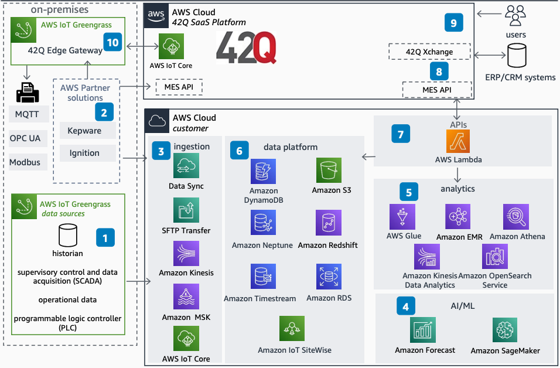

# 42Q Cloud MES on AWS

Publication date: **October 13, 2022 ([Diagram history](#42q-diagram-history "#42q-diagram-history"))**

With this architecture, you can build end-to-end data flows using AWS services and the
42Q SaaS manufacturing execution system (MES). You can ingest data from
industrial equipment and connect it to the 42Q cloud platform for digital
factory integration. This architecture uses [AWS IoT Greengrass](../../../greengrass/v2/developerguide.md "../../../greengrass/v2/developerguide.md"), [AWS IoT Core](../../../iot/latest/developerguide.md "../../../iot/latest/developerguide.md"), [Amazon S3](../../../AmazonS3/latest/userguide.md "../../../AmazonS3/latest/userguide.md"), [AWS Lambda](../../../lambda/latest/dg.md "../../../lambda/latest/dg.md"), and [Amazon SageMaker AI](../../../sagemaker/latest/dg.md "../../../sagemaker/latest/dg.md").

## 42Q Cloud MES architecture diagram

The following steps describe the architecture:

1. Ingest data from multiple sources. AWS IoT Greengrass connectors provide OPC-UA,
   Modbus-TCP, Modbus-RTU, and IoT Ethernet IP connectivity.
2. AWS Partner solutions connect to additional data sources and provide
   context.
3. Ingest data into your AWS account. Select the service based on the source. Use
   [AWS DataSync](../../../datasync/latest/userguide.md "../../../datasync/latest/userguide.md"),
   [Amazon Kinesis](../../../kinesis/latest/dev.md "../../../kinesis/latest/dev.md"), [Amazon Managed Streaming for Apache Kafka](../../../msk/latest/developerguide.md "../../../msk/latest/developerguide.md"), AWS IoT Core, or
   [AWS Transfer Family](../../../transfer/latest/userguide.md "../../../transfer/latest/userguide.md").
4. Use AI and ML services such as [Amazon Forecast](../../../forecast/latest/dg.md "../../../forecast/latest/dg.md") and Amazon SageMaker AI to build, train, and deploy
   ML models.
5. Use analytics services including [Amazon EMR](../../../emr/latest/ManagementGuide.md "../../../emr/latest/ManagementGuide.md"), [AWS Glue](../../../glue/latest/dg.md "../../../glue/latest/dg.md"), [Amazon Athena](../../../athena/latest/ug.md "../../../athena/latest/ug.md"), [Amazon Data Firehose](../../../firehose/latest/dev.md "../../../firehose/latest/dev.md"), and [Amazon OpenSearch Service](../../../opensearch-service/latest/developerguide.md "../../../opensearch-service/latest/developerguide.md").
6. Store data optimized for workload. Use [Amazon DynamoDB](../../../amazondynamodb/latest/developerguide.md "../../../amazondynamodb/latest/developerguide.md"), Amazon S3, [Amazon Neptune](../../../neptune/latest/userguide.md "../../../neptune/latest/userguide.md"), [Amazon Redshift](../../../redshift/latest/dg.md "../../../redshift/latest/dg.md"), [Amazon Timestream](../../../timestream/latest/developerguide.md "../../../timestream/latest/developerguide.md"), and [AWS IoT SiteWise](../../../iot-sitewise/latest/userguide.md "../../../iot-sitewise/latest/userguide.md").
7. Lambda writes data from Amazon S3 or any data store to the 42Q MES
   API.
8. 42Q Xchange SOAP-based APIs connect ERP and CRM systems to
   42Q for digital factory integration.
9. 42Q provides cloud-based MES with simplified access.
10. AWS IoT Greengrass supports legacy printers for on-premises label printing.

## Further reading

For additional information, see the following resources:

- [AWS Architecture Icons](https://aws.amazon.com/architecture/icons "https://aws.amazon.com/architecture/icons")
- [AWS Architecture Center](https://aws.amazon.com/architecture "https://aws.amazon.com/architecture")
- [AWS Well-Architected](https://aws.amazon.com/architecture/well-architected "https://aws.amazon.com/architecture/well-architected")
- [Industrial Data Platform on AWS](../industrial-data-platform/industrial-data-platform.md "../industrial-data-platform/industrial-data-platform.md")

## Diagram history

To be notified about updates to this reference architecture diagram, subscribe to the RSS feed.

| Change              | Description                                     | Date             |
| ------------------- | ----------------------------------------------- | ---------------- |
| Initial publication | Reference architecture diagram first published. | October 13, 2022 |

###### RSS subscription

To subscribe to RSS updates, you must have an RSS plugin enabled for the browser that you are using.
