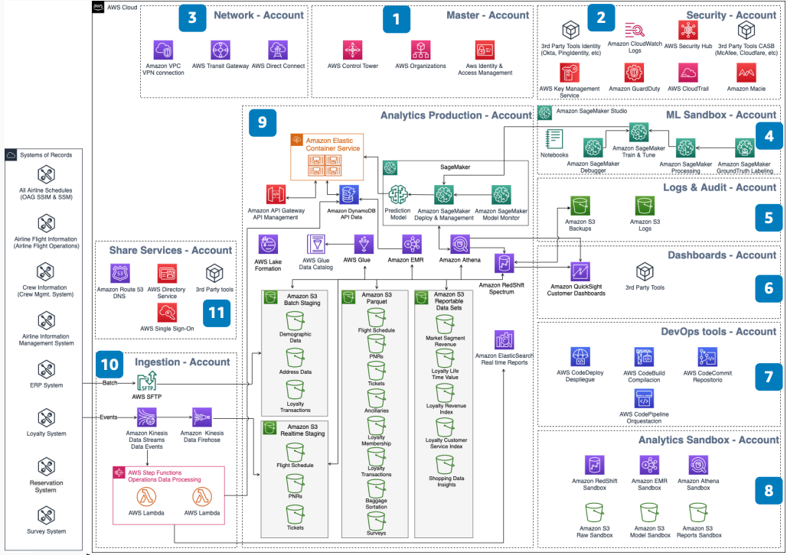

# Account and Security Strategy for the Serverless Data Platform

Publication date: **December 21, 2020 ([Diagram history](#account-security-history "#account-security-history"))**

A multi-account strategy is a best practice for resource and security isolation. An
analytics architecture demands data governance with high security standards. You must grant
correct access levels to users across multiple accounts.

This architecture shows how to organize AWS accounts for a serverless data platform.
It addresses security, governance, and access control across environments.

## Account and security strategy diagram

The following steps describe the architecture:

1. The root account is the most critical account in AWS. Apply restrictive access
   policies to protect this account.
2. The security account maintains the overall security posture. Use it to scan for
   vulnerabilities across all accounts.
3. Centralized network connections from on-premises are shared with other accounts.
   Control communication between accounts with [AWS Transit Gateway](../../../vpc/latest/tgw.md "../../../vpc/latest/tgw.md").
4. Users interact with data and develop machine learning (ML) models with correct
   security and data access. Publish final models with [SageMaker AI](../../../sagemaker/latest/dg.md "../../../sagemaker/latest/dg.md").
5. Centralized logs monitor all accounts to audit activities. Use [CloudWatch](../../../AmazonCloudWatch/latest/logs.md "../../../AmazonCloudWatch/latest/logs.md") for unified
   logging.
6. Use any tools your customers need to present data. These include third-party tools
   or AWS services such as [Quick](../../../quicksight/latest/user/welcome.md "../../../quicksight/latest/user/welcome.md").
7. DevOps flows deploy code as a service and artifacts on ingestion and analytics
   accounts.
8. Users who need development and test analytics models work with correct security
   and data governance.
9. Centralized data services provide governance and API management. Run queries against
   petabytes of data in [Amazon S3](../../../AmazonS3/latest/userguide.md "../../../AmazonS3/latest/userguide.md")
   through [Amazon Redshift](../../../redshift/latest/dg.md "../../../redshift/latest/dg.md") Spectrum.
   Transform data with [Amazon EMR](../../../emr/latest/ManagementGuide.md "../../../emr/latest/ManagementGuide.md"). Secure repositories with [Lake Formation](../../../lake-formation/latest/dg.md "../../../lake-formation/latest/dg.md").
10. Control batch or streaming ingestion that feeds the data lake. Use [Kinesis](../../../kinesis/latest/dev.md "../../../kinesis/latest/dev.md") for real-time data
    streaming.
11. Common services shared with other accounts include golden AMIs and DNS
    management.

## Further reading

For additional information, see the following resources:

- [AWS Architecture Icons](https://aws.amazon.com/architecture/icons "https://aws.amazon.com/architecture/icons")
- [AWS Architecture Center](https://aws.amazon.com/architecture/ "https://aws.amazon.com/architecture/")
- [AWS Well-Architected](https://aws.amazon.com/architecture/well-architected "https://aws.amazon.com/architecture/well-architected")

## Diagram history

To receive updates about this reference architecture diagram, subscribe to the RSS
feed.

| Change              | Description                                     | Date              |
| ------------------- | ----------------------------------------------- | ----------------- |
| Initial publication | Reference architecture diagram first published. | December 21, 2020 |

###### RSS subscription requirement

To subscribe to RSS updates, you must have an RSS plugin enabled for the browser you
are using.
