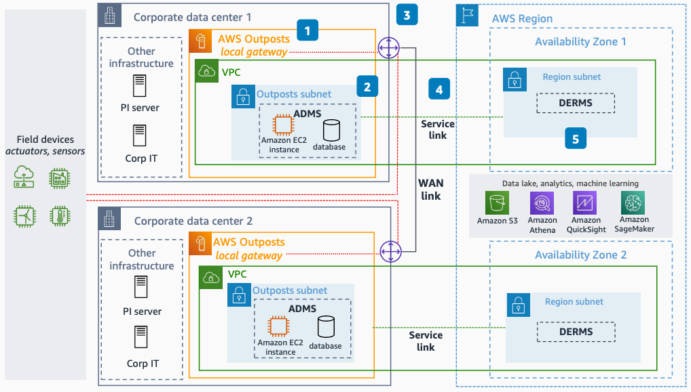

# Advanced Distribution Management System on AWS

Publication date: **July 21, 2022 ([Diagram history](#adms-history "#adms-history"))**

With this architecture, you can deploy an advanced distribution management system (ADMS)
on [AWS Outposts](../../../outposts/latest/userguide.md "../../../outposts/latest/userguide.md"). The system
is fully automated, resilient, and highly available. The solution meets low-latency, data
residency, and local data processing requirements. It also connects to AWS Regional services
for analytics and machine learning (ML).

## Advanced Distribution Management System diagram

The following steps describe the deployment topology and connectivity for this
architecture:

1. Install two AWS Outposts racks in different physically isolated sites for a resilient and
   highly available setup. Home each rack to a different Availability Zone in the parent
   AWS Region.
2. Deploy multiple ADMS applications on [Amazon Elastic Compute Cloud](../../../AWSEC2/latest/UserGuide.md "../../../AWSEC2/latest/UserGuide.md") instances running on AWS Outposts
   inside your data center. Use a purpose-built AWS database or deploy a
   vendor-supported database on Amazon EC2.
3. Connect the ADMS application to on-premises applications in the OT network and to
   field devices such as sensors and actuators. Use a low-latency local network through the
   Outposts local gateway.
4. Connect the Outpost to the home AWS Region through a service link for management
   of the AWS Outposts instance and intra-VPC traffic. Use your existing internet connection or
   [AWS Direct Connect](../../../directconnect/latest/UserGuide.md "../../../directconnect/latest/UserGuide.md").
5. Connect applications running on AWS Outposts securely to other applications running in
   the AWS Region, such as a Distributed Energy Resource Management System (DERMS). Use
   services in the AWS Region such as [Amazon Simple Storage Service](../../../AmazonS3/latest/userguide.md "../../../AmazonS3/latest/userguide.md"), [Amazon Athena](../../../athena/latest/ug.md "../../../athena/latest/ug.md"), [Amazon Quick Sight](../../../quicksight/latest/developerguide/welcome.md "../../../quicksight/latest/developerguide/welcome.md"), and [Amazon SageMaker AI](../../../sagemaker/latest/dg.md "../../../sagemaker/latest/dg.md") for data analytics
   and ML use cases.

## Further reading

For additional information, see the following resources:

- [AWS Architecture Icons](https://aws.amazon.com/architecture/icons "https://aws.amazon.com/architecture/icons")
- [AWS Architecture Center](https://aws.amazon.com/architecture/ "https://aws.amazon.com/architecture/")
- [AWS
  Well-Architected](https://aws.amazon.com/architecture/well-architected "https://aws.amazon.com/architecture/well-architected")

## Diagram history

To receive updates about this reference architecture diagram, subscribe to the RSS
feed.

| Change              | Description                                     | Date          |
| ------------------- | ----------------------------------------------- | ------------- |
| Initial publication | Reference architecture diagram first published. | July 21, 2022 |

###### RSS subscription requirement

To subscribe to RSS updates, you must have an RSS plugin enabled for the browser you are
using.
