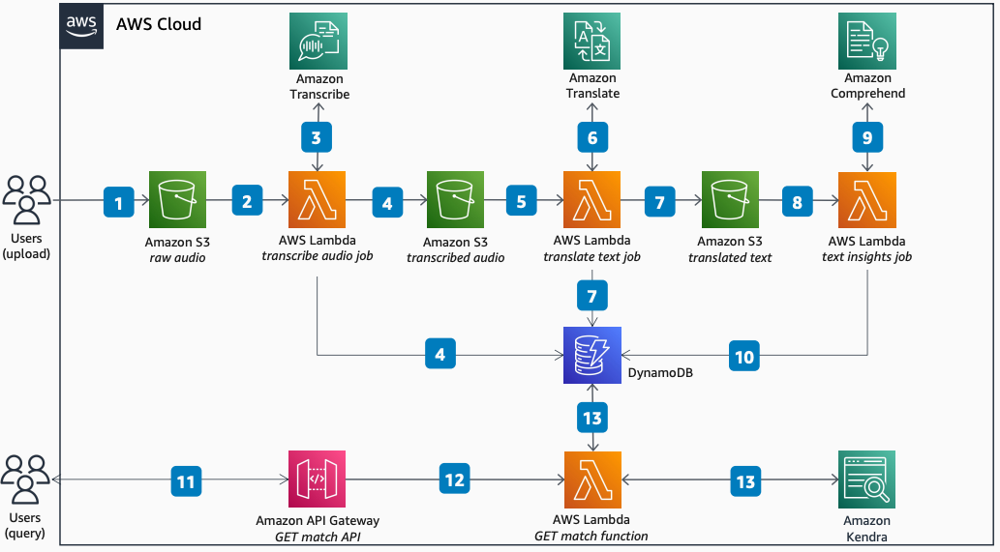

# AI-Enabled Audio Insight Processing Pipeline

Publication date: **June 20, 2022 ([Diagram history](#diagram-history "#diagram-history"))**

This architecture shows how to use API-driven AI/ML services to process audio files. With a serverless architecture, you can create a pipeline for multi-language insights including transcription, translation, and natural language understanding.

## AI-Enabled Audio Insight Processing Pipeline

The following steps describe the architecture:

1. Upload an audio file to an [Amazon Simple Storage Service](../../../AmazonS3/latest/userguide/Welcome.md "../../../AmazonS3/latest/userguide/Welcome.md") bucket.
2. The file upload creates an Amazon S3 event and initiates an [AWS Lambda](../../../lambda/latest/dg/welcome.md "../../../lambda/latest/dg/welcome.md") transcribe job.
3. The Lambda transcribe job calls the [Amazon Transcribe](../../../transcribe/latest/dg/what-is.md "../../../transcribe/latest/dg/what-is.md") API for transcription. Audio is converted to text and output is returned to the Lambda job.
4. The transcribed audio file is written to the Amazon S3 transcribed text bucket. The audio file name and metadata is written to the [Amazon DynamoDB](../../../amazondynamodb/latest/developerguide/Introduction.md "../../../amazondynamodb/latest/developerguide/Introduction.md") table as a new entry.
5. A Lambda translate job is initiated by the Amazon S3 file upload. The [Amazon Translate](../../../translate/latest/dg/what-is.md "../../../translate/latest/dg/what-is.md") API is called for translation.
6. Amazon Translate converts text from input language to output language. Translated text is returned to Lambda.
7. The translated audio file is written to the Amazon S3 translated text bucket. The DynamoDB table entry is updated to include translate metadata.
8. The Lambda text insights job is initiated by the Amazon S3 file upload.
9. The function calls the [Amazon Comprehend](../../../comprehend/latest/dg/what-is.md "../../../comprehend/latest/dg/what-is.md") API for document understanding inference. Amazon Comprehend runs inference on translated text and returns analysis. This includes entity recognition, sentiment analysis, and key phrase extraction.
10. The Lambda function updates the DynamoDB entry with Amazon Comprehend insights as additional metadata.
11. Your `HTTP GET` match API call is routed through [Amazon API Gateway](../../../apigateway/latest/developerguide/welcome.md "../../../apigateway/latest/developerguide/welcome.md").
12. API Gateway initiates the Lambda GET match function.
13. The Lambda GET match function queries [Amazon Kendra](../../../kendra/latest/dg/what-is-kendra.md "../../../kendra/latest/dg/what-is-kendra.md") to find a file match from the translated text Amazon S3 bucket. The query returns matching file IDs. Lambda then uses these to query DynamoDB for insight metadata and returns the most suitable matches.

## Further reading

For additional information, refer to the following resources:

- [AWS Architecture Icons](https://aws.amazon.com/architecture/icons "https://aws.amazon.com/architecture/icons")
- [AWS Architecture Center](https://aws.amazon.com/architecture "https://aws.amazon.com/architecture")
- [AWS Well-Architected](https://aws.amazon.com/architecture/well-architected "https://aws.amazon.com/architecture/well-architected")
- [Amazon Transcribe product page](https://aws.amazon.com/transcribe/ "https://aws.amazon.com/transcribe/")
- [Amazon Kendra product page](https://aws.amazon.com/kendra/ "https://aws.amazon.com/kendra/")

## Diagram history

To be notified about updates to this reference architecture diagram, subscribe to the RSS feed.

| Change              | Description                                     | Date          |
| ------------------- | ----------------------------------------------- | ------------- |
| Initial publication | Reference architecture diagram first published. | June 20, 2022 |

###### Note

To subscribe to RSS updates, you must have an RSS plugin enabled for the browser you are using.
