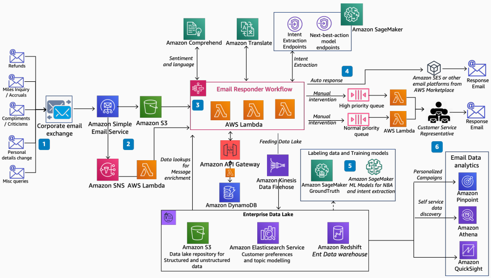

# AI/ML Based Intelligent Email Responder

Publication date: **March 10, 2021 ([Diagram history](#diagram-history "#diagram-history"))**

This architecture shows how to improve customer experience and agent productivity. With [Amazon Simple Email Service](../../../ses/latest/dg/Welcome.md "../../../ses/latest/dg/Welcome.md") (Amazon SES) and AWS ML services, you can comprehend intent and identify next-best-action for email responses.

## AI/ML Based Intelligent Email Responder

The following steps describe the architecture:

1. Amazon SES captures emails received at the corporate email exchange.
2. Amazon SES writes the raw payload to [Amazon Simple Storage Service](../../../AmazonS3/latest/userguide/Welcome.md "../../../AmazonS3/latest/userguide/Welcome.md") and triggers a notification through [Amazon Simple Notification Service](../../../sns/latest/dg/welcome.md "../../../sns/latest/dg/welcome.md"). An [AWS Lambda](../../../lambda/latest/dg/welcome.md "../../../lambda/latest/dg/welcome.md") function captures this notification and triggers the email responder workflow.
3. The email responder workflow uses [Amazon Comprehend](../../../comprehend/latest/dg/what-is.md "../../../comprehend/latest/dg/what-is.md") for language, sentiment, and keyword extraction. It uses [Amazon Translate](../../../translate/latest/dg/what-is.md "../../../translate/latest/dg/what-is.md") for language translation. It calls intent extraction and next-best-action model endpoints deployed on [Amazon SageMaker AI](../../../sagemaker/latest/dg/whatis.md "../../../sagemaker/latest/dg/whatis.md") for better routing. It performs data lookups from the enterprise data lake. It updates the transactional data stores by using [Amazon Kinesis Data Firehose](../../../firehose/latest/dev/what-is-this-service.md "../../../firehose/latest/dev/what-is-this-service.md").
4. Based on confidence and completeness, the workflow either sends a response through Amazon SES or routes the email to the right queue for an agent.
5. From the data collected, you continuously improve the intent extraction and next-best-action models by using SageMaker AI Ground Truth and SageMaker AI.
6. You can perform personalized email campaigns, additional email analytics, and reporting by using [Amazon Pinpoint](../../../pinpoint/latest/userguide/welcome.md "../../../pinpoint/latest/userguide/welcome.md"), [Amazon Athena](../../../athena/latest/ug/what-is.md "../../../athena/latest/ug/what-is.md"), and [Amazon Quick Sight](../../../quicksight/latest/user/welcome.md "../../../quicksight/latest/user/welcome.md").

## Further reading

For additional information, refer to the following resources:

- [AWS Architecture Icons](https://aws.amazon.com/architecture/icons "https://aws.amazon.com/architecture/icons")
- [AWS Architecture Center](https://aws.amazon.com/architecture "https://aws.amazon.com/architecture")
- [AWS Well-Architected](https://aws.amazon.com/architecture/well-architected "https://aws.amazon.com/architecture/well-architected")
- [Amazon SageMaker AI product page](https://aws.amazon.com/sagemaker/ "https://aws.amazon.com/sagemaker/")

## Diagram history

To be notified about updates to this reference architecture diagram, subscribe to the RSS feed.

| Change              | Description                                     | Date           |
| ------------------- | ----------------------------------------------- | -------------- |
| Initial publication | Reference architecture diagram first published. | March 10, 2021 |

###### Note

To subscribe to RSS updates, you must have an RSS plugin enabled for the browser you are using.
