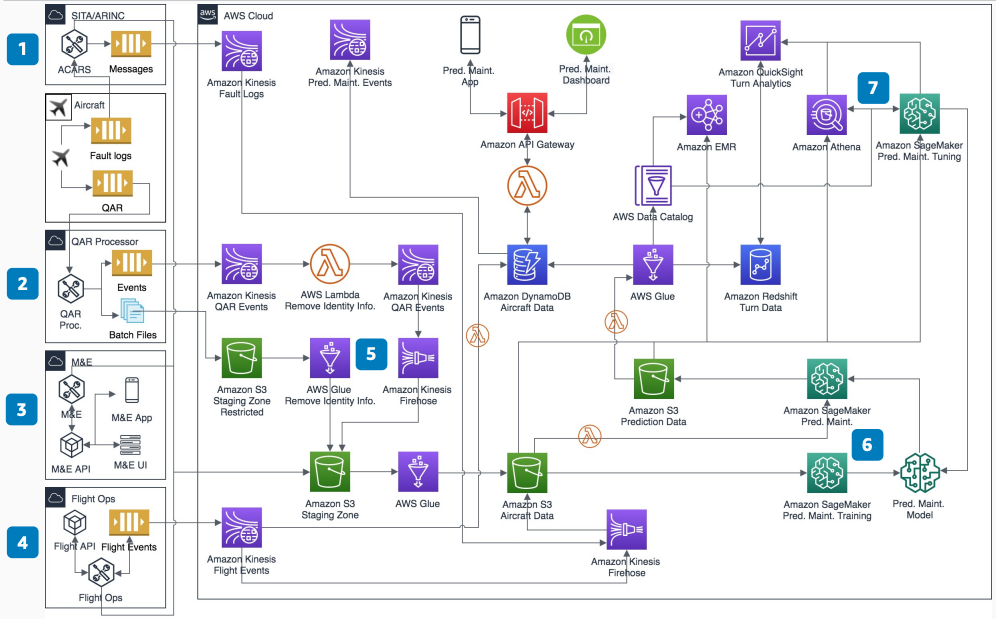

# Aircraft Predictive Maintenance

Publication date: **March 10, 2021 ([Diagram history](#predictive-maintenance-history "#predictive-maintenance-history"))**

Flight delays and cancellations caused by unscheduled maintenance cost airlines USD $120K to
 USD $300K per aircraft per year. This potentially translates to USD $60M to USD $150M annually for an
airline with 500 aircraft.

Implementing predictive maintenance solutions that use aircraft log, sensor, and maintenance
data can reduce this cost by up to 25 percent.

This architecture uses [Amazon SageMaker AI](../../../sagemaker/latest/dg.md "../../../sagemaker/latest/dg.md") to correlate aircraft fault data with
maintenance history. The trained models predict component failures before they cause delays.

## Aircraft predictive maintenance diagram

The following steps describe the architecture:

1. The Aircraft Communications Addressing and Reporting System (ACARS) collects fault
   logs and pilot reports in real time.
2. The Quick Access Recorder (QAR) collects and uploads data into AWS based on
   aircraft capability. Frequency varies based on the connectivity package installed.
3. Maintenance and engineering systems provide maintenance logs, part removals, and
   part repair history periodically.
4. The flight operations system provides scheduled and actual flight information. This
   correlates delays and cancellations with component failures.
5. You must delete identifying information from QAR data before use.
6. SageMaker AI trains the model to correlate delays and cancellations to fault logs,
   maintenance logs, part removals, and QAR data. Feature engineering identifies the most
   significant and predictable chapters and components.
7. Tune models periodically to improve predictions and reduce false
   positives.

## Further reading

For additional information, see the following resources:

- [AWS Architecture Icons](https://aws.amazon.com/architecture/icons "https://aws.amazon.com/architecture/icons")
- [AWS Architecture Center](https://aws.amazon.com/architecture/ "https://aws.amazon.com/architecture/")
- [AWS Well-Architected](https://aws.amazon.com/architecture/well-architected "https://aws.amazon.com/architecture/well-architected")

## Diagram history

To receive updates about this reference architecture diagram, subscribe to the RSS
feed.

| Change              | Description                                     | Date           |
| ------------------- | ----------------------------------------------- | -------------- |
| Initial publication | Reference architecture diagram first published. | March 10, 2021 |

###### RSS subscription requirement

To subscribe to RSS updates, you must have an RSS plugin enabled for the browser you
are using.
