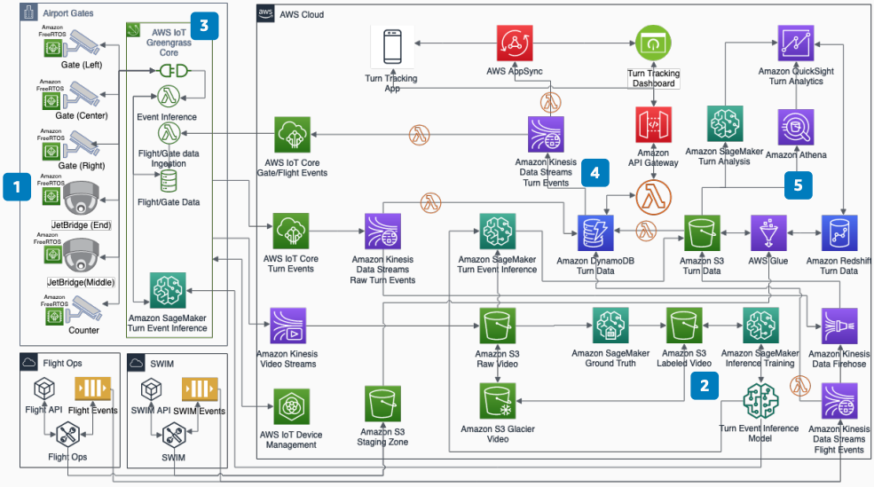

# Aircraft Turn Tracking Passive Data Collection

Publication date: **March 10, 2021 ([Diagram history](#turn-tracking-history "#turn-tracking-history"))**

Airlines and airports can realize cost savings by improving turn cycle time and reducing
turn variation time at the gate. Reducing cycle time frees aircraft and gates for more
efficient schedule usage.

Reducing cycle time by 4 to 6 minutes can potentially free 2 to 3 percent of a fleet of
500 aircraft. With aircraft costing USD $3M to USD $5M per year, this might result in cost savings
of USD $30M to USD $75M.

This architecture uses cameras and edge inference to passively collect turn event data.
It provides real-time tracking and analytics for turn optimization.

## Aircraft turn tracking diagram

The following steps describe the architecture:

1. Gate cameras: three cameras outside the aircraft cover tarmac turn events. Jet bridge
   cameras: two cameras cover boarding. Gate counter camera: one camera covers crew and
   agent arrival.
2. For inference training, install cameras at one or two gates. Record the video
   stream for 4 to 6 weeks. Use [SageMaker AI](../../../sagemaker/latest/dg.md "../../../sagemaker/latest/dg.md") Ground Truth to label turn events.
3. [AWS IoT Greengrass](../../../greengrass/v2/developerguide.md "../../../greengrass/v2/developerguide.md"),
   [AWS IoT Core](../../../iot/latest/developerguide.md "../../../iot/latest/developerguide.md"), and
   AWS IoT Device Management manage cameras and run inference on the edge with [Lambda](../../../lambda/latest/dg.md "../../../lambda/latest/dg.md") and SageMaker AI.
4. Use purpose-built databases and serverless architecture. [DynamoDB](../../../amazondynamodb/latest/developerguide.md "../../../amazondynamodb/latest/developerguide.md"), [Kinesis](../../../kinesis/latest/dev.md "../../../kinesis/latest/dev.md"), Lambda, [API Gateway](../../../apigateway/latest/developerguide.md "../../../apigateway/latest/developerguide.md"), and AWS AppSync provide
   real-time microservices, notifications, and events for mobile apps and dashboards.
5. [Amazon S3](../../../AmazonS3/latest/userguide.md "../../../AmazonS3/latest/userguide.md"), [Amazon Redshift](../../../redshift/latest/dg.md "../../../redshift/latest/dg.md"), and [Quick](../../../quicksight/latest/user/welcome.md "../../../quicksight/latest/user/welcome.md") provide the data lake
   and analytics platform. Use SageMaker AI for AI/ML models for turn optimization. Use [Athena](../../../athena/latest/ug.md "../../../athena/latest/ug.md") for ad hoc analysis.

## Further reading

For additional information, see the following resources:

- [AWS Architecture Icons](https://aws.amazon.com/architecture/icons "https://aws.amazon.com/architecture/icons")
- [AWS Architecture Center](https://aws.amazon.com/architecture/ "https://aws.amazon.com/architecture/")
- [AWS Well-Architected](https://aws.amazon.com/architecture/well-architected "https://aws.amazon.com/architecture/well-architected")

## Diagram history

To receive updates about this reference architecture diagram, subscribe to the RSS
feed.

| Change              | Description                                     | Date           |
| ------------------- | ----------------------------------------------- | -------------- |
| Initial publication | Reference architecture diagram first published. | March 10, 2021 |

###### RSS subscription requirement

To subscribe to RSS updates, you must have an RSS plugin enabled for the browser you
are using.
