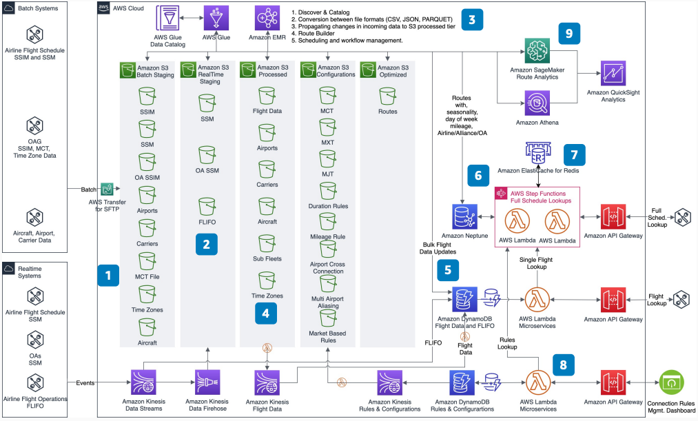

# Airline Schedule Engine

Publication date: **May 3, 2021 ([Diagram history](#schedule-engine-history "#schedule-engine-history"))**

An airline schedule engine aggregates batch and real-time flight data to support fast
flight and schedule lookups. With this architecture, you can create a scalable, configurable,
and fault-tolerant tier-0 system. It uses purpose-built databases, serverless compute, and a
data lake to reduce total cost of ownership.

This architecture uses the [Airport Terminal
Optimizer](../airport-terminal-optimizer/airport-terminal-optimizer.md "../airport-terminal-optimizer/airport-terminal-optimizer.md") as a source for schedule data context. You can combine batch inputs
with real-time data feeds to build complete flight schedules.

## Airline schedule engine diagram

The following steps describe the architecture:

1. Load all batch inputs such as Standard Schedules Information Manual (SSIM)
   into a batch staging bucket in [Amazon S3](../../../AmazonS3/latest/userguide.md "../../../AmazonS3/latest/userguide.md").
2. Load all real-time data feeds such as Standard Schedule Messages (SSM) and
   flight information (FLIFO) into a real-time staging bucket in Amazon S3.
3. Use [AWS Glue](../../../glue/latest/dg.md "../../../glue/latest/dg.md") and
   [Amazon EMR](../../../emr/latest/ManagementGuide.md "../../../emr/latest/ManagementGuide.md")
   processes to discover, catalog, and process inputs. Create processed data in Amazon S3.
   Combine batch and real-time data.
4. Create flight data by converting schedule files into individual flights. Load
   the data into [DynamoDB](../../../amazondynamodb/latest/developerguide.md "../../../amazondynamodb/latest/developerguide.md") for direct flight
   lookup.
5. Run flight lookups through [Lambda](../../../lambda/latest/dg.md "../../../lambda/latest/dg.md") and DynamoDB with in-memory caching from
   DynamoDB Accelerator (DAX). Ingest and serve FLIFO events with flight data.
6. Process routes with mileage, day of week, seasonality, and airline type. Load
   the data into [Amazon Neptune](../../../neptune/latest/userguide.md "../../../neptune/latest/userguide.md") graph database for route
   lookups by origin and destination.
7. Apply duration and mileage rules. Retrieve flights for each route and combine
   them with connection rules to create the full schedule. Use [Amazon ElastiCache](../../../AmazonElastiCache/latest/dg.md "../../../AmazonElastiCache/latest/dg.md") for
   Redis for performance.
8. Maintain connection rules in DynamoDB for fast retrieval. Manage these rules with
   a connection rules dashboard.
9. Use [SageMaker AI](../../../sagemaker/latest/dg.md "../../../sagemaker/latest/dg.md") to
   improve route building and schedule lookup performance.

## Further reading

For additional information, see the following resources:

- [AWS Architecture Icons](https://aws.amazon.com/architecture/icons "https://aws.amazon.com/architecture/icons")
- [AWS Architecture Center](https://aws.amazon.com/architecture/ "https://aws.amazon.com/architecture/")
- [AWS Well-Architected](https://aws.amazon.com/architecture/well-architected "https://aws.amazon.com/architecture/well-architected")

## Diagram history

To receive updates about this reference architecture diagram, subscribe to the RSS
feed.

| Change              | Description                                     | Date        |
| ------------------- | ----------------------------------------------- | ----------- |
| Initial publication | Reference architecture diagram first published. | May 3, 2021 |

###### RSS subscription requirement

To subscribe to RSS updates, you must have an RSS plugin enabled for the browser you
are using.
