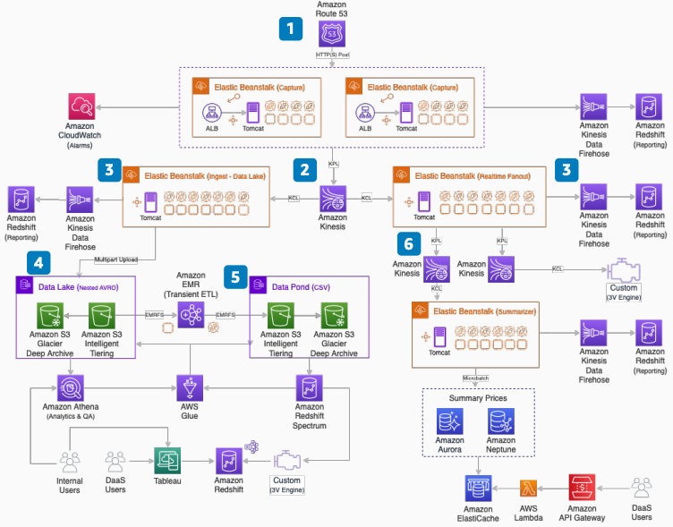

# Streaming Airline Ticket Shopping Insights

Publication date: **March 10, 2021 ([Diagram history](#ticket-shopping-history "#ticket-shopping-history"))**

3Victors implemented an AWS architecture to capture and durably store over
10 TB of daily streamed air shopping data into a data lake. Dozens of extract, transform,
and load (ETL) jobs run at regular intervals.

The implementation provides an extensible, real-time predictive analytics pipeline for
demand forecasting and deal classification.

## Streaming airline ticket shopping insights diagram

The following steps describe the architecture:

1. [Route 53](../../../Route53/latest/DeveloperGuide.md "../../../Route53/latest/DeveloperGuide.md")
   directs per-stream vendor content to source-specific AWS Elastic Beanstalk application
   orchestration. Handle 20,000 per second HTTPS POST transactions with autoscaling on
   [Amazon EC2](../../../AWSEC2/latest/UserGuide.md "../../../AWSEC2/latest/UserGuide.md") Spot Instances.
   Monitor with [CloudWatch](../../../AmazonCloudWatch/latest/monitoring.md "../../../AmazonCloudWatch/latest/monitoring.md"). Log statistics to [Amazon Redshift](../../../redshift/latest/dg.md "../../../redshift/latest/dg.md") through Amazon Data
   Firehose.
2. Transform captured pricing data into a common format. Place data on a
   durable 24-hour [Kinesis](../../../kinesis/latest/dev.md "../../../kinesis/latest/dev.md") streaming buffer across 100 or more
   shards.
3. Two concurrent pipelines fan out from the streaming buffer.
4. A data lake pipeline persists data in [Amazon S3](../../../AmazonS3/latest/userguide.md "../../../AmazonS3/latest/userguide.md") Intelligent-Tiering. Directory paths support
   partitioning and cross-account access. Update schema-on-read mappings in [AWS Glue](../../../glue/latest/dg.md "../../../glue/latest/dg.md") metastore for [Athena](../../../athena/latest/ug.md "../../../athena/latest/ug.md") analytics. Lifecycle
   policies archive to Amazon S3 Glacier Deep Archive.
5. Periodic ETL jobs deposit results into cross-account Data Ponds by using [Amazon EMR](../../../emr/latest/ManagementGuide.md "../../../emr/latest/ManagementGuide.md") transient
   compute with Spot Instance fleets. AWS Glue metastore provides Amazon Redshift Spectrum access
   integrated with Amazon Redshift for business intelligence tool access.
6. A real-time analytics pipeline fans out to Kinesis stream buffers. Populate [Amazon Aurora](../../../AmazonRDS/latest/AuroraUserGuide.md "../../../AmazonRDS/latest/AuroraUserGuide.md") (row)
   and [Amazon Neptune](../../../neptune/latest/userguide.md "../../../neptune/latest/userguide.md") (graph) databases for customer
   API access through serverless API Gateway and [Lambda](../../../lambda/latest/dg.md "../../../lambda/latest/dg.md"). Optimize database I/O with [Amazon ElastiCache](../../../AmazonElastiCache/latest/dg.md "../../../AmazonElastiCache/latest/dg.md").

## Further reading

For additional information, see the following resources:

- [AWS Architecture Icons](https://aws.amazon.com/architecture/icons "https://aws.amazon.com/architecture/icons")
- [AWS Architecture Center](https://aws.amazon.com/architecture/ "https://aws.amazon.com/architecture/")
- [AWS Well-Architected](https://aws.amazon.com/architecture/well-architected "https://aws.amazon.com/architecture/well-architected")

## Diagram history

To receive updates about this reference architecture diagram, subscribe to the RSS
feed.

| Change              | Description                                     | Date           |
| ------------------- | ----------------------------------------------- | -------------- |
| Initial publication | Reference architecture diagram first published. | March 10, 2021 |

###### RSS subscription requirement

To subscribe to RSS updates, you must have an RSS plugin enabled for the browser you
are using.
