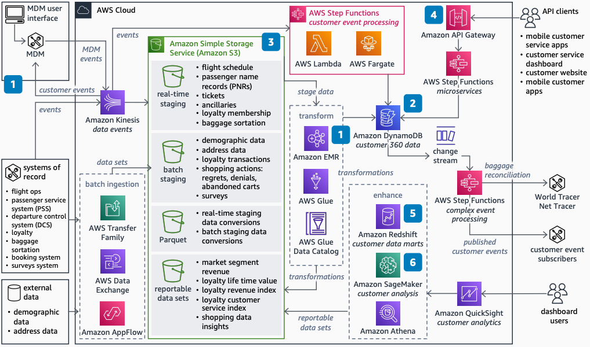

# Airline Data Platform with Master Data Management

Publication date: **September 1, 2022 ([Diagram history](#airlines-data-platform-mdm-history "#airlines-data-platform-mdm-history"))**

This reference architecture enhances the airline customer data platform with master
data management (MDM) tools. Airlines use this architecture to identify unique travelers
and detect duplicate records in loyalty membership databases. You can develop a single
view of the customer beyond loyalty members.

Without MDM, airlines maintain fragmented customer profiles across multiple systems.
Duplicate records reduce the accuracy of segmentation models and personalization efforts.
This architecture adds MDM capabilities using ML transforms in AWS Glue to identify
and merge duplicate customer records automatically.

This architecture uses the [Airlines Data Platform](../airlines-data-platform/airlines-data-platform.md "../airlines-data-platform/airlines-data-platform.md")
as its foundation.

## Airline data platform with MDM diagram

The following steps describe the architecture:

1. Augment the single view of customer data as a service by using an MDM tool.
   Build simple MDM with customer identification and deduplication. Use ML transforms
   in [AWS Glue](../../../glue/latest/dg.md "../../../glue/latest/dg.md") to identify
   duplicates in loyalty membership and customers without loyalty signups.
2. Adapt the operations data stores, data lakes, and analytics platforms to new
   customer data feeds. Deliver new capabilities as new versions of customer-centric
   microservices and events.
3. Enhance the data lake by changing to a customer-centric view. Store lifetime
   value, revenue index, and service index data in [Amazon S3](../../../AmazonS3/latest/userguide.md "../../../AmazonS3/latest/userguide.md").
4. Agile development teams quickly add new microservices. These microservices
   consume and publish customer-centric services.
5. Agile data teams quickly augment the enterprise data warehouse (EDW). Add
   customer-centric domain schemas and data marts in [Amazon Redshift](../../../redshift/latest/dg.md "../../../redshift/latest/dg.md").
6. Data scientists use existing raw and curated data plus new customer data. Build
   models in [Amazon SageMaker AI](../../../sagemaker/latest/dg.md "../../../sagemaker/latest/dg.md") for segmentation and lifetime value.

## Further reading

For additional information, see the following resources:

- [AWS Architecture Icons](https://aws.amazon.com/architecture/icons "https://aws.amazon.com/architecture/icons")
- [AWS Architecture Center](https://aws.amazon.com/architecture/ "https://aws.amazon.com/architecture/")
- [AWS Well-Architected](https://aws.amazon.com/architecture/well-architected "https://aws.amazon.com/architecture/well-architected")

## Diagram history

To receive updates about this reference architecture diagram, subscribe to the RSS
feed.

| Change              | Description                                     | Date              |
| ------------------- | ----------------------------------------------- | ----------------- |
| Initial publication | Reference architecture diagram first published. | September 1, 2022 |

###### RSS subscription requirement

To subscribe to RSS updates, you must have an RSS plugin enabled for the browser you
are using.
