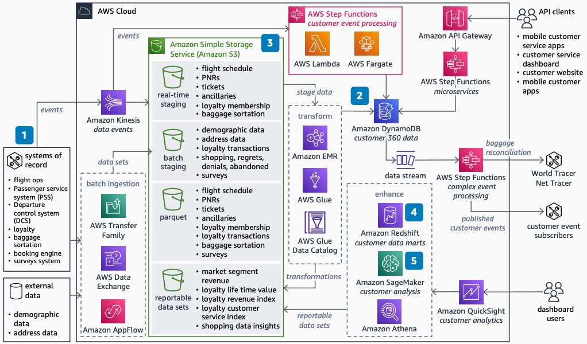

# Airlines Data Platform

Publication date: **August 23, 2022 ([Diagram history](#airlines-data-platform-history "#airlines-data-platform-history"))**

This reference architecture provides a data platform for airlines that replaces or
augments on-premises data infrastructure. Airlines use this architecture to build
domain-owned data products with separated storage and compute. The platform supports
flight operations, passenger services, and loyalty program domains.

Airline initiatives to build operations data stores often don't adapt to change.
Rigid schemas, long implementation times, siloed operations, and on-premises scaling
limitations restrict agility. This data platform architecture relieves or replaces your
on-premises data platform load. It increases development agility and cost savings.

This architecture uses the [Implementing
Travel and Hospitality Data Mesh](../travel-hospitality-data-mesh/travel-hospitality-data-mesh.md "../travel-hospitality-data-mesh/travel-hospitality-data-mesh.md") as its foundation for a domain-owned design
approach.

## Airlines data platform diagram

The following steps describe the architecture:

1. Build data products for relevant domains such as flight, passenger, and loyalty.
   Separate storage from compute to scale each independently.
2. In the operational data store, use managed services and purpose-built databases
   with microservice and event-driven patterns. This replaces expensive on-premises
   infrastructure. It eliminates operational databases, service-oriented architecture
   (SOA) infrastructure, and message-oriented middleware.
3. Use open standards to build a data lake with [Amazon S3](../../../AmazonS3/latest/userguide.md "../../../AmazonS3/latest/userguide.md"). Use a read-pattern schema to make
   raw and curated data available for all user roles.
4. For known query patterns, build standard enterprise data warehouse schemas in
   [Amazon Redshift](../../../redshift/latest/dg.md "../../../redshift/latest/dg.md"). Build data marts
   in Amazon Redshift for heavily used analytics. For ad hoc queries, publish the data catalog in
   [AWS Glue](../../../glue/latest/dg.md "../../../glue/latest/dg.md"). Use [Athena](../../../athena/latest/ug.md "../../../athena/latest/ug.md") to query the data lake
   directly.
5. Use [Amazon SageMaker AI](../../../sagemaker/latest/dg.md "../../../sagemaker/latest/dg.md") for
   standard AI/ML models. Build customer segmentation and lifetime value models on top
   of the data lake.

## Further reading

For additional information, see the following resources:

- [AWS Architecture Icons](https://aws.amazon.com/architecture/icons "https://aws.amazon.com/architecture/icons")
- [AWS Architecture Center](https://aws.amazon.com/architecture/ "https://aws.amazon.com/architecture/")
- [AWS Well-Architected](https://aws.amazon.com/architecture/well-architected "https://aws.amazon.com/architecture/well-architected")

## Diagram history

To receive updates about this reference architecture diagram, subscribe to the RSS
feed.

| Change              | Description                                     | Date            |
| ------------------- | ----------------------------------------------- | --------------- |
| Initial publication | Reference architecture diagram first published. | August 23, 2022 |

###### RSS subscription requirement

To subscribe to RSS updates, you must have an RSS plugin enabled for the browser you
are using.
