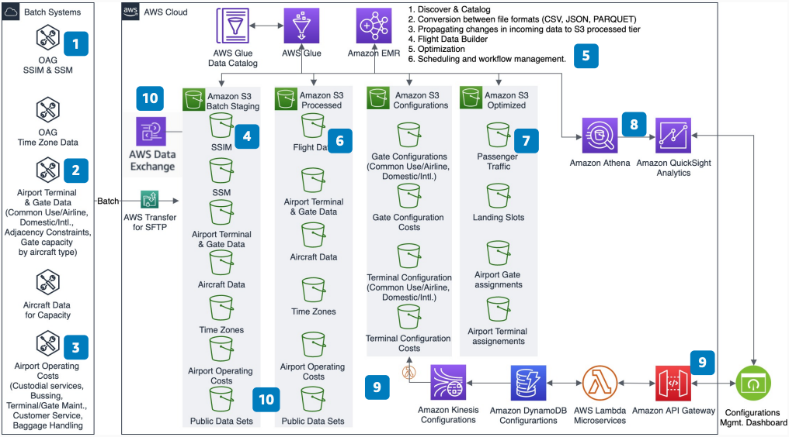

# Airport Terminal Optimizer

Publication date: **April 16, 2020 ([Diagram history](#terminal-optimizer-history "#terminal-optimizer-history"))**

With this architecture, you can optimize terminal and gate openings for airports with
multiple terminals. Use schedules from OAG (up to 330 days ahead), operating
costs, and terminal configurations. You can determine the most cost-effective terminal and gate
assignments during reduced schedules.

## Airport terminal optimizer diagram

The following steps describe the architecture:

1. Airline schedules from OAG provide daily arrivals and departures.
   Schedules extend up to 330 days ahead.
2. The airport provides terminal and gate configurations. These include airline-specific
   compared to common-use gates, domestic compared to international, and capacity by aircraft type.
3. The airport provides operating costs by terminal.
4. Load batch inputs into [Amazon S3](../../../AmazonS3/latest/userguide.md "../../../AmazonS3/latest/userguide.md"). Inputs include Standard Schedules
   Information Manual (SSIM), Standard Schedule Messages (SSM), configurations, and costs.
5. Use [AWS Glue](../../../glue/latest/dg.md "../../../glue/latest/dg.md") and
   [Amazon EMR](../../../emr/latest/ManagementGuide.md "../../../emr/latest/ManagementGuide.md") to discover,
   catalog, and process inputs. Store results in Amazon S3 in Apache Parquet
   format.
6. Create flight data from the schedule files.
7. Create hourly and daily passenger traffic and landing slots from flight data.
8. Create optimized terminal and gate assignments from configurations and costs.
9. Visualize results with [Amazon Athena](../../../athena/latest/ug.md "../../../athena/latest/ug.md") and [Amazon Quick Sight](../../../quicksight/latest/user/welcome.md "../../../quicksight/latest/user/welcome.md").
10. (Optional) Build a configuration dashboard with [API Gateway](../../../apigateway/latest/developerguide.md "../../../apigateway/latest/developerguide.md"), [Lambda](../../../lambda/latest/dg.md "../../../lambda/latest/dg.md"), and [DynamoDB](../../../amazondynamodb/latest/developerguide.md "../../../amazondynamodb/latest/developerguide.md") for what-if analyses.

## Further reading

For additional information, see the following resources:

- [AWS Architecture Icons](https://aws.amazon.com/architecture/icons "https://aws.amazon.com/architecture/icons")
- [AWS Architecture Center](https://aws.amazon.com/architecture/ "https://aws.amazon.com/architecture/")
- [AWS Well-Architected](https://aws.amazon.com/architecture/well-architected "https://aws.amazon.com/architecture/well-architected")

## Diagram history

To receive updates about this reference architecture diagram, subscribe to the RSS
feed.

| Change              | Description                                     | Date           |
| ------------------- | ----------------------------------------------- | -------------- |
| Initial publication | Reference architecture diagram first published. | April 16, 2020 |

###### RSS subscription requirement

To subscribe to RSS updates, you must have an RSS plugin enabled for the browser you
are using.
