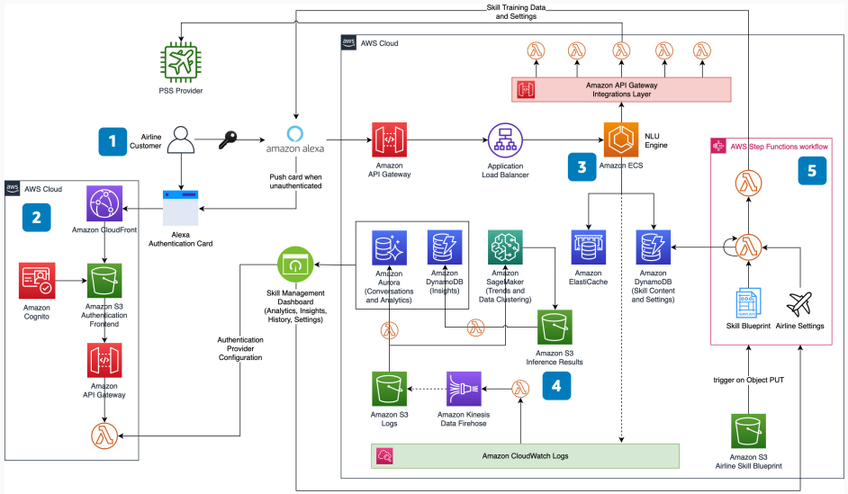

# Amazon Alexa Skill for Airlines

Publication date: **March 10, 2021 ([Diagram history](#alexa-skill-history "#alexa-skill-history"))**

As conversational AI technology evolves, consumer demands evolve as well. A multi-channel
digital strategy is no longer optional for airlines.

This architecture helps airlines deliver a secure, integrated experience for booking and
managing air travel seamlessly through Amazon Alexa. The solution integrates with Passenger
Service System (PSS) providers like Amadeus, Sabre, and
Navitaire.

## Amazon Alexa Skill for airlines diagram

The following steps describe the architecture:

1. A traveler activates the airline's Alexa Skill. During the first interaction,
   Alexa prompts authentication and pushes a card to the Amazon Alexa App.
2. The authentication flow uses [Amazon S3](../../../AmazonS3/latest/userguide.md "../../../AmazonS3/latest/userguide.md"), [API Gateway](../../../apigateway/latest/developerguide.md "../../../apigateway/latest/developerguide.md"), and [Lambda](../../../lambda/latest/dg.md "../../../lambda/latest/dg.md"). Lambda retrieves auth provider information.
   [Amazon Cognito](../../../cognito/latest/developerguide.md "../../../cognito/latest/developerguide.md")
   authenticates the customer. [CloudFront](../../../AmazonCloudFront/latest/DeveloperGuide.md "../../../AmazonCloudFront/latest/DeveloperGuide.md") ensures optimal network
   latency.
3. Use API Gateway, Application Load Balancer, and [Amazon Elastic Container Service](../../../AmazonECS/latest/developerguide.md "../../../AmazonECS/latest/developerguide.md") to deploy your natural
   language understanding (NLU) engine at scale. Use [DynamoDB](../../../amazondynamodb/latest/developerguide.md "../../../amazondynamodb/latest/developerguide.md") and [Amazon ElastiCache](../../../AmazonElastiCache/latest/dg.md "../../../AmazonElastiCache/latest/dg.md") for
   low-latency content and conversation state access.
4. [CloudWatch](../../../AmazonCloudWatch/latest/logs.md "../../../AmazonCloudWatch/latest/logs.md"),
   Amazon Data Firehose, and Amazon S3 capture and store application logs. Use Lambda for
   real-time analytics stored in [Amazon Aurora](../../../AmazonRDS/latest/AuroraUserGuide.md "../../../AmazonRDS/latest/AuroraUserGuide.md"). Use [SageMaker AI](../../../sagemaker/latest/dg.md "../../../sagemaker/latest/dg.md") for AI/ML models on
   conversation trends. Store results in DynamoDB.
5. Use Amazon S3 PUT triggers and [Step Functions](../../../step-functions/latest/dg.md "../../../step-functions/latest/dg.md") to orchestrate a workflow that updates
   application content and Alexa Skill configuration.

## Further reading

For additional information, see the following resources:

- [AWS Architecture Icons](https://aws.amazon.com/architecture/icons "https://aws.amazon.com/architecture/icons")
- [AWS Architecture Center](https://aws.amazon.com/architecture/ "https://aws.amazon.com/architecture/")
- [AWS Well-Architected](https://aws.amazon.com/architecture/well-architected "https://aws.amazon.com/architecture/well-architected")

## Diagram history

To receive updates about this reference architecture diagram, subscribe to the RSS
feed.

| Change              | Description                                     | Date           |
| ------------------- | ----------------------------------------------- | -------------- |
| Initial publication | Reference architecture diagram first published. | March 10, 2021 |

###### RSS subscription requirement

To subscribe to RSS updates, you must have an RSS plugin enabled for the browser you
are using.
