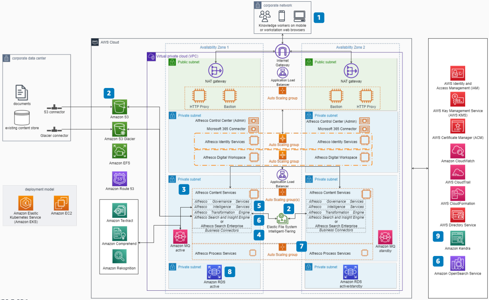

# Alfresco Digital Business Platform on AWS

Publication date: **March 1, 2023 ([Diagram history](#alfresco-diagram-history "#alfresco-diagram-history"))**

With this architecture, you can deploy a highly available Alfresco Digital Business Platform on AWS. The platform offers Alfresco Content Services for enterprise content management (ECM) and Alfresco Process Services for business process management (BPM). You also get add-on components for search, information governance, rendition, and machine learning (ML).

## Alfresco Digital Business Platform on AWS

The following steps describe the architecture:

1. Users connect to applications through web browsers on a workstation or mobile device.
2. Alfresco Content Connector provides the extended content store in [Amazon Simple Storage Service](../../../AmazonS3/latest/userguide/Welcome.md "../../../AmazonS3/latest/userguide/Welcome.md") or Amazon S3 Glacier. [Amazon Elastic File System](../../../efs/latest/ug.md "../../../efs/latest/ug.md") Intelligent-Tiering is an option.
3. Alfresco Content Services (ACS) provides ECM capabilities with information governance.
4. Business connectors provide integrations with Google Docs, Salesforce, SAP, SAP Cloud, Microsoft Teams, Outlook, and Office.
5. Alfresco Intelligence Services is an add-on module to the Alfresco Transform engine. It integrates with [Amazon Textract](../../../textract/latest/dg/what-is.md "../../../textract/latest/dg/what-is.md"), [Amazon Rekognition](../../../rekognition/latest/dg/what-is.md "../../../rekognition/latest/dg/what-is.md"), and [Amazon Comprehend](../../../comprehend/latest/dg/what-is.md "../../../comprehend/latest/dg/what-is.md") for metadata extraction and image and text analysis.
6. Alfresco Search and Insight Engine uses Solr on [Amazon Elastic Compute Cloud](../../../AWSEC2/latest/UserGuide/concepts.md "../../../AWSEC2/latest/UserGuide/concepts.md") and [Amazon Elastic Block Store](../../../ebs/latest/userguide/what-is-ebs.md "../../../ebs/latest/userguide/what-is-ebs.md") to provide full-text search across metadata stored in the database. Alfresco Search Enterprise uses [Amazon OpenSearch Service](../../../opensearch-service/latest/developerguide/what-is.md "../../../opensearch-service/latest/developerguide/what-is.md") as an alternative.
7. Alfresco Process Services is a BPM offering that can create, publish, and use business operations. It supports [Amazon Aurora](../../../AmazonRDS/latest/AuroraUserGuide/CHAP_AuroraOverview.md "../../../AmazonRDS/latest/AuroraUserGuide/CHAP_AuroraOverview.md") and [Amazon Relational Database Service](../../../AmazonRDS/latest/UserGuide/Welcome.md "../../../AmazonRDS/latest/UserGuide/Welcome.md") (MySQL, Oracle, PostgreSQL, and Microsoft SQL Server).
8. Use the [Amazon Kendra](../../../kendra/latest/dg/what-is-kendra.md "../../../kendra/latest/dg/what-is-kendra.md") Alfresco data source connector for intelligent enterprise searches.

## Further reading

For additional information, see the following resources:

- [AWS Architecture Icons](https://aws.amazon.com/architecture/icons "https://aws.amazon.com/architecture/icons")
- [AWS Architecture Center](https://aws.amazon.com/architecture "https://aws.amazon.com/architecture")
- [AWS Well-Architected](https://aws.amazon.com/architecture/well-architected "https://aws.amazon.com/architecture/well-architected")

## Diagram history

To be notified about updates to this reference architecture diagram, subscribe to the RSS feed.

| Change              | Description                                     | Date          |
| ------------------- | ----------------------------------------------- | ------------- |
| Initial publication | Reference architecture diagram first published. | March 1, 2023 |

###### RSS subscription

To subscribe to RSS updates, you must have an RSS plugin enabled for the browser that you are using.
