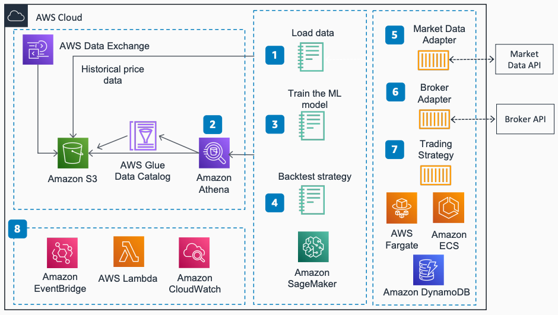

# Algorithmic Trading on AWS

Publication date: **December 21, 2020 ([Diagram history](#algotrading-history "#algotrading-history"))**

With this architecture, you can backtest and host machine learning (ML)-based algorithmic
trading strategies. The solution uses [Amazon Elastic Container Service](../../../AmazonECS/latest/developerguide.md "../../../AmazonECS/latest/developerguide.md") with [AWS Fargate](../../../AmazonECS/latest/userguide/what-is-fargate.md "../../../AmazonECS/latest/userguide/what-is-fargate.md") for containerized
services, [Amazon SageMaker AI](../../../sagemaker/latest/dg.md "../../../sagemaker/latest/dg.md") for model
training, and [Amazon DynamoDB](../../../amazondynamodb/latest/developerguide.md "../../../amazondynamodb/latest/developerguide.md") for transactional data
storage.

## Algorithmic trading diagram

The following steps describe the data flow and trading components for this
architecture:

1. Get historical price data from AWS Data Exchange or external market data
   sources.
2. Catalog historical price data in [AWS Glue Data Catalog](../../../glue/latest/dg.md "../../../glue/latest/dg.md") and query data by using [Amazon Athena](../../../athena/latest/ug.md "../../../athena/latest/ug.md").
3. Train the ML model for ML-based trading strategies by using SageMaker AI.
4. Run the backtest for your trading strategy as a task through AWS Fargate and
   Amazon ECS.
5. Run the Market Data Adapter as a service through AWS Fargate and Amazon ECS.
   Feed data into DynamoDB.
6. Run the Broker Adapter as a service through AWS Fargate and Amazon ECS. Use
   DynamoDB as the transaction store.
7. Run the Trading Strategy as a service through AWS Fargate and Amazon ECS.
8. Use [Amazon EventBridge](../../../eventbridge/latest/userguide.md "../../../eventbridge/latest/userguide.md") for job scheduling with [AWS Lambda](../../../lambda/latest/dg.md "../../../lambda/latest/dg.md") functions. Use [Amazon CloudWatch](../../../AmazonCloudWatch/latest/monitoring.md "../../../AmazonCloudWatch/latest/monitoring.md") for
   monitoring.

## Further reading

For additional information, see the following resources:

- [AWS Architecture Icons](https://aws.amazon.com/architecture/icons "https://aws.amazon.com/architecture/icons")
- [AWS Architecture Center](https://aws.amazon.com/architecture/ "https://aws.amazon.com/architecture/")
- [AWS
  Well-Architected](https://aws.amazon.com/architecture/well-architected "https://aws.amazon.com/architecture/well-architected")

## Diagram history

To receive updates about this reference architecture diagram, subscribe to the RSS
feed.

| Change              | Description                                     | Date              |
| ------------------- | ----------------------------------------------- | ----------------- |
| Initial publication | Reference architecture diagram first published. | December 21, 2020 |

###### RSS subscription requirement

To subscribe to RSS updates, you must have an RSS plugin enabled for the browser you are
using.
