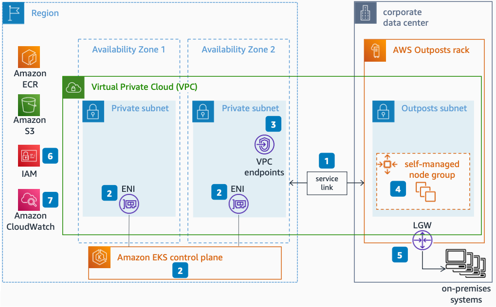

# Amazon Elastic Kubernetes Service on AWS Outposts Rack

Publication date: **October 31, 2022 ([Diagram history](#diagram-history "#diagram-history"))**

This reference architecture diagram shows how to deploy [Amazon Elastic Kubernetes Service](../../../eks/latest/userguide/what-is-eks.md "../../../eks/latest/userguide/what-is-eks.md") (Amazon EKS) on an [AWS Outposts](../../../outposts/latest/userguide/what-is-outposts.md "../../../outposts/latest/userguide/what-is-outposts.md") rack.

## Amazon Elastic Kubernetes Service on AWS Outposts Rack

1. Ensure a reliable network connection between your AWS Outpost and its parent Region. Highly available, low-latency connectivity, such as [https://docs.aws.amazon.com/directconnect/latest/UserGuide/Welcome.html](../../../directconnect/latest/UserGuide/Welcome.md "../../../directconnect/latest/UserGuide/Welcome.md").
2. Create a private Amazon EKS cluster control plane, selecting subnets in the Region where Amazon EKS managed elastic network interfaces (ENIs) will be placed.
3. For private subnets without a path to the internet, create VPC endpoints for [Amazon Elastic Compute Cloud](../../../AWSEC2/latest/UserGuide/concepts.md "../../../AWSEC2/latest/UserGuide/concepts.md") (Amazon EC2), [Amazon Simple Storage Service](../../../AmazonS3/latest/userguide/Welcome.md "../../../AmazonS3/latest/userguide/Welcome.md") (Amazon S3), and Amazon Elastic Container Registry (Amazon ECR). Depending on which other AWS services you plan to use, additional endpoints might be needed.
4. Create self-managed Amazon EKS nodes on AWS Outposts, following the prerequisites.
5. Expose Amazon EKS nodes to your local network through a local gateway (LGW). See [how Local gateways](../../../outposts/latest/userguide/outposts-local-gateways.md "../../../outposts/latest/userguide/outposts-local-gateways.md") work.
6. Use [AWS Identity and Access Management](../../../IAM/latest/UserGuide/introduction.md "../../../IAM/latest/UserGuide/introduction.md") (IAM) to manage user and role access to your cluster.
7. AWS Outposts supports Amazon CloudWatch metrics. For a list of supported metrics, see [CloudWatch metrics for AWS Outposts](../../../outposts/latest/userguide/outposts-cloudwatch-metrics.md "../../../outposts/latest/userguide/outposts-cloudwatch-metrics.md").

## Further reading

For additional information, refer to

- [AWS Architecture Icons](https://aws.amazon.com/architecture/icons "https://aws.amazon.com/architecture/icons")
- [AWS Architecture Center](https://aws.amazon.com/architecture "https://aws.amazon.com/architecture")
- [AWS Well-Architected](https://aws.amazon.com/architecture/well-architected "https://aws.amazon.com/architecture/well-architected")
- [AWS Outposts product page](https://aws.amazon.com/outposts/ "https://aws.amazon.com/outposts/")

## Diagram history

To be notified about updates to this reference architecture diagram, subscribe to the RSS feed.

| Change              | Description                                     | Date             |
| ------------------- | ----------------------------------------------- | ---------------- |
| Initial publication | Reference architecture diagram first published. | October 31, 2022 |

###### Note

To subscribe to RSS updates, you must have an RSS plugin enabled for the browser you are using.
