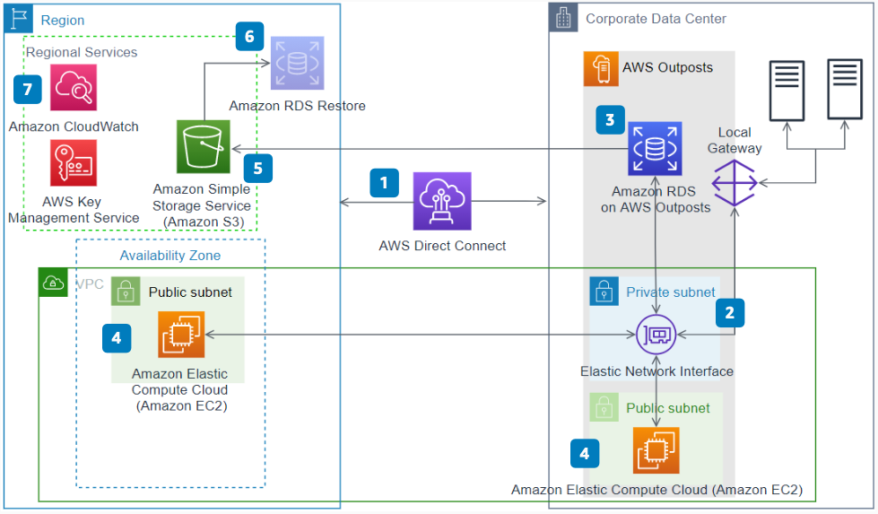

# Amazon Relational Database Service on AWS Outposts

Publication date: **January 12, 2021 ([Diagram history](#diagram-history "#diagram-history"))**

This reference architecture diagram shows how to deploy [Amazon Relational Database Service](../../../AmazonRDS/latest/UserGuide/Welcome.md "../../../AmazonRDS/latest/UserGuide/Welcome.md") (Amazon RDS) on [AWS Outposts](../../../outposts/latest/userguide/what-is-outposts.md "../../../outposts/latest/userguide/what-is-outposts.md").

## Amazon Relational Database Service on AWS Outposts

1. Ensure a secure connection between AWS Outposts and the parent Region by using [https://docs.aws.amazon.com/directconnect/latest/UserGuide/Welcome.html](../../../directconnect/latest/UserGuide/Welcome.md "../../../directconnect/latest/UserGuide/Welcome.md") or a virtual private network (VPN). If the network connection between the AWS Region and AWS Outposts is disconnected, Amazon RDS for Outposts continues to run. API calls and management tasks are unavailable until the connection is restored.
2. Create a database (DB) subnet group that includes one subnet associated with your Outpost by using the AWS Management Console, the , or APIs. Customer Owned IP is also available for Amazon RDS on Outposts.
3. Create a supported Amazon RDS on Outposts instance by using the AWS Management Console, , or APIs. Amazon RDS creates an Elastic Network Interface (ENI) in the DB subnet group specified earlier. Amazon RDS currently supports MySQL and PostgreSQL database engines and db.m5 and db.r5 instances.
4. For Amazon RDS on AWS Outposts backups, you can use automated backups or manual snapshots. All snapshots and transaction logs are stored in the AWS Region. By default, automatic backups are enabled for 7 days. Retention can be set to a minimum of 1 day and maximum of 35 days.
5. Applications in the same VPC within the same Region or on Outposts can connect to the database by using the Amazon RDS endpoint. On-premises applications can connect to the Amazon RDS database through the Outposts Local gateway Direct VPC connect.
6. For disaster recovery, you can restore the Amazon RDS database in the parent Region. Use a snapshot taken from the Amazon RDS instance running on AWS Outposts.
7. AWS Outposts supports Amazon CloudWatch metrics. For a list of supported metrics, see [CloudWatch metrics for AWS Outposts](../../../outposts/latest/userguide/outposts-cloudwatch-metrics.md "../../../outposts/latest/userguide/outposts-cloudwatch-metrics.md").

## Further reading

For additional information, refer to

- [AWS Architecture Icons](https://aws.amazon.com/architecture/icons "https://aws.amazon.com/architecture/icons")
- [AWS Architecture Center](https://aws.amazon.com/architecture "https://aws.amazon.com/architecture")
- [AWS Well-Architected](https://aws.amazon.com/architecture/well-architected "https://aws.amazon.com/architecture/well-architected")
- [AWS Outposts product page](https://aws.amazon.com/outposts/ "https://aws.amazon.com/outposts/")

## Diagram history

To be notified about updates to this reference architecture diagram, subscribe to the RSS feed.

| Change              | Description                                     | Date             |
| ------------------- | ----------------------------------------------- | ---------------- |
| Initial publication | Reference architecture diagram first published. | January 12, 2021 |

###### Note

To subscribe to RSS updates, you must have an RSS plugin enabled for the browser you are using.
