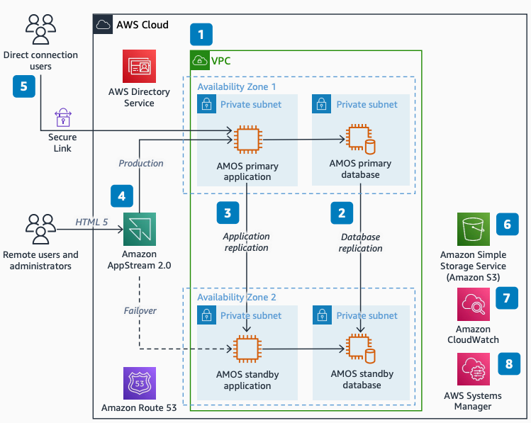

# AMOS Implementation on AWS

Publication date: **April 19, 2022 ([Diagram history](#amos-implementation-history "#amos-implementation-history"))**

This reference architecture shows how airlines can implement the Aircraft Maintenance
and Engineering Operating System (AMOS) on AWS. Airlines use this architecture to achieve
high availability, resiliency, and cost efficiency for Maintenance, Repair, and Overhaul (MRO)
workloads. AMOS is an MRO management system that airlines and maintenance organizations
use for aircraft maintenance operations.

Airlines that run AMOS on-premises often face challenges with hardware refresh cycles,
limited disaster recovery options, and high total cost of ownership (TCO). This architecture
provides a resilient deployment of AMOS across multiple Availability Zones with managed
services for monitoring, patch management, and secure remote access.

## AMOS implementation diagram

The following steps describe the architecture:

1. Create an [Amazon VPC](../../../vpc/latest/userguide.md "../../../vpc/latest/userguide.md") to host
   [Amazon EC2](../../../AWSEC2/latest/UserGuide.md "../../../AWSEC2/latest/UserGuide.md") instances.
   Deploy production application and database instances to one Availability Zone.
   Deploy failover instances to another Availability Zone.
2. AMOS supports SAP Adaptive Server Enterprise (ASE),
   Oracle Database Standard Edition (SE) and Enterprise Edition (EE),
   and PostgreSQL. Use native replication tools for cross-AZ database replication.
3. AMOS is not designed for load-balanced environments. Replicate with a standby
   Amazon EC2 instance through the AMOS native solution. On failover, remap the primary
   Elastic Network Interface to the standby instance.
4. Deploy Amazon AppStream 2.0 for HTML5 browser access. Use
   AWS Directory Service for user authentication. Use [Route 53](../../../Route53/latest/DeveloperGuide.md "../../../Route53/latest/DeveloperGuide.md") for DNS translation.
5. When direct connection to AMOS is required, connect through a secure channel.
   Use AWS Client VPN with [AWS Direct Connect](../../../directconnect/latest/UserGuide.md "../../../directconnect/latest/UserGuide.md").
6. Use [Amazon S3](../../../AmazonS3/latest/userguide.md "../../../AmazonS3/latest/userguide.md") for AMOS application binaries,
   database devices, web drivers, and backups.
7. Use [CloudWatch](../../../AmazonCloudWatch/latest/logs.md "../../../AmazonCloudWatch/latest/logs.md") for server and ecosystem monitoring.
8. Use [AWS Systems Manager](../../../systems-manager/latest/userguide.md "../../../systems-manager/latest/userguide.md") for Amazon EC2
   operating system patch management.

## Further reading

For additional information, see the following resources:

- [AWS Architecture Icons](https://aws.amazon.com/architecture/icons "https://aws.amazon.com/architecture/icons")
- [AWS Architecture Center](https://aws.amazon.com/architecture/ "https://aws.amazon.com/architecture/")
- [AWS Well-Architected](https://aws.amazon.com/architecture/well-architected "https://aws.amazon.com/architecture/well-architected")

## Diagram history

To receive updates about this reference architecture diagram, subscribe to the RSS
feed.

| Change              | Description                                     | Date           |
| ------------------- | ----------------------------------------------- | -------------- |
| Initial publication | Reference architecture diagram first published. | April 19, 2022 |

###### RSS subscription requirement

To subscribe to RSS updates, you must have an RSS plugin enabled for the browser you
are using.
