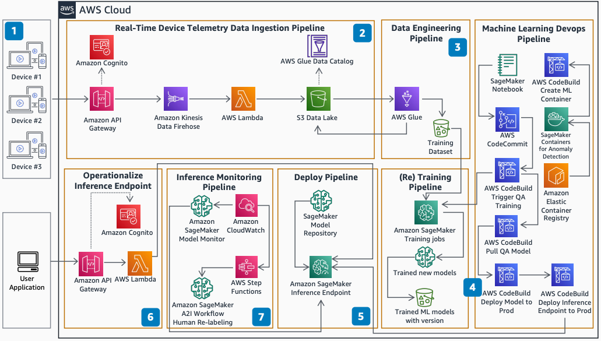

# Build Your Own Anomaly Detection ML Pipeline

Publication date: **June 1, 2021 ([Diagram history](#diagram-history "#diagram-history"))**

This architecture shows how to build an end-to-end ML pipeline that detects anomalies. You can ingest real-time streaming data, perform transformations, and continuously retrain ML models.

## Build Your Own Anomaly Detection ML Pipeline

The following steps describe the architecture:

1. Device telemetry data is ingested from field devices on a near real-time basis through calls to the API through [Amazon API Gateway](../../../apigateway/latest/developerguide/welcome.md "../../../apigateway/latest/developerguide/welcome.md"). [Amazon Cognito](../../../cognito/latest/developerguide/what-is-amazon-cognito.md "../../../cognito/latest/developerguide/what-is-amazon-cognito.md") authenticates and authorizes the requests.
2. [Amazon Kinesis Data Firehose](../../../firehose/latest/dev/what-is-this-service.md "../../../firehose/latest/dev/what-is-this-service.md") ingests the data in real time and invokes [AWS Lambda](../../../lambda/latest/dg/welcome.md "../../../lambda/latest/dg/welcome.md") to transform the data into Parquet format. Kinesis Data Firehose automatically scales to match the data throughput.
3. [AWS Glue](../../../glue/latest/dg/what-is-glue.md "../../../glue/latest/dg/what-is-glue.md") jobs aggregate the telemetry data on an hourly basis. The jobs re-partition data based on year, month, date, and hour. Additional steps such as transformations and feature engineering prepare the data for training. The training dataset is stored in the [Amazon Simple Storage Service](../../../AmazonS3/latest/userguide/Welcome.md "../../../AmazonS3/latest/userguide/Welcome.md") data lake.
4. Training code checked into [AWS CodeCommit](../../../codecommit/latest/userguide/welcome.md "../../../codecommit/latest/userguide/welcome.md") triggers an MLOps pipeline by using [AWS CodePipeline](../../../codepipeline/latest/userguide/welcome.md "../../../codepipeline/latest/userguide/welcome.md"). CodePipeline builds the [Amazon SageMaker AI](../../../sagemaker/latest/dg/whatis.md "../../../sagemaker/latest/dg/whatis.md") training and inference containers. It triggers the SageMaker AI training job, deploys the trained model in the testing environment, and upon approval, deploys the model into production.
5. The ML models generated by training jobs are registered in the SageMaker AI Model Repository. The deploy pipeline selects the best ML model to deploy by using SageMaker AI hosting.
6. You can classify telemetry data as anomalous or not through an HTTPS API by using API Gateway and Lambda functions. The Lambda function invokes the SageMaker AI endpoint to predict the anomaly.
7. SageMaker AI Model Monitor monitors the inference quality. Requests with ambiguous prediction scores are sent for re-labeling by using [Amazon CloudWatch](../../../AmazonCloudWatch/latest/monitoring/WhatIsCloudWatch.md "../../../AmazonCloudWatch/latest/monitoring/WhatIsCloudWatch.md") events. These events trigger the SageMaker AI A2I workflow through [AWS Step Functions](../../../step-functions/latest/dg/welcome.md "../../../step-functions/latest/dg/welcome.md").

## Further reading

For additional information, refer to the following resources:

- [AWS Architecture Icons](https://aws.amazon.com/architecture/icons "https://aws.amazon.com/architecture/icons")
- [AWS Architecture Center](https://aws.amazon.com/architecture "https://aws.amazon.com/architecture")
- [AWS Well-Architected](https://aws.amazon.com/architecture/well-architected "https://aws.amazon.com/architecture/well-architected")
- [Amazon SageMaker AI product page](https://aws.amazon.com/sagemaker/ "https://aws.amazon.com/sagemaker/")

## Diagram history

To be notified about updates to this reference architecture diagram, subscribe to the RSS feed.

| Change              | Description                                     | Date         |
| ------------------- | ----------------------------------------------- | ------------ |
| Initial publication | Reference architecture diagram first published. | June 1, 2021 |

###### Note

To subscribe to RSS updates, you must have an RSS plugin enabled for the browser you are using.
