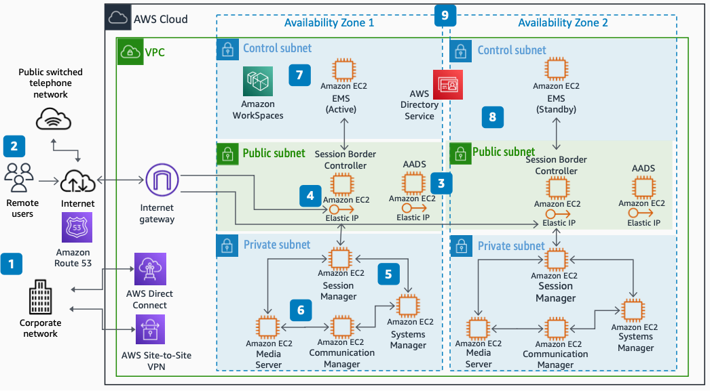

# Architecture for Unified Communications

Publication date: **November 1, 2021 ([Diagram history](#diagram-history "#diagram-history"))**

This reference architecture diagram shows how to deploy the Avaya Aura Unified Communications platform on AWS.

## Architecture for Unified Communications

1. Users on a corporate network register UC applications and devices by using [AWS Direct Connect](../../../directconnect/latest/UserGuide/Welcome.md "../../../directconnect/latest/UserGuide/Welcome.md") or AWS Site-to-Site VPN.
2. Remote workers connect UC applications and devices through the public internet.
3. UC devices and soft clients pull configuration from Avaya Aura Device Services (AADS) that runs on [Amazon Elastic Compute Cloud](../../../AWSEC2/latest/UserGuide/concepts.md "../../../AWSEC2/latest/UserGuide/concepts.md") (Amazon EC2).
4. Sessions are established with one of the Session Border Controllers (SBCs) as entry points managed by the Element Management System (EMS).
5. User authentication and session management occurs at the Session Managers, controlled by the Systems Manager.
6. Communication Manager provides telephony features with Media Servers for digital signal processing (DSP) resources.
7. [Amazon WorkSpaces](../../../workspaces/latest/adminguide/amazon-workspaces.md "../../../workspaces/latest/adminguide/amazon-workspaces.md") provides a simplified bastion host for management activities.
8. [AWS Directory Service](../../../directoryservice/latest/admin-guide/what_is.md "../../../directoryservice/latest/admin-guide/what_is.md") provides a unified directory for user creation.
9. Avaya Aura roles are distributed in two Availability Zones for high availability (HA) purposes.

## Further reading

For additional information, refer to

- [AWS Architecture Icons](https://aws.amazon.com/architecture/icons "https://aws.amazon.com/architecture/icons")
- [AWS Architecture Center](https://aws.amazon.com/architecture "https://aws.amazon.com/architecture")
- [AWS Well-Architected](https://aws.amazon.com/architecture/well-architected "https://aws.amazon.com/architecture/well-architected")
- [Amazon Connect product page](https://aws.amazon.com/connect/ "https://aws.amazon.com/connect/")
- [AWS Direct Connect product page](https://aws.amazon.com/directconnect/ "https://aws.amazon.com/directconnect/")

## Diagram history

To be notified about updates to this reference architecture diagram, subscribe to the RSS feed.

| Change              | Description                                     | Date             |
| ------------------- | ----------------------------------------------- | ---------------- |
| Initial publication | Reference architecture diagram first published. | November 1, 2021 |

###### Note

To subscribe to RSS updates, you must have an RSS plugin enabled for the browser you are using.
