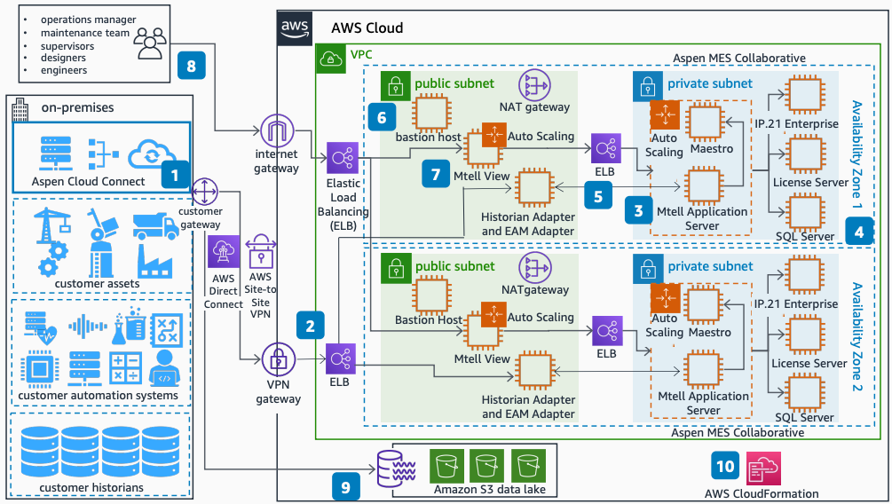

# Predictive Maintenance on AWS using Aspen Mtell

Publication date: **January 26, 2023 ([Diagram history](#amp-diagram-history "#amp-diagram-history"))**

With this architecture, you can deploy AI and ML-powered predictive maintenance by using
Aspen Mtell with [AWS Direct Connect](../../../directconnect/latest/UserGuide.md "../../../directconnect/latest/UserGuide.md") or [AWS Site-to-Site VPN](../../../vpn/latest/s2svpn.md "../../../vpn/latest/s2svpn.md"). This solution provides early warnings of
equipment failure from your assets, control automation systems, and historians. The
architecture uses [Amazon Elastic Compute Cloud](../../../AWSEC2/latest/UserGuide.md "../../../AWSEC2/latest/UserGuide.md"), [Amazon Simple Storage Service](../../../AmazonS3/latest/userguide.md "../../../AmazonS3/latest/userguide.md"), and [AWS CloudFormation](../../../AWSCloudFormation/latest/UserGuide.md "../../../AWSCloudFormation/latest/UserGuide.md").

## Aspen Mtell predictive maintenance architecture diagram

The following steps describe the architecture:

1. Aspen Connect connects data sources from your assets, automation
   systems, and historians into Aspen MES Collaborative through
   Direct Connect or Site-to-Site VPN.
2. Distribute data through Elastic Load Balancing (ELB) to Amazon EC2 instances running the
   Athena Historian Adapter across two Availability Zones.
3. In each Availability Zone, Aspen IP.21 Enterprise runs on Amazon EC2
   instances in a private subnet to aggregate and manage data.
4. The Aspen Mtell Application Server persists data in SQL Server on
   Amazon EC2.
5. The Historian Adapter fetches data from remote historians. The EAM Adapter connects
   to EAM applications on premises or in the cloud.
6. A bastion host in the public subnet connects to private subnet instances for
   troubleshooting.
7. Aspen Mtell View runs on Amazon EC2 in an Auto Scaling group.
8. End users connect to Mtell View through a web browser. ELB behind an
   internet gateway directs traffic.
9. Aspen Cloud Connect delivers asset model and operational technology
   (OT) data to Amazon S3 for data lakes.
10. A CloudFormation template provides deployment of Aspen Mtell.

For more information about Aspen Mtell, see [Aspen Mtell product
page](https://www.aspentech.com/en/products/apm/aspen-mtell "https://www.aspentech.com/en/products/apm/aspen-mtell") on the AspenTech website.

## Further reading

For additional information, see the following resources:

- [AWS Architecture Icons](https://aws.amazon.com/architecture/icons "https://aws.amazon.com/architecture/icons")
- [AWS Architecture Center](https://aws.amazon.com/architecture "https://aws.amazon.com/architecture")
- [AWS Well-Architected](https://aws.amazon.com/architecture/well-architected "https://aws.amazon.com/architecture/well-architected")

## Diagram history

To be notified about updates to this reference architecture diagram, subscribe to the RSS feed.

| Change              | Description                                     | Date             |
| ------------------- | ----------------------------------------------- | ---------------- |
| Initial publication | Reference architecture diagram first published. | January 26, 2023 |

###### RSS subscription

To subscribe to RSS updates, you must have an RSS plugin enabled for the browser that you are using.
