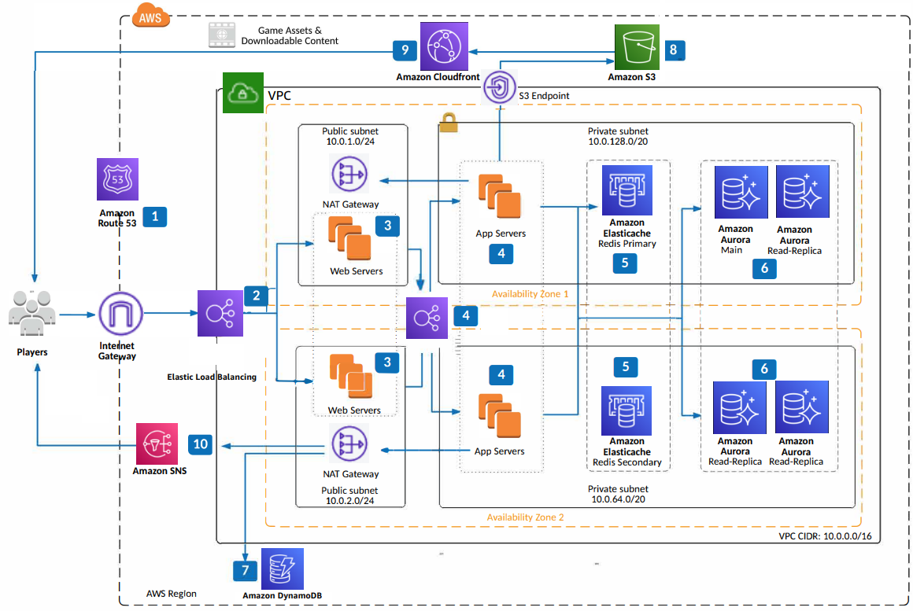

# Asynchronous Online Gaming

Publication date: **March 24, 2021 ([Diagram history](#async-history "#async-history"))**

This architecture is intended for mobile and online games. These workloads are a natural fit
for running on AWS due to unexpected traffic patterns and highly demanding request rates. With
AWS, you can start small and scale up your architecture in response to your players. Use
managed services for popular caching and database technologies to deliver the best experience for
your game.

## Asynchronous Online Gaming diagram

The following steps describe the architecture:

1. Use Amazon Route 53 to make sure your players can always discover your service
   endpoints. Use the built-in routing policies to route users based on latency or
   geography.
2. Route users to your backend by using Elastic Load Balancing, which scales
   automatically for incoming traffic. Keep player data secure in transit through HTTPS and
   by using the SSL termination capabilities of the load balancer.
3. Launch your web servers running on [Amazon Elastic Compute Cloud](../../../AWSEC2/latest/UserGuide.md "../../../AWSEC2/latest/UserGuide.md") in an Auto Scaling group that spans
   multiple Availability Zones.
4. If you separate your app tier from your web tier, use an internal load balancer. This
   load balancer provides additional security by residing in a private subnet and making sure
   no external traffic overwhelms your app tier.
5. Use [Amazon ElastiCache](../../../AmazonElastiCache/latest/red-ug.md "../../../AmazonElastiCache/latest/red-ug.md") for Redis to reduce the cost and operational
   overhead of running a highly available, scalable Redis cluster. Use
   Multi-AZ ElastiCache in your game to provide automated disaster recovery and a scalable
   tier with read replicas.
6. Amazon Aurora is a MySQL-compatible database that provides high read
   and write throughput. It supports up to 64 TB of six-way replicated storage and up to 15
   low-latency read replicas across multiple Availability Zones.
7. Your game also benefits from [Amazon DynamoDB](../../../amazondynamodb/latest/developerguide.md "../../../amazondynamodb/latest/developerguide.md"), a managed NoSQL database
   that provides predictable performance and scalability.
8. Use [Amazon Simple Storage Service](../../../AmazonS3/latest/userguide.md "../../../AmazonS3/latest/userguide.md") to
   store your game assets, downloadable content, and log files generated by your servers. As
   your user base grows geographically, use [Amazon CloudFront](../../../AmazonCloudFront/latest/DeveloperGuide.md "../../../AmazonCloudFront/latest/DeveloperGuide.md") as a globally distributed
   cache for content.
9. For push notifications, use [Amazon Simple Notification Service](../../../sns/latest/dg.md "../../../sns/latest/dg.md") with built-in support for Apple,
   Google, Amazon, and Windows
   platforms.

## Further reading

For additional information, see the following resources:

- [AWS Architecture Icons](https://aws.amazon.com/architecture/icons "https://aws.amazon.com/architecture/icons")
- [AWS Architecture Center](https://aws.amazon.com/architecture/ "https://aws.amazon.com/architecture/")
- [AWS
  Well-Architected](https://aws.amazon.com/architecture/well-architected "https://aws.amazon.com/architecture/well-architected")

## Diagram history

To be notified about updates to this reference architecture diagram, subscribe to the RSS
feed.

| Change              | Description                                     | Date           |
| ------------------- | ----------------------------------------------- | -------------- |
| Initial publication | Reference architecture diagram first published. | March 24, 2021 |

###### Note

To subscribe to RSS updates, you must have an RSS plugin enabled for the browser you are
using.
