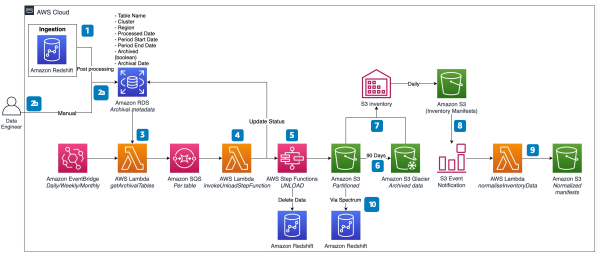

# Automated Archival for Amazon Redshift

Publication date: **July 12, 2021 ([Diagram history](#diagram-history "#diagram-history"))**

This architecture shows how to automate the periodic data archival process for an [Amazon Redshift](../../../redshift/latest/dg/welcome.md "../../../redshift/latest/dg/welcome.md") database. The cold data remains available instantly, and you can join it with existing datasets in the Amazon Redshift cluster using Amazon Redshift Spectrum.

## Automated Archival for Amazon Redshift

The following steps describe the architecture:

1. Ingest data into the Amazon Redshift cluster at various frequencies.
2. After every ingestion load, create a queue of metadata about tables populated into Amazon Redshift tables in Amazon RDS. Data engineers can also create the archival queue manually.
3. Use [Amazon EventBridge](../../../eventbridge/latest/userguide/eb-what-is.md "../../../eventbridge/latest/userguide/eb-what-is.md") to trigger an [AWS Lambda](../../../lambda/latest/dg/welcome.md "../../../lambda/latest/dg/welcome.md") function periodically. The function reads the queue from the RDS table and creates an [Amazon Simple Queue Service](../../../AWSSimpleQueueService/latest/SQSDeveloperGuide/welcome.md "../../../AWSSimpleQueueService/latest/SQSDeveloperGuide/welcome.md") message for every period due for archival.
4. A proxy Lambda function dequeues the Amazon SQS messages and invokes [AWS Step Functions](../../../step-functions/latest/dg/welcome.md "../../../step-functions/latest/dg/welcome.md") for every message.
5. Step Functions unloads the data from the Amazon Redshift cluster into an [Amazon Simple Storage Service](../../../AmazonS3/latest/userguide/Welcome.md "../../../AmazonS3/latest/userguide/Welcome.md") bucket for the given table and period.
6. Amazon S3 Lifecycle configuration moves data in buckets from S3 Standard storage class to S3 Glacier storage class after 90 days.
7. Amazon S3 inventory tool generates manifest files from the Amazon S3 bucket dedicated for cold data on a daily basis and stores them in an Amazon S3 bucket for manifest files.
8. Every time an inventory manifest file is created in a manifest Amazon S3 bucket, a Lambda function triggers through an Amazon S3 event notification.
9. A Lambda function normalizes the manifest file for easy consumption in the event of restore.
10. Query the data stored in the Amazon S3 bucket for cold data using Amazon Redshift Spectrum.

## Further reading

For additional information, refer to the following resources:

- [AWS Architecture Icons](https://aws.amazon.com/architecture/icons "https://aws.amazon.com/architecture/icons")
- [AWS Architecture Center](https://aws.amazon.com/architecture "https://aws.amazon.com/architecture")
- [AWS Well-Architected](https://aws.amazon.com/architecture/well-architected "https://aws.amazon.com/architecture/well-architected")

## Diagram history

To be notified about updates to this reference architecture diagram, subscribe to the RSS feed.

| Change              | Description                                     | Date          |
| ------------------- | ----------------------------------------------- | ------------- |
| Initial publication | Reference architecture diagram first published. | July 12, 2021 |

###### Note

To subscribe to RSS updates, you must have an RSS plugin enabled for the browser you are using.
