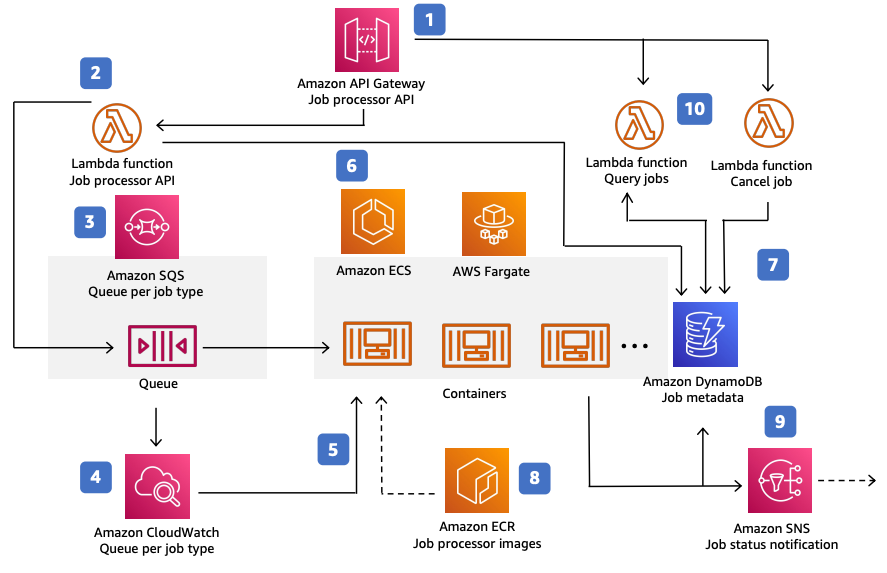

# Autoscaling Asynchronous Job Queues

Publication date: **April 15, 2021 ([Diagram history](#diagram-history "#diagram-history"))**

This architecture shows how to perform background processing jobs such as document generation, extract, transform, and load (ETL) tasks, and inference with [AWS Fargate](../../../AmazonECS/latest/developerguide/AWS_Fargate.md "../../../AmazonECS/latest/developerguide/AWS_Fargate.md"). You use [Amazon Simple Queue Service](../../../AWSSimpleQueueService/latest/SQSDeveloperGuide/welcome.md "../../../AWSSimpleQueueService/latest/SQSDeveloperGuide/welcome.md"), [Amazon DynamoDB](../../../amazondynamodb/latest/developerguide/Introduction.md "../../../amazondynamodb/latest/developerguide/Introduction.md"), and [AWS Lambda](../../../lambda/latest/dg/welcome.md "../../../lambda/latest/dg/welcome.md") to manage the job lifecycle.

## Autoscaling Asynchronous Job Queues

The following steps describe the architecture:

1. Each job type requires an [Amazon Elastic Container Service](../../../AmazonECS/latest/developerguide/Welcome.md "../../../AmazonECS/latest/developerguide/Welcome.md") instance (desiredCount = 0), an Amazon SQS queue, and associated [Amazon CloudWatch](../../../AmazonCloudWatch/latest/monitoring/WhatIsCloudWatch.md "../../../AmazonCloudWatch/latest/monitoring/WhatIsCloudWatch.md") alarms.
2. [Amazon API Gateway](../../../apigateway/latest/developerguide/welcome.md "../../../apigateway/latest/developerguide/welcome.md") provides an interface to add, query, and cancel jobs.
3. The add job Lambda function creates the job state item in DynamoDB and enqueues the job ID on Amazon SQS.
4. The Amazon SQS job queue contains messages with the IDs of the jobs to be processed.
5. CloudWatch monitors the Amazon SQS queue depth. Alarms are triggered when the depth exceeds a configurable value and when the queue is empty.
6. Amazon ECS responds to the CloudWatch alarms, changing the desired count and scaling the number of parallel jobs.
7. AWS Fargate runs job processing containers from Amazon Elastic Container Registry (Amazon ECR). The containers poll Amazon SQS for job IDs, read the job item from DynamoDB, and perform processing, updating the job status in DynamoDB and publishing to an [Amazon Simple Notification Service](../../../sns/latest/dg/welcome.md "../../../sns/latest/dg/welcome.md") topic on a status change.
8. A DynamoDB table stores the state, parameters, and results of the jobs by job ID.
9. Amazon ECR stores the job processing container images. An Amazon SNS topic publishes job items on state change notifications to subscribers.
10. Two control Lambda functions allow jobs to be queried and canceled from API Gateway by reading or updating the job item in DynamoDB.

## Further reading

For additional information, refer to the following resources:

- [AWS Architecture Icons](https://aws.amazon.com/architecture/icons "https://aws.amazon.com/architecture/icons")
- [AWS Architecture Center](https://aws.amazon.com/architecture "https://aws.amazon.com/architecture")
- [AWS Well-Architected](https://aws.amazon.com/architecture/well-architected "https://aws.amazon.com/architecture/well-architected")

## Diagram history

To be notified about updates to this reference architecture diagram, subscribe to the RSS feed.

| Change              | Description                                     | Date           |
| ------------------- | ----------------------------------------------- | -------------- |
| Initial publication | Reference architecture diagram first published. | April 15, 2021 |

###### Note

To subscribe to RSS updates, you must have an RSS plugin enabled for the browser you are using.
