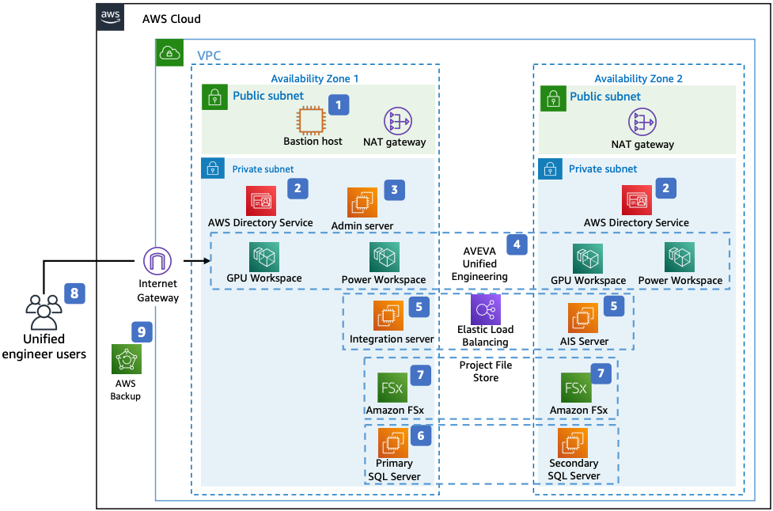

# AVEVA Unified Engineering Deployment on AWS

Publication date: **April 5, 2022 ([Diagram history](#aveva-diagram-history "#aveva-diagram-history"))**

With this architecture, you can deploy AVEVA Unified Engineering, a suite of
Windows desktop authoring applications for process simulation and 1D, 2D, 3D engineering and
design. You can provide engineers with secure virtual desktop access through [Amazon WorkSpaces](../../../workspaces/latest/adminguide.md "../../../workspaces/latest/adminguide.md"). This architecture
uses Amazon WorkSpaces, [AWS Directory Service](../../../directoryservice/latest/admin-guide.md "../../../directoryservice/latest/admin-guide.md"), [Amazon Elastic Compute Cloud](../../../AWSEC2/latest/UserGuide.md "../../../AWSEC2/latest/UserGuide.md") (Amazon EC2), [FSx for Windows File Server](../../../fsx/latest/WindowsGuide.md "../../../fsx/latest/WindowsGuide.md"), and [AWS Backup](../../../aws-backup/latest/devguide.md "../../../aws-backup/latest/devguide.md").

## AVEVA Unified Engineering architecture diagram

The following steps describe the architecture:

1. AWS Directory Service provides managed domain access control for engineers to access
   AVEVA Unified Engineering through Amazon WorkSpaces.
2. Users access virtual desktops through Amazon WorkSpaces.
3. Operations administrators log on to the Admin server through a bastion host in the
   public subnet.
4. GPU-powered and CPU-based WorkSpaces provide access to each Unified Engineering
   application. Deploy WorkSpaces in two Availability Zones for high availability.
5. The integration server hosts AVEVA middleware. Load balance Amazon EC2
   instances with [Elastic Load Balancing](../../../elasticloadbalancing/latest/userguide.md "../../../elasticloadbalancing/latest/userguide.md") for resilient
   architecture.
6. AVEVA stores data in Microsoft SQL Server on Amazon EC2
   instances. Deploy SQL servers in two Availability Zones as primary and secondary.
7. FSx for Windows File Server managed file system replicates between two Availability Zones for
   AVEVA Dabacon databases and project files through SMB.
8. A bastion host on Amazon EC2 allows administrators to access servers in the private
   subnet for Active Directory admin, SQL admin, and service configuration.
9. AWS Backup backs up AIS, admin, and SQL Server Amazon EC2 instances along with [Amazon Elastic Block Store](../../../ebs/latest/userguide.md "../../../ebs/latest/userguide.md") (Amazon EBS)
   and Amazon FSx.

## Further reading

For additional information, see the following resources:

- [AWS Architecture Icons](https://aws.amazon.com/architecture/icons "https://aws.amazon.com/architecture/icons")
- [AWS Architecture Center](https://aws.amazon.com/architecture "https://aws.amazon.com/architecture")
- [AWS Well-Architected](https://aws.amazon.com/architecture/well-architected "https://aws.amazon.com/architecture/well-architected")
- [Manufacturing on AWS](../manufacturing-on-aws/manufacturing-on-aws.md "../manufacturing-on-aws/manufacturing-on-aws.md")

## Diagram history

To be notified about updates to this reference architecture diagram, subscribe to the RSS feed.

| Change              | Description                                     | Date          |
| ------------------- | ----------------------------------------------- | ------------- |
| Initial publication | Reference architecture diagram first published. | April 5, 2022 |

###### RSS subscription

To subscribe to RSS updates, you must have an RSS plugin enabled for the browser that you are using.
