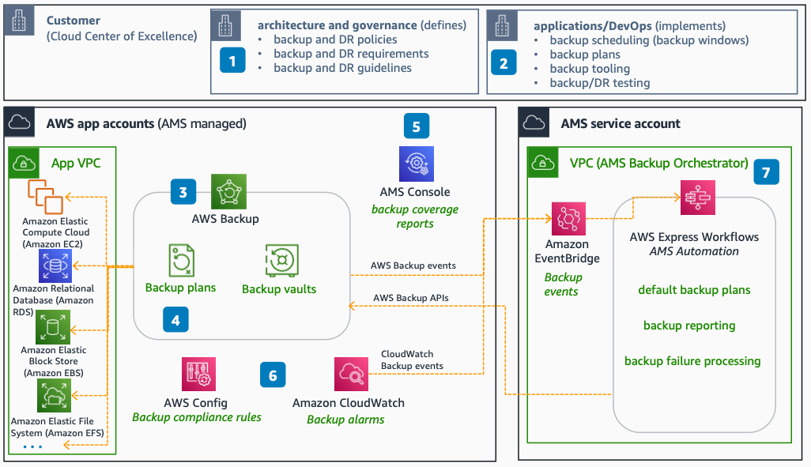

# AMS for Backup

Use this reference architecture to understand how AWS Managed Services (AMS) manages data availability and continuity. AMS takes complete ownership of backup monitoring, alerting, restoration, and reporting.

This reference architecture was validated by the AWS Managed Services team for technical accuracy on September 20, 2022.

The following steps describe the architecture:

1. The backup capability primarily falls under the architecture and governance teams. They define policies, provide guidelines, and requirements.
2. Your application and DevOps teams follow the guidelines and ensure regular backup at the application and OS levels. Your application teams are responsible for defining backup windows, backup plans, and disaster recovery (DR) testing.
3. AMS uses AWS Backup to perform backup and restore for all AWS services it supports. AMS sets up backup automation and vaults as part of AWS account onboarding.
4. AMS offers multiple backup plans to suit different needs. You set up custom backup plans or vaults based on environment, tier, recovery point objective (RPO), and applications by using AWS tags.
5. With AMS, you get daily backup coverage reporting based on account, plan, and resources. Backup reports are available to consume and export through the AMS Console.
6. AMS implements backup alerting and monitoring by using rules and Amazon CloudWatch.
7. The AMS internal service account runs backup orchestration and automation. receives all backup-related events to perform backup deployment, monitoring, alerting, reporting, and failure remediations.

## Deploy the architecture

AWS Managed Services deploys and manages this architecture on your behalf as part of the AMS operations plan. You do not need to deploy CloudFormation templates or write custom code. To get started with AMS, see the [What is AWS Managed Services?](../../../managedservices/latest/userguide/what-is-ams.md "../../../managedservices/latest/userguide/what-is-ams.md") section in the AMS User Guide.

For onboarding details and account setup, see [AMS onboarding](../../../managedservices/latest/userguide/ams-onboarding.md "../../../managedservices/latest/userguide/ams-onboarding.md").

## Further reading

For additional information, refer to the following resources:

- [AWS Architecture Icons](https://aws.amazon.com/architecture/icons "https://aws.amazon.com/architecture/icons")
- [AWS Architecture Center](https://aws.amazon.com/architecture "https://aws.amazon.com/architecture")
- [AWS Well-Architected](https://aws.amazon.com/architecture/well-architected "https://aws.amazon.com/architecture/well-architected")
- [AWS Managed Services product page](https://aws.amazon.com/managed-services/ "https://aws.amazon.com/managed-services/")

## Diagram history

To be notified about updates to this reference architecture diagram, subscribe to the RSS feed.

| Change                                                                                                                                 | Description                                      | Date               |
| -------------------------------------------------------------------------------------------------------------------------------------- | ------------------------------------------------ | ------------------ |
| [Initial publication](ams-helpdesk.md#helpdesk-diagram-history "ams-helpdesk.md#helpdesk-diagram-history")                             | Reference architecture diagrams first published. | September 20, 2022 |
| [Initial publication](ams-proactive-monitoring.md#monitoring-diagram-history "ams-proactive-monitoring.md#monitoring-diagram-history") | Reference architecture diagrams first published. | September 20, 2022 |
| [Initial publication](ams-security-operations.md#security-diagram-history "ams-security-operations.md#security-diagram-history")       | Reference architecture diagrams first published. | September 20, 2022 |
| [Initial publication](ams-logging.md#logging-diagram-history "ams-logging.md#logging-diagram-history")                                 | Reference architecture diagrams first published. | September 20, 2022 |
| [Initial publication](ams-patching.md#patching-diagram-history "ams-patching.md#patching-diagram-history")                             | Reference architecture diagrams first published. | September 20, 2022 |
| Initial publication                                                                                                                    | Reference architecture diagrams first published. | September 20, 2022 |

###### Note

To subscribe to RSS updates, you must have an RSS plugin enabled for the browser you are using.
