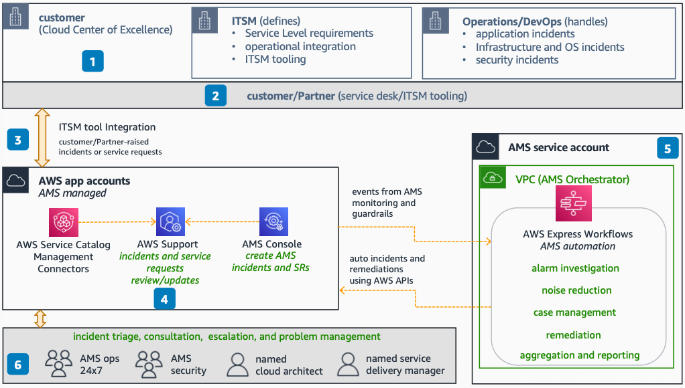

# AMS for Helpdesk

Use this reference architecture to understand how AWS Managed Services (AMS) provides 24x7 helpdesk in an AWS environment. AMS reduces operational burden by providing incident management, service requests, and problem management for all AWS services.

This reference architecture was validated by the AWS Managed Services team for technical accuracy on September 20, 2022.

The following steps describe the architecture:

1. The Helpdesk capability primarily falls under the information technology service management (ITSM) team. They define policies, provide guidelines, SLA requirements, and implement operational integration and ITSM tooling.
2. You or your partners can rely on AMS Helpdesk 24x7 for incidents at OS, infrastructure, and security levels. This frees your workforce for more value-added activities.
3. You and your partners are responsible for ITSM tooling and integration to the AWS ticketing system. With AMS, you can rely on AWS Service Management Connector (for ServiceNow or Jira SD) or use AWS Support APIs to integrate.
4. When you or your partners raise incidents and service requests, they end up in the standard AWS Support console. AMS then provides updates and resolutions.
5. The AMS service account receives events from AMS proactive monitoring and AMS security guardrails. AMS automation raises incidents, triggers remediations, and updates you through the AWS Support portal.
6. AMS acts as a single interface for all AWS related incidents. The AMS Operations team monitors your environments 24x7 (with email, phone, and chat support), backed by dedicated AMS security engineers.

## Deploy the architecture

AWS Managed Services deploys and manages this architecture on your behalf as part of the AMS operations plan. You do not need to deploy CloudFormation templates or write custom code. To get started with AMS, see the [What is AWS Managed Services?](../../../managedservices/latest/userguide/what-is-ams.md "../../../managedservices/latest/userguide/what-is-ams.md") section in the AMS User Guide.

For onboarding details and account setup, see [AMS onboarding](../../../managedservices/latest/userguide/ams-onboarding.md "../../../managedservices/latest/userguide/ams-onboarding.md").

## Further reading

For additional information, refer to the following resources:

- [AWS Architecture Icons](https://aws.amazon.com/architecture/icons "https://aws.amazon.com/architecture/icons")
- [AWS Architecture Center](https://aws.amazon.com/architecture "https://aws.amazon.com/architecture")
- [AWS Well-Architected](https://aws.amazon.com/architecture/well-architected "https://aws.amazon.com/architecture/well-architected")
- [AWS Managed Services product page](https://aws.amazon.com/managed-services/ "https://aws.amazon.com/managed-services/")

## Diagram history

To be notified about updates to this reference architecture diagram, subscribe to the RSS feed.

| Change                                                                                                                                 | Description                                      | Date               |
| -------------------------------------------------------------------------------------------------------------------------------------- | ------------------------------------------------ | ------------------ |
| Initial publication                                                                                                                    | Reference architecture diagrams first published. | September 20, 2022 |
| [Initial publication](ams-proactive-monitoring.md#monitoring-diagram-history "ams-proactive-monitoring.md#monitoring-diagram-history") | Reference architecture diagrams first published. | September 20, 2022 |
| [Initial publication](ams-security-operations.md#security-diagram-history "ams-security-operations.md#security-diagram-history")       | Reference architecture diagrams first published. | September 20, 2022 |
| [Initial publication](ams-logging.md#logging-diagram-history "ams-logging.md#logging-diagram-history")                                 | Reference architecture diagrams first published. | September 20, 2022 |
| [Initial publication](ams-patching.md#patching-diagram-history "ams-patching.md#patching-diagram-history")                             | Reference architecture diagrams first published. | September 20, 2022 |
| [Initial publication](ams-backup.md#backup-diagram-history "ams-backup.md#backup-diagram-history")                                     | Reference architecture diagrams first published. | September 20, 2022 |

###### Note

To subscribe to RSS updates, you must have an RSS plugin enabled for the browser you are using.
