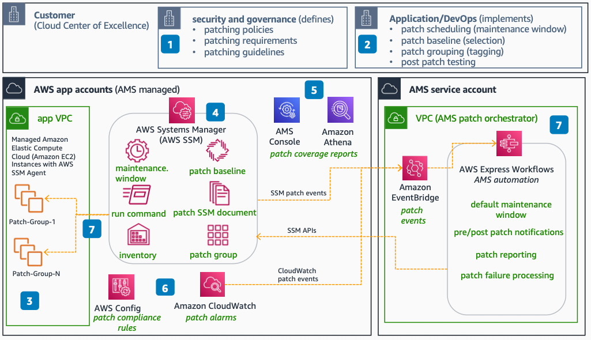

# AMS for Patching

Use this reference architecture to understand how AWS Managed Services (AMS) provides cross-account centralized patching. AMS takes complete ownership of OS patching, notifications, rollback, and reporting.

This reference architecture was validated by the AWS Managed Services team for technical accuracy on September 20, 2022.

The following steps describe the architecture:

1. The patching capability primarily falls under the security and governance teams. They define policies, provide guidelines, and requirements.
2. Your application and DevOps teams follow the guidelines to ensure regular patching at the application and OS levels. Your application teams are responsible for defining patch windows and post-patch application testing.
3. AMS sets up patch automation as part of AWS account onboarding. You define patch groups based on environment, tiers, and applications by using AWS Tags.
4. AMS uses AWS Systems Manager to perform OS patching. AMS works with you to set up patch baselines and patch maintenance windows by using AMS-provided Systems Manager automation documents (runbooks).
5. With AMS, you get daily patch coverage reporting based on account, groups, and patches. Reports are available to download through the AMS Console.
6. AMS implements patch alerting and monitoring by using rules and Amazon CloudWatch.
7. The AMS internal service account runs patch orchestration and automation. receives all patch-related events from Systems Manager. These events trigger pre-patch and post-patch notifications, pre-patch backup, OS patch updates, patch failure remediations, and patch inventory.

## Deploy the architecture

AWS Managed Services deploys and manages this architecture on your behalf as part of the AMS operations plan. You do not need to deploy CloudFormation templates or write custom code. To get started with AMS, see the [What is AWS Managed Services?](../../../managedservices/latest/userguide/what-is-ams.md "../../../managedservices/latest/userguide/what-is-ams.md") section in the AMS User Guide.

For onboarding details and account setup, see [AMS onboarding](../../../managedservices/latest/userguide/ams-onboarding.md "../../../managedservices/latest/userguide/ams-onboarding.md").

## Further reading

For additional information, refer to the following resources:

- [AWS Architecture Icons](https://aws.amazon.com/architecture/icons "https://aws.amazon.com/architecture/icons")
- [AWS Architecture Center](https://aws.amazon.com/architecture "https://aws.amazon.com/architecture")
- [AWS Well-Architected](https://aws.amazon.com/architecture/well-architected "https://aws.amazon.com/architecture/well-architected")
- [AWS Managed Services product page](https://aws.amazon.com/managed-services/ "https://aws.amazon.com/managed-services/")

## Diagram history

To be notified about updates to this reference architecture diagram, subscribe to the RSS feed.

| Change                                                                                                                                 | Description                                      | Date               |
| -------------------------------------------------------------------------------------------------------------------------------------- | ------------------------------------------------ | ------------------ |
| [Initial publication](ams-helpdesk.md#helpdesk-diagram-history "ams-helpdesk.md#helpdesk-diagram-history")                             | Reference architecture diagrams first published. | September 20, 2022 |
| [Initial publication](ams-proactive-monitoring.md#monitoring-diagram-history "ams-proactive-monitoring.md#monitoring-diagram-history") | Reference architecture diagrams first published. | September 20, 2022 |
| [Initial publication](ams-security-operations.md#security-diagram-history "ams-security-operations.md#security-diagram-history")       | Reference architecture diagrams first published. | September 20, 2022 |
| [Initial publication](ams-logging.md#logging-diagram-history "ams-logging.md#logging-diagram-history")                                 | Reference architecture diagrams first published. | September 20, 2022 |
| Initial publication                                                                                                                    | Reference architecture diagrams first published. | September 20, 2022 |
| [Initial publication](ams-backup.md#backup-diagram-history "ams-backup.md#backup-diagram-history")                                     | Reference architecture diagrams first published. | September 20, 2022 |

###### Note

To subscribe to RSS updates, you must have an RSS plugin enabled for the browser you are using.
