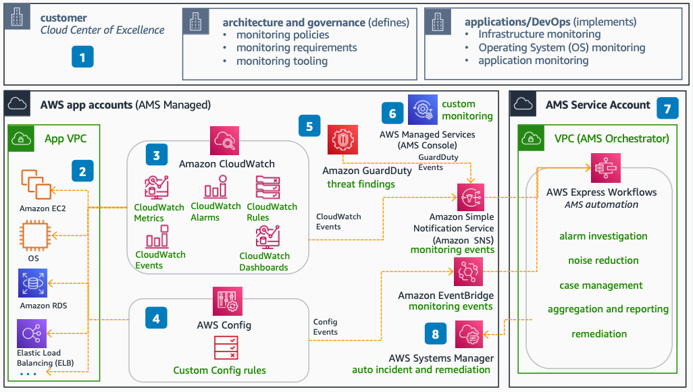

# AMS for Proactive Monitoring

Use this reference architecture to understand how AWS Managed Services (AMS) improves observability with metrics, alarms, and automated response. AMS takes ownership of AWS infrastructure and OS monitoring, alerting, and restoration.

This reference architecture was validated by the AWS Managed Services team for technical accuracy on September 20, 2022.

The following steps describe the architecture:

1. Architecture and governance teams define high-level policies, requirements, and tooling. Your application and operations teams follow the guidelines and ensure monitoring is in place.
2. As part of account onboarding, AMS sets up multiple AWS services for monitoring. These include Amazon CloudWatch, , and to monitor at OS, infrastructure, and account levels.
3. AMS deploys various CloudWatch monitors, alerts, rules, and dashboards as baseline monitoring. This covers OS and AWS services such as Amazon EC2, Amazon RDS, Elastic Load Balancing (ELB), AWS VPN, and NAT Gateway.
4. AMS implements and monitors numerous custom rules. These rules cover PCI, NIST, CIS, and HIPAA compliance standards.
5. AMS implements threat monitoring by using . This service monitors more than 100 guardrails against Amazon EC2, Amazon S3, IAM, and Amazon EKS.
6. With AMS, you can use the AMS Service Console and an AMS-curated tool (Alarm Manager) to create custom CloudWatch alarms or change AMS monitoring thresholds.

## Deploy the architecture

AWS Managed Services deploys and manages this architecture on your behalf as part of the AMS operations plan. You do not need to deploy CloudFormation templates or write custom code. To get started with AMS, see the [What is AWS Managed Services?](../../../managedservices/latest/userguide/what-is-ams.md "../../../managedservices/latest/userguide/what-is-ams.md") section in the AMS User Guide.

For onboarding details and account setup, see [AMS onboarding](../../../managedservices/latest/userguide/ams-onboarding.md "../../../managedservices/latest/userguide/ams-onboarding.md").

## Further reading

For additional information, refer to the following resources:

- [AWS Architecture Icons](https://aws.amazon.com/architecture/icons "https://aws.amazon.com/architecture/icons")
- [AWS Architecture Center](https://aws.amazon.com/architecture "https://aws.amazon.com/architecture")
- [AWS Well-Architected](https://aws.amazon.com/architecture/well-architected "https://aws.amazon.com/architecture/well-architected")
- [AWS Managed Services product page](https://aws.amazon.com/managed-services/ "https://aws.amazon.com/managed-services/")

## Diagram history

To be notified about updates to this reference architecture diagram, subscribe to the RSS feed.

| Change                                                                                                                           | Description                                      | Date               |
| -------------------------------------------------------------------------------------------------------------------------------- | ------------------------------------------------ | ------------------ |
| [Initial publication](ams-helpdesk.md#helpdesk-diagram-history "ams-helpdesk.md#helpdesk-diagram-history")                       | Reference architecture diagrams first published. | September 20, 2022 |
| Initial publication                                                                                                              | Reference architecture diagrams first published. | September 20, 2022 |
| [Initial publication](ams-security-operations.md#security-diagram-history "ams-security-operations.md#security-diagram-history") | Reference architecture diagrams first published. | September 20, 2022 |
| [Initial publication](ams-logging.md#logging-diagram-history "ams-logging.md#logging-diagram-history")                           | Reference architecture diagrams first published. | September 20, 2022 |
| [Initial publication](ams-patching.md#patching-diagram-history "ams-patching.md#patching-diagram-history")                       | Reference architecture diagrams first published. | September 20, 2022 |
| [Initial publication](ams-backup.md#backup-diagram-history "ams-backup.md#backup-diagram-history")                               | Reference architecture diagrams first published. | September 20, 2022 |

###### Note

To subscribe to RSS updates, you must have an RSS plugin enabled for the browser you are using.
