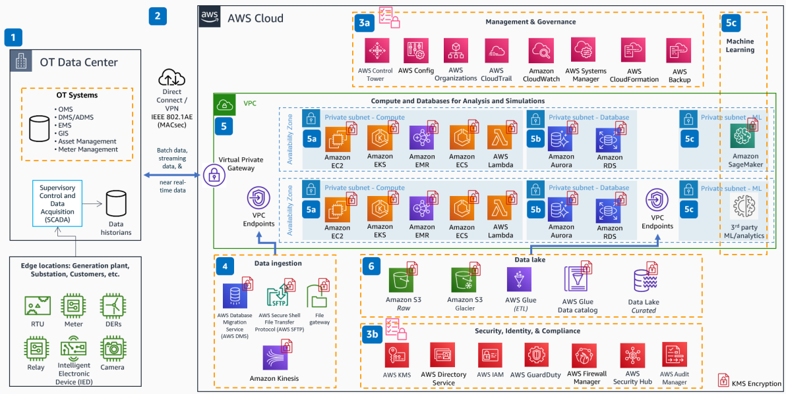

# BES Cyber System Information on AWS

Publication date: **May 18, 2022 ([Diagram history](#bcsi-history "#bcsi-history"))**

With this architecture, you can build a secure extension of an Operations Technology (OT)
data center into AWS. This extension supports ingestion of data from Bulk Electric System
(BES) assets. The solution uses an AWS Amazon VPC for inherent security and isolation. Compute,
analytics, and AI/ML services operate on a data lake to conduct contingency analysis, incident
response, and advanced analytics. The architecture also demonstrates North American Electric
Reliability Corporation (NERC) Critical Infrastructure Protection (CIP) compliance for BES
Cyber System Information (BCSI).

## BES Cyber System Information diagram

The following steps describe the security, networking, and analytics components for this
architecture:

1. Connect your utility OT network (generation facilities, remote substations, data
   centers, and customer locations) to AWS.
2. Establish secure and highly reliable networking to AWS over VPN. For guaranteed
   bandwidth, use [AWS Direct Connect](../../../directconnect/latest/UserGuide.md "../../../directconnect/latest/UserGuide.md") with IEEE 802.1AE (MACSec)
   encryption. (Relates to CIP 11.)
3. 3A. Manage and govern cloud resources at scale from a centralized location by using
   services such as [AWS Control Tower](../../../controltower/latest/userguide.md "../../../controltower/latest/userguide.md"), [AWS Audit Manager](../../../audit-manager/latest/userguide.md "../../../audit-manager/latest/userguide.md"), and AWS Systems Manager.
   Log all account activity with [AWS CloudTrail](../../../awscloudtrail/latest/userguide.md "../../../awscloudtrail/latest/userguide.md"). Use [AWS Config](../../../config/latest/developerguide.md "../../../config/latest/developerguide.md") to assess all cloud configurations
   and any changes. (Relates to CIP 11.)

3B. Control access with [AWS Identity and Access Management](../../../IAM/latest/UserGuide.md "../../../IAM/latest/UserGuide.md") and [Directory Service](../../../directoryservice/latest/admin-guide.md "../../../directoryservice/latest/admin-guide.md"). Monitor network traffic for
malicious activity by using [Amazon GuardDuty](../../../guardduty/latest/ug.md "../../../guardduty/latest/ug.md"). Encrypt and protect data by using [AWS Key Management Service](../../../kms/latest/developerguide.md "../../../kms/latest/developerguide.md"). (Relates to
CIP 4 and CIP 11.) 4. Ingest data by using services such as [AWS Database Migration Service](../../../dms/latest/userguide.md "../../../dms/latest/userguide.md"), [AWS Storage Gateway](../../../storagegateway/latest/userguide.md "../../../storagegateway/latest/userguide.md"), [AWS Transfer Family](../../../transfer/latest/userguide/what-is-aws-transfer-family.md "../../../transfer/latest/userguide/what-is-aws-transfer-family.md"), or [Amazon Kinesis](../../../streams/latest/dev.md "../../../streams/latest/dev.md"). Route data flows to
Amazon VPC through Amazon VPC endpoints. (Relates to CIP 11.) 5. Use Amazon VPC with its inherent security and isolation for hosting compute and database
resources. (Relates to CIP 11.)

5A. Run analysis and simulations by using compute options including [Amazon Elastic Compute Cloud](../../../AWSEC2/latest/UserGuide.md "../../../AWSEC2/latest/UserGuide.md"), [AWS Lambda](../../../lambda/latest/dg.md "../../../lambda/latest/dg.md"), [Amazon Elastic Kubernetes Service](../../../eks/latest/userguide.md "../../../eks/latest/userguide.md"), [Amazon Elastic Container Service](../../../AmazonECS/latest/developerguide.md "../../../AmazonECS/latest/developerguide.md"), and
[AWS Fargate](../../../AmazonECS/latest/userguide/what-is-fargate.md "../../../AmazonECS/latest/userguide/what-is-fargate.md") for
containerized applications, and [Amazon EMR](../../../emr/latest/ManagementGuide.md "../../../emr/latest/ManagementGuide.md"). Encrypt all compute resources with
AWS KMS. (Relates to CIP 11.)

5B. Store data securely in highly available relational databases by using [Amazon RDS](../../../AmazonRDS/latest/UserGuide.md "../../../AmazonRDS/latest/UserGuide.md") and [Amazon Aurora](../../../AmazonRDS/latest/AuroraUserGuide.md "../../../AmazonRDS/latest/AuroraUserGuide.md").
Encrypt data at rest with AWS KMS. (Relates to CIP 11.)

5C. Use AI/ML services such as [Amazon SageMaker AI](../../../sagemaker/latest/dg.md "../../../sagemaker/latest/dg.md") for analysis and assessment of
BCSI. 6. Create the OT data lake on [Amazon Simple Storage Service](../../../AmazonS3/latest/userguide.md "../../../AmazonS3/latest/userguide.md"). Perform ETL and build the data
catalog with [AWS Glue](../../../glue/latest/dg.md "../../../glue/latest/dg.md"). Archive
data in Amazon S3 Glacier. Encrypt data by using AWS KMS. Restrict data access to the Amazon VPC by
using Amazon VPC endpoints. (Relates to CIP 11.)

## Further reading

For additional information, see the following resources:

- [AWS Architecture Icons](https://aws.amazon.com/architecture/icons "https://aws.amazon.com/architecture/icons")
- [AWS Architecture Center](https://aws.amazon.com/architecture/ "https://aws.amazon.com/architecture/")
- [AWS
  Well-Architected](https://aws.amazon.com/architecture/well-architected "https://aws.amazon.com/architecture/well-architected")

## Diagram history

To receive updates about this reference architecture diagram, subscribe to the RSS
feed.

| Change              | Description                                     | Date         |
| ------------------- | ----------------------------------------------- | ------------ |
| Initial publication | Reference architecture diagram first published. | May 18, 2022 |

###### RSS subscription requirement

To subscribe to RSS updates, you must have an RSS plugin enabled for the browser you are
using.
