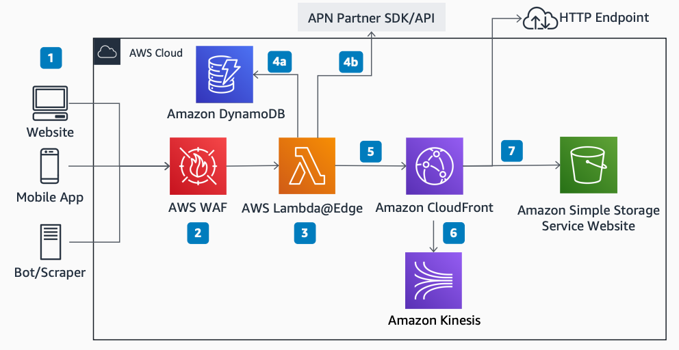

# Bot Mitigation for Travel and Hospitality

Publication date: **October 12, 2020 ([Diagram history](#botmit-history "#botmit-history"))**

With this architecture, you can build a fully serverless content delivery network (CDN)
platform for travel and hospitality websites. Detect and mitigate bots in real time to reduce
price scraping and automated purchases. The solution uses [Amazon CloudFront](../../../AmazonCloudFront/latest/DeveloperGuide.md "../../../AmazonCloudFront/latest/DeveloperGuide.md"), [AWS WAF](../../../waf/latest/developerguide.md "../../../waf/latest/developerguide.md"), and [AWS Lambda](../../../lambda/latest/dg.md "../../../lambda/latest/dg.md")@Edge to profile and filter requests.

## Bot mitigation diagram

The following steps describe the architecture:

1. Traffic hits the endpoints from sources such as a website, mobile app, or
   bot/scraper.
2. Use AWS WAF to create and update rules that block common attack patterns. Filter
   traffic patterns such as known bad IP lists, HTTP headers, or URI strings. Update rules
   programmatically.
3. Use Lambda@Edge to intercept HTTP requests to the CloudFront distribution. Write custom
   logic to make external HTTP requests and API calls to AWS services. Then process or
   reject the request.
4. 4A. Create a service that uses [Amazon DynamoDB](../../../amazondynamodb/latest/developerguide.md "../../../amazondynamodb/latest/developerguide.md") to store fingerprint
   information about requesters.

4B. Alternatively, integrate directly with an AWS Partner Network (APN) partner
offering. Write custom code to validate IPs, user agents, and headers, or offload this
work to a partner solution. 5. After validation, the HTTP request proceeds to CloudFront. 6. Stream CloudFront logs in real time to [Amazon Kinesis](../../../kinesis/latest/dev.md "../../../kinesis/latest/dev.md") for real-time traffic analytics. 7. CloudFront sends the request to the specified origin, such as an [Amazon Simple Storage Service](../../../AmazonS3/latest/userguide.md "../../../AmazonS3/latest/userguide.md") website or HTTP endpoint.

## Further reading

For additional information, see the following resources:

- [AWS Architecture Icons](https://aws.amazon.com/architecture/icons "https://aws.amazon.com/architecture/icons")
- [AWS Architecture Center](https://aws.amazon.com/architecture/ "https://aws.amazon.com/architecture/")
- [AWS
  Well-Architected](https://aws.amazon.com/architecture/well-architected "https://aws.amazon.com/architecture/well-architected")

## Diagram history

To receive updates about this reference architecture diagram, subscribe to the RSS
feed.

| Change              | Description                                     | Date             |
| ------------------- | ----------------------------------------------- | ---------------- |
| Initial publication | Reference architecture diagram first published. | October 12, 2020 |

###### RSS subscription requirement

To subscribe to RSS updates, you must have an RSS plugin enabled for the browser you are
using.
