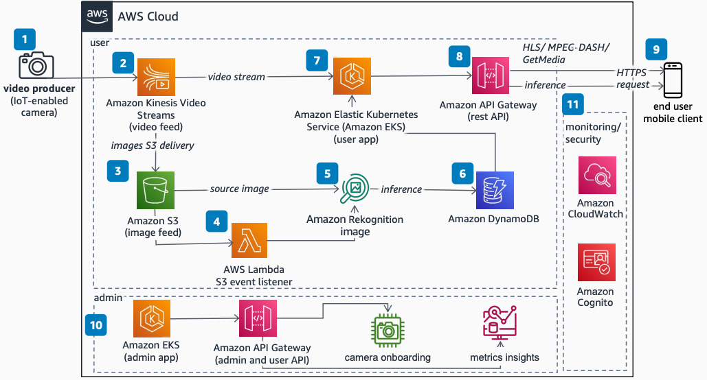

# Camera as a Service

Publication date: **January 25, 2023 ([Diagram history](#caas-history "#caas-history"))**

With this architecture, you can use Internet of Things (IoT)-enabled cameras to generate
live video feed and machine learning (ML) inference that you can consume in near
real-time. The solution uses [Amazon Kinesis Video Streams](../../../kinesisvideostreams/latest/dg.md "../../../kinesisvideostreams/latest/dg.md"), [Amazon Rekognition](../../../rekognition/latest/dg.md "../../../rekognition/latest/dg.md"), [Amazon Elastic Kubernetes Service](../../../eks/latest/userguide.md "../../../eks/latest/userguide.md") (Amazon EKS), and [Amazon API Gateway](../../../apigateway/latest/developerguide.md "../../../apigateway/latest/developerguide.md").

## Camera as a service diagram

The following steps describe the architecture:

1. Generate video feed by using Amazon Kinesis Video Streams Producer libraries.
2. Ingest live video feed to Amazon Kinesis Video Streams.
3. Convert the live feed into images through an on-demand or automated feature and send
   the images to [Amazon Simple Storage Service](../../../AmazonS3/latest/userguide.md "../../../AmazonS3/latest/userguide.md") (Amazon S3).
4. An Amazon S3 write event invokes a [AWS Lambda](../../../lambda/latest/dg.md "../../../lambda/latest/dg.md") function. The function sends the image to
   Amazon Rekognition to generate inference.
5. Store the inference and metadata in [Amazon DynamoDB](../../../amazondynamodb/latest/developerguide.md "../../../amazondynamodb/latest/developerguide.md").
6. Use APIs to fetch the inference from DynamoDB.
7. The user app consumes live feed from Kinesis Video Streams, fetches inference from DynamoDB, and
   exposes the live feed by using a REST API. The user app runs on Amazon EKS.
8. API Gateway exposes the API for video feed and inference.
9. The end user consumes two APIs from API Gateway. The first provides video feed by using
   HTTP Live Streaming (HLS), [MPEG-DASH](https://ottverse.com/mpeg-dash-video-streaming-the-complete-guide/ "https://ottverse.com/mpeg-dash-video-streaming-the-complete-guide/"), or GetMedia streaming. The second provides the ML
   inference.
10. The admin app on Amazon EKS handles governance, administrative APIs, user APIs, camera
    onboarding, metrics, and insights.
11. Use [Amazon CloudWatch](../../../AmazonCloudWatch/latest/monitoring.md "../../../AmazonCloudWatch/latest/monitoring.md") to store logs and metrics
    from the complete stack. Use [Amazon Cognito](../../../cognito/latest/developerguide.md "../../../cognito/latest/developerguide.md") to secure the API feed generated
    by API Gateway.

## Further reading

For additional information, see the following resources:

- [AWS Architecture Icons](https://aws.amazon.com/architecture/icons "https://aws.amazon.com/architecture/icons")
- [AWS Architecture Center](https://aws.amazon.com/architecture/ "https://aws.amazon.com/architecture/")
- [AWS
  Well-Architected](https://aws.amazon.com/architecture/well-architected "https://aws.amazon.com/architecture/well-architected")

## Diagram history

To receive updates about this reference architecture diagram, subscribe to the RSS
feed.

| Change              | Description                                     | Date             |
| ------------------- | ----------------------------------------------- | ---------------- |
| Initial publication | Reference architecture diagram first published. | January 25, 2023 |

###### RSS subscription requirement

To subscribe to RSS updates, you must have an RSS plugin enabled for the browser you are
using.
