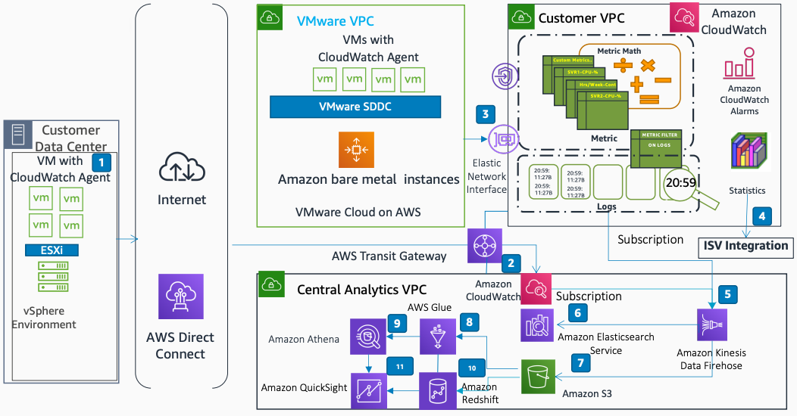

# Central Logging and Analytics in Hybrid Environments

Publication date: **July 21, 2020 ([Diagram history](#diagram-history "#diagram-history"))**

This architecture shows how to build a central logging and analytics solution. You can analyze [Amazon CloudWatch](../../../AmazonCloudWatch/latest/monitoring/WhatIsCloudWatch.md "../../../AmazonCloudWatch/latest/monitoring/WhatIsCloudWatch.md") logs from a hybrid environment, including VMware Cloud on AWS.

## Central Logging and Analytics in Hybrid Environments

1. Install the Amazon CloudWatch agent on VMs on-premises.
2. Send CloudWatch metrics and logs to the customer central logging VPC through and AWS Transit Gateway.
3. Send CloudWatch data from VMware Cloud on AWS to the CloudWatch endpoint in the customer-owned VPC through an elastic network interface.
4. Export log data from your log group to load onto other systems such as ISV solutions.
5. Create a subscription to deliver logs from a specific CloudWatch log group to [Amazon Data Firehose](../../../firehose/latest/dev/what-is-this-service.md "../../../firehose/latest/dev/what-is-this-service.md") in the logging account destination.
6. Use Amazon Data Firehose to continuously stream the log data to [https://docs.aws.amazon.com/opensearch-service/latest/developerguide/what-is.html](../../../opensearch-service/latest/developerguide/what-is.md "../../../opensearch-service/latest/developerguide/what-is.md").
7. Use Amazon Data Firehose to deliver log data to the [Amazon S3](../../../AmazonS3/latest/userguide/Welcome.md "../../../AmazonS3/latest/userguide/Welcome.md") bucket.
8. Use [AWS Glue](../../../glue/latest/dg/what-is-glue.md "../../../glue/latest/dg/what-is-glue.md") to build the Data Catalog and to create the ETL jobs for data processing.
9. [Amazon Athena](../../../athena/latest/ug/what-is.md "../../../athena/latest/ug/what-is.md") uses the AWS Glue Data Catalog to discover and query data in Amazon S3.
10. [Amazon Redshift](../../../redshift/latest/dg/welcome.md "../../../redshift/latest/dg/welcome.md") reads and loads data from multiple data files stored in Amazon S3 buckets.
11. Build visualizations and dashboards by using [Amazon QuickSight](../../../quicksight/latest/user/welcome.md "../../../quicksight/latest/user/welcome.md") with Amazon Athena and Amazon Redshift.

## Further reading

For additional information, refer to

- [AWS Architecture Icons](https://aws.amazon.com/architecture/icons "https://aws.amazon.com/architecture/icons")
- [AWS Architecture Center](https://aws.amazon.com/architecture "https://aws.amazon.com/architecture")
- [AWS Well-Architected](https://aws.amazon.com/architecture/well-architected "https://aws.amazon.com/architecture/well-architected")
- [Amazon CloudWatch product page](https://aws.amazon.com/cloudwatch/ "https://aws.amazon.com/cloudwatch/")

## Diagram history

To be notified about updates to this reference architecture diagram, subscribe to the RSS feed.

| Change              | Description                                     | Date          |
| ------------------- | ----------------------------------------------- | ------------- |
| Initial publication | Reference architecture diagram first published. | July 21, 2020 |

###### Note

To subscribe to RSS updates, you must have an RSS plugin enabled for the browser you are using.
