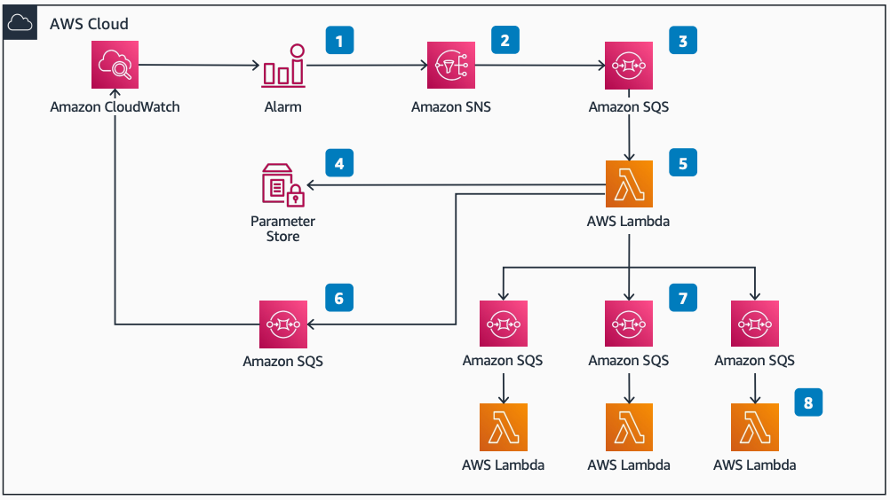

# Centralized Alarms and Notifications

Publication date: **January 10, 2022 ([Diagram history](#diagram-history "#diagram-history"))**

This architecture shows how to deploy a serverless monitoring and alarm system. The system sends workload-specific notifications.

## Centralized Alarms and Notifications

1. Create cross-account [Amazon CloudWatch](../../../AmazonCloudWatch/latest/monitoring/WhatIsCloudWatch.md "../../../AmazonCloudWatch/latest/monitoring/WhatIsCloudWatch.md") alarms in the central monitoring account. You can tag CloudWatch alarms with resource identifiers.
2. Store workload-specific configuration in the central monitoring account. It contains details on connected workload [Amazon SNS](../../../sns/latest/dg/welcome.md "../../../sns/latest/dg/welcome.md") topics.
3. (Optional) Use an intermediary [Amazon SQS](../../../AWSSimpleQueueService/latest/SQSDeveloperGuide/welcome.md "../../../AWSSimpleQueueService/latest/SQSDeveloperGuide/welcome.md") queue to buffer [AWS Lambda](../../../lambda/latest/dg/welcome.md "../../../lambda/latest/dg/welcome.md") invocations if concurrency issues occur.
4. A central Amazon SNS topic receives alarm events.
5. A serverless function receives the alarm event and queries parameter store for account and workload Amazon SNS delivery topics. The function validates configured topics, cycles through them, and sends the payload.
6. Send messages where no workload configuration exists to a monitoring Amazon SQS dead letter queue (DLQ).
7. Amazon SNS topics configured to receive the message invoke an associated AWS Lambda function to process the message.
8. Each AWS Lambda function performs a unique action (for example, sends email).

## Further reading

For additional information, refer to

- [AWS Architecture Icons](https://aws.amazon.com/architecture/icons "https://aws.amazon.com/architecture/icons")
- [AWS Architecture Center](https://aws.amazon.com/architecture "https://aws.amazon.com/architecture")
- [AWS Well-Architected](https://aws.amazon.com/architecture/well-architected "https://aws.amazon.com/architecture/well-architected")
- [Amazon CloudWatch product page](https://aws.amazon.com/cloudwatch/ "https://aws.amazon.com/cloudwatch/")

## Diagram history

To be notified about updates to this reference architecture diagram, subscribe to the RSS feed.

| Change              | Description                                     | Date             |
| ------------------- | ----------------------------------------------- | ---------------- |
| Initial publication | Reference architecture diagram first published. | January 10, 2022 |

###### Note

To subscribe to RSS updates, you must have an RSS plugin enabled for the browser you are using.
