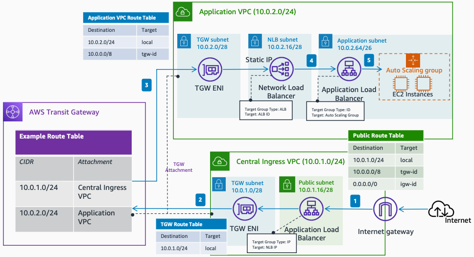

# Centralized Ingress - Auto Scaling Group Target with ALB

Publication date: **March 24, 2022 ([Diagram history](#asgalb-diagram-history "#asgalb-diagram-history"))**

This architecture chains a [Network Load Balancer](../../../elasticloadbalancing/latest/network/introduction.md "../../../elasticloadbalancing/latest/network/introduction.md") and [Application Load Balancer](../../../elasticloadbalancing/latest/application/introduction.md "../../../elasticloadbalancing/latest/application/introduction.md") in the application VPC. The Network Load Balancer static IP eliminates manual registration, and the chained ALB provides layer 7 load balancing capabilities at the application level.

## Centralized ingress with Auto Scaling group and ALB target architecture

The following steps describe the data flow in this architecture:

1. Traffic from the internet reaches the **Central Ingress VPC**. The Application Load Balancer sends the request to the target group with the Network Load Balancer IP address through AWS Transit Gateway.
2. The traffic forwards to the **Application VPC** according to the Transit Gateway route table associated with the **Central Ingress VPC**.
3. The traffic enters the Application VPC and forwards to the Network Load Balancer IP address.
4. The Network Load Balancer forwards the traffic to the Application Load Balancer using an ALB-type target group.
5. The Application Load Balancer forwards the traffic to registered instances in the Auto Scaling group using an instance ID target type.

For more information about Application Load Balancer target group types, see [Target groups for your Application Load Balancers](../../../elasticloadbalancing/latest/application/load-balancer-target-groups.md "../../../elasticloadbalancing/latest/application/load-balancer-target-groups.md").

For more information about Network Load Balancer target group types, see [Target groups for your Network Load Balancers](../../../elasticloadbalancing/latest/network/load-balancer-target-groups.md "../../../elasticloadbalancing/latest/network/load-balancer-target-groups.md").

## Further reading

For additional information, see the following resources:

- [AWS Architecture Icons](https://aws.amazon.com/architecture/icons "https://aws.amazon.com/architecture/icons")
- [AWS Architecture Center](https://aws.amazon.com/architecture "https://aws.amazon.com/architecture")
- [AWS Well-Architected](https://aws.amazon.com/architecture/well-architected "https://aws.amazon.com/architecture/well-architected")

## Diagram history

To be notified about updates to this reference architecture diagram, subscribe to the RSS feed.

| Change                                                                                                                                 | Description                                     | Date           |
| -------------------------------------------------------------------------------------------------------------------------------------- | ----------------------------------------------- | -------------- |
| [Initial publication](centralized-ingress-ec2-target.md#ec2t-diagram-history "centralized-ingress-ec2-target.md#ec2t-diagram-history") | Reference architecture diagram first published. | March 24, 2022 |
| [Initial publication](centralized-ingress-asg-target.md#asg-diagram-history "centralized-ingress-asg-target.md#asg-diagram-history")   | Reference architecture diagram first published. | March 24, 2022 |
| Initial publication                                                                                                                    | Reference architecture diagram first published. | March 24, 2022 |

###### Note

To subscribe to RSS updates, you must have an RSS plugin enabled for the browser you are using.
