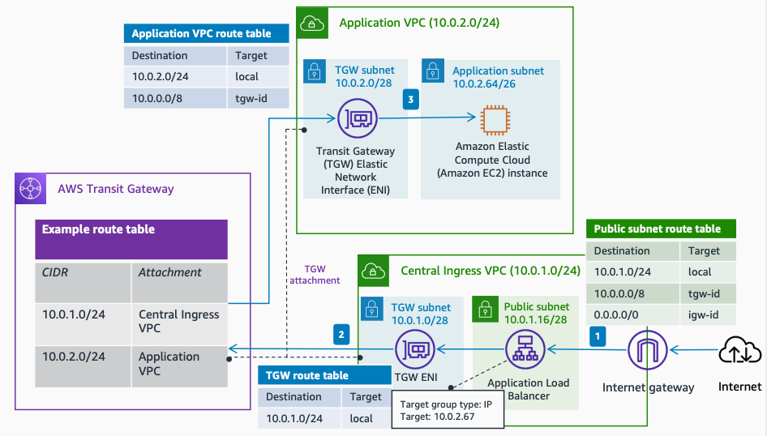

# Centralized Ingress - Amazon EC2 Target

Publication date: **March 24, 2022 ([Diagram history](#ec2t-diagram-history "#ec2t-diagram-history"))**

This architecture uses a centralized ingress Amazon VPC with a public [Application Load Balancer](../../../elasticloadbalancing/latest/application/introduction.md "../../../elasticloadbalancing/latest/application/introduction.md") and IP targets. You directly target the IP addresses of Amazon EC2 instances in the application VPC through [AWS Transit Gateway](../../../vpc/latest/tgw/what-is-transit-gateway.md "../../../vpc/latest/tgw/what-is-transit-gateway.md"). This approach requires manual management of IP registrations on the ALB.

## Centralized ingress with Amazon EC2 target architecture

The following steps describe the data flow in this architecture:

1. Traffic from the internet reaches the **Central Ingress VPC**. The Application Load Balancer sends the request to the target group with the configured IP address through AWS Transit Gateway.
2. The traffic forwards to the **Application VPC** according to the Transit Gateway route table associated with the **Central Ingress VPC**.
3. The traffic enters the Application VPC and forwards to the Amazon EC2 instance.

For more information about Application Load Balancer target group types, see [Target groups for your Application Load Balancers](../../../elasticloadbalancing/latest/application/load-balancer-target-groups.md "../../../elasticloadbalancing/latest/application/load-balancer-target-groups.md").

## Further reading

For additional information, see the following resources:

- [AWS Architecture Icons](https://aws.amazon.com/architecture/icons "https://aws.amazon.com/architecture/icons")
- [AWS Architecture Center](https://aws.amazon.com/architecture "https://aws.amazon.com/architecture")
- [AWS Well-Architected](https://aws.amazon.com/architecture/well-architected "https://aws.amazon.com/architecture/well-architected")

## Diagram history

To be notified about updates to this reference architecture diagram, subscribe to the RSS feed.

| Change                                                                                                                                             | Description                                     | Date           |
| -------------------------------------------------------------------------------------------------------------------------------------------------- | ----------------------------------------------- | -------------- |
| Initial publication                                                                                                                                | Reference architecture diagram first published. | March 24, 2022 |
| [Initial publication](centralized-ingress-asg-target.md#asg-diagram-history "centralized-ingress-asg-target.md#asg-diagram-history")               | Reference architecture diagram first published. | March 24, 2022 |
| [Initial publication](centralized-ingress-asg-alb-target.md#asgalb-diagram-history "centralized-ingress-asg-alb-target.md#asgalb-diagram-history") | Reference architecture diagram first published. | March 24, 2022 |

###### Note

To subscribe to RSS updates, you must have an RSS plugin enabled for the browser you are using.
