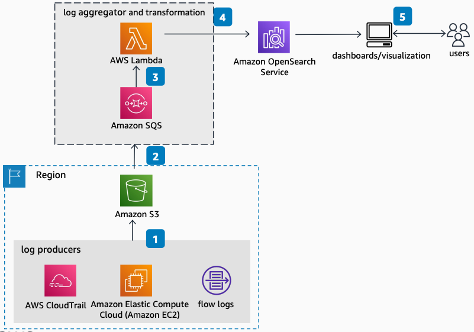

# Centralized Log Analytics

Publication date: **November 7, 2022 ([Diagram history](#diagram-history "#diagram-history"))**

This architecture shows how to search, analyze, and visualize machine data by using for operational insights.

## Centralized Log Analytics

1. Collectors such as FluentBit, Amazon Kinesis Agent, and the [Amazon CloudWatch](../../../AmazonCloudWatch/latest/monitoring/WhatIsCloudWatch.md "../../../AmazonCloudWatch/latest/monitoring/WhatIsCloudWatch.md") Agent (or services such as [AWS CloudTrail](../../../awscloudtrail/latest/userguide/cloudtrail-user-guide.md "../../../awscloudtrail/latest/userguide/cloudtrail-user-guide.md")) collect log lines and store them in [Amazon S3](../../../AmazonS3/latest/userguide/Welcome.md "../../../AmazonS3/latest/userguide/Welcome.md").
2. Amazon S3 sends an object create event to [Amazon SQS](../../../AWSSimpleQueueService/latest/SQSDeveloperGuide/welcome.md "../../../AWSSimpleQueueService/latest/SQSDeveloperGuide/welcome.md").
3. Amazon SQS invokes an [AWS Lambda](../../../lambda/latest/dg/welcome.md "../../../lambda/latest/dg/welcome.md") function that transforms the log lines from strings to structured JSON (if necessary).
4. The Lambda function uses the OpenSearch \_bulk API to deliver the JSON-formatted log lines to [https://docs.aws.amazon.com/opensearch-service/latest/developerguide/what-is.html](../../../opensearch-service/latest/developerguide/what-is.md "../../../opensearch-service/latest/developerguide/what-is.md").
5. The user logs into OpenSearch Dashboards to perform interactive log analytics, build visualizations or notebooks, and monitor dashboards.

## Further reading

For additional information, refer to

- [AWS Architecture Icons](https://aws.amazon.com/architecture/icons "https://aws.amazon.com/architecture/icons")
- [AWS Architecture Center](https://aws.amazon.com/architecture "https://aws.amazon.com/architecture")
- [AWS Well-Architected](https://aws.amazon.com/architecture/well-architected "https://aws.amazon.com/architecture/well-architected")
- [product page](https://aws.amazon.com/opensearch-service/ "https://aws.amazon.com/opensearch-service/")

## Diagram history

To be notified about updates to this reference architecture diagram, subscribe to the RSS feed.

| Change              | Description                                     | Date             |
| ------------------- | ----------------------------------------------- | ---------------- |
| Initial publication | Reference architecture diagram first published. | November 7, 2022 |

###### Note

To subscribe to RSS updates, you must have an RSS plugin enabled for the browser you are using.
