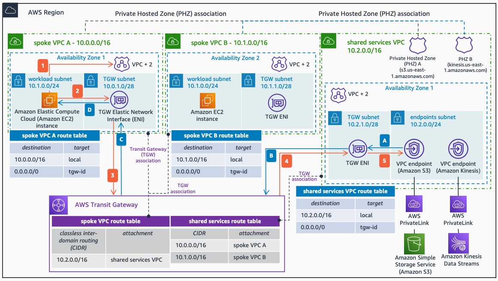

# Centralizing Amazon VPC Endpoint Access with AWS Transit Gateway

Publication date: **March 25, 2022 ([Diagram history](#cvpc-diagram-history "#cvpc-diagram-history"))**

This architecture centralizes [Amazon VPC interface endpoints](../../../vpc/latest/privatelink/vpce-interface.md "../../../vpc/latest/privatelink/vpce-interface.md") in a shared services VPC using [AWS Transit Gateway](../../../vpc/latest/tgw/what-is-transit-gateway.md "../../../vpc/latest/tgw/what-is-transit-gateway.md"). You create custom [Amazon Route 53 private hosted zones](../../../Route53/latest/DeveloperGuide/hosted-zones-private.md "../../../Route53/latest/DeveloperGuide/hosted-zones-private.md") and associate them to all VPCs that consume these endpoints.

## Centralizing Amazon VPC endpoint access architecture

The following steps describe the data flow in this architecture:

1. An Amazon Elastic Compute Cloud instance in **spoke VPC A** resolves the Amazon Simple Storage Service domain name by querying the VPC+2 resolver. Private hosted zone A associates with **spoke VPC A** to complete domain resolution.
2. The instance sends the traffic to the Transit Gateway ENI as per the **spoke VPC A** route table.
3. The traffic forwards to AWS Transit Gateway.
4. The **Transit Gateway spoke VPC route table** forwards the traffic to the **shared services VPC**.
5. The Transit Gateway ENI in the shared services VPC forwards the traffic to the corresponding interface endpoint connecting to Amazon S3.

The return path follows these steps:

1. The VPC endpoint sends the response back to the Transit Gateway ENI.
2. The traffic forwards to AWS Transit Gateway.
3. The **Transit Gateway shared services route table** sends the traffic to **spoke VPC A**.
4. The Transit Gateway ENI delivers the response to the destination Amazon EC2 instance.

For more information about interface endpoints and AWS PrivateLink, see [Access an AWS service using an interface VPC endpoint](../../../vpc/latest/privatelink/vpce-interface.md "../../../vpc/latest/privatelink/vpce-interface.md").

To see an example of this architecture in Terraform, see [AWS Hub and Spoke Architecture with Shared Services VPC](https://github.com/aws-samples/hub-and-spoke-with-shared-services-vpc-terraform "https://github.com/aws-samples/hub-and-spoke-with-shared-services-vpc-terraform").

## Further reading

For additional information, see the following resources:

- [AWS Architecture Icons](https://aws.amazon.com/architecture/icons "https://aws.amazon.com/architecture/icons")
- [AWS Architecture Center](https://aws.amazon.com/architecture "https://aws.amazon.com/architecture")
- [AWS Well-Architected](https://aws.amazon.com/architecture/well-architected "https://aws.amazon.com/architecture/well-architected")

## Diagram history

To be notified about updates to this reference architecture diagram, subscribe to the RSS feed.

| Change                                                                                                                           | Description                                     | Date           |
| -------------------------------------------------------------------------------------------------------------------------------- | ----------------------------------------------- | -------------- |
| Initial publication                                                                                                              | Reference architecture diagram first published. | March 25, 2022 |
| [Initial publication](on-premises-vpc-endpoints.md#onprem-diagram-history "on-premises-vpc-endpoints.md#onprem-diagram-history") | Reference architecture diagram first published. | March 25, 2022 |

###### Note

To subscribe to RSS updates, you must have an RSS plugin enabled for the browser you are using.
