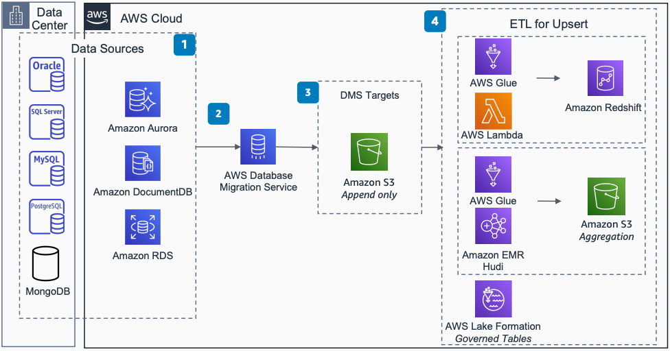

# Change Data Capture Using AWS DMS: Amazon S3 with ETL for Upsert

This architecture shows how to use AWS Database Migration Service (AWS DMS) to create data pipelines with change data capture to build transactional data lakes.

## Change Data Capture Using AWS DMS: Amazon S3 with ETL for Upsert

The following steps describe the architecture:

1. Sources for CDC include Oracle, SQL Server, MySQL, PostgreSQL, MongoDB, Amazon Aurora, Amazon DocumentDB, and Amazon RDS.
2. AWS DMS helps you with one-time data migration of databases and continuous data replication. AWS DMS captures changes on the source database and applies them in a transactionally consistent way to the target.
3. The target for change data capture is [Amazon Simple Storage Service](../../../AmazonS3/latest/userguide/Welcome.md "../../../AmazonS3/latest/userguide/Welcome.md").
4. Use [AWS Glue](../../../glue/latest/dg/what-is-glue.md "../../../glue/latest/dg/what-is-glue.md") or Amazon EMR for extract, transform, load (ETL) upsert to Amazon S3 and Amazon Redshift.
